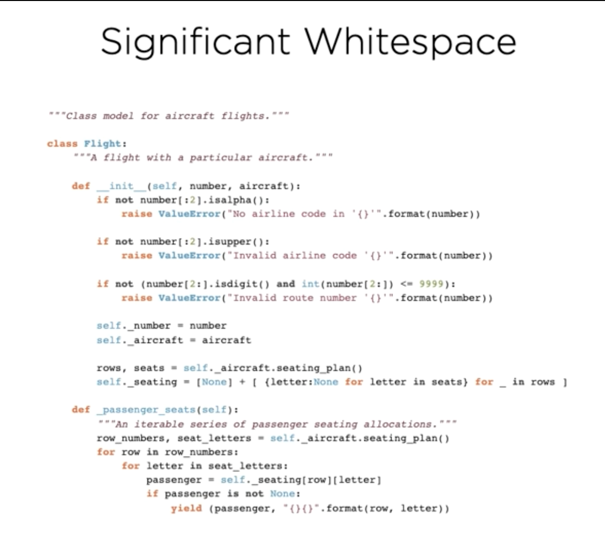
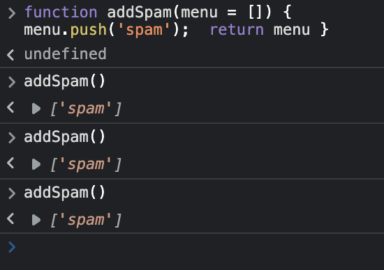
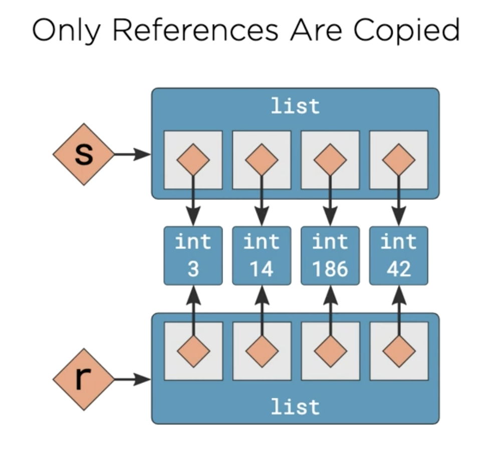
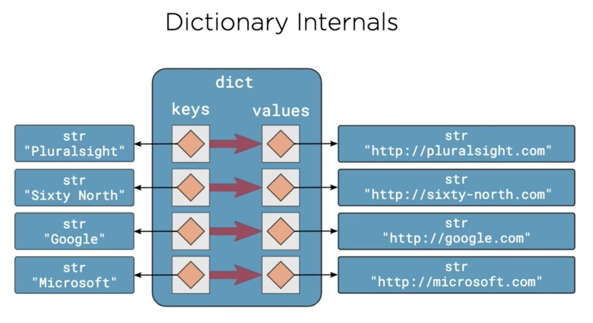
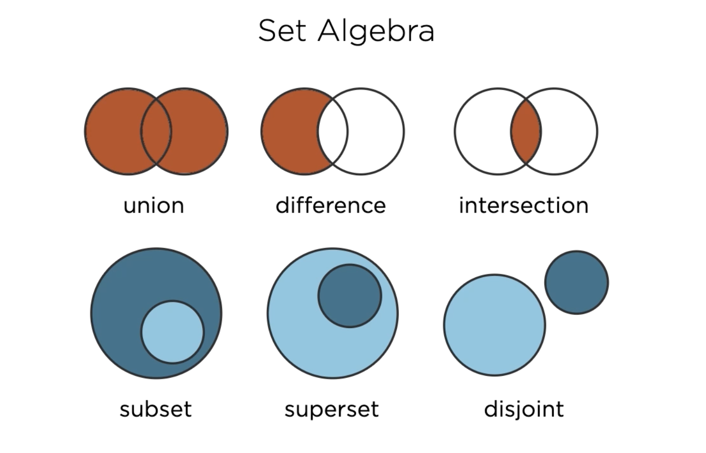
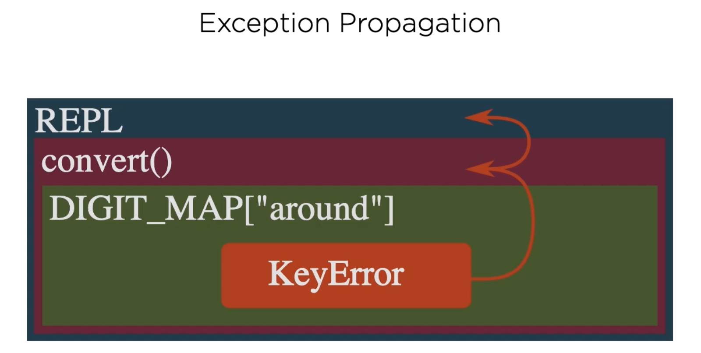

table of contents

- [course overview](#course-overview)
- [installing and starting python](#installing-and-starting-python)
  - [installing python](#installing-python)
  - [interactive python](#interactive-python)
    - [typing in the command line](#typing-in-the-command-line)
    - [how to exit REPL](#how-to-exit-repl)
  - [significant whitespace](#significant-whitespace)
  - [python culture](#python-culture)
    - [moment of zen 1: readability counts](#moment-of-zen-1-readability-counts)
  - [using the standard library](#using-the-standard-library)
    - [using the `math` module](#using-the-math-module)
      - [`from module_name import attribute_name`](#from-module_name-import-attribute_name)
      - [`from math import factorial as fac`](#from-math-import-factorial-as-fac)
  - [summary](#summary)
- [scalar types, operators, and control flow](#scalar-types-operators-and-control-flow)
  - [scalar types](#scalar-types)
    - [`integers`](#integers)
    - [`float`](#float)
    - [`None`](#none)
    - [`bool`](#bool)
  - [relational operators](#relational-operators)
    - [control flow](#control-flow)
      - [if-statement syntax](#if-statement-syntax)
        - [else-clause](#else-clause)
      - [while-loops](#while-loops)
        - [`break`](#break)
  - [summary](#summary-1)
- [introducing strings, collections, and iteration](#introducing-strings-collections-and-iteration)
  - [`str`](#str)
  - [`string literals`](#string-literals)
    - [newline](#newline)
    - [escape sequences](#escape-sequences)
    - [string features](#string-features)
    - [difference between string and string literal](#difference-between-string-and-string-literal)
  - [`bytes`](#bytes)
  - [`list`](#list)
  - [`dict`](#dict)
    - [dict literals](#dict-literals)
  - [`for-loop`](#for-loop)
  - [putting it all together](#putting-it-all-together)
  - [from REPL to IDE](#from-repl-to-ide)
  - [summary](#summary-2)
    - [strings](#strings)
    - [bytes](#bytes-1)
    - [lists](#lists)
    - [dicts](#dicts)
    - [for-loops](#for-loops)
- [modularity](#modularity)
  - [overview](#overview)
  - [modules](#modules)
  - [functions](#functions)
    - [naming special functions](#naming-special-functions)
  - [`__name__`](#__name__)
  - [the python execution model](#the-python-execution-model)
    - [module, script, or program?](#module-script-or-program)
      - [module](#module)
      - [python script](#python-script)
      - [python program](#python-program)
  - [command line arguments](#command-line-arguments)
  - [moment of zen 2: sparse is better than dense](#moment-of-zen-2-sparse-is-better-than-dense)
  - [docstrings](#docstrings)
  - [comments](#comments)
  - [shebang](#shebang)
  - [summary](#summary-3)
- [objects and types](#objects-and-types)
  - [overview](#overview-1)
    - [assigning to a variable](#assigning-to-a-variable)
      - [built-in `id()` function](#built-in-id-function)
    - [value vs. identity equality](#value-vs-identity-equality)
  - [passing arguments and returning values](#passing-arguments-and-returning-values)
    - [argument passing](#argument-passing)
      - [argument passing semantics](#argument-passing-semantics)
      - [replacing argument value](#replacing-argument-value)
      - [mutable arguments](#mutable-arguments)
      - [return semantics](#return-semantics)
  - [function arguments](#function-arguments)
    - [when are default values evaluated?](#when-are-default-values-evaluated)
  - [python's type system](#pythons-type-system)
  - [scopes](#scopes)
    - [scopes of words.py](#scopes-of-wordspy)
      - [global/module scope](#globalmodule-scope)
      - [local scope inside `fetch_words()`](#local-scope-inside-fetch_words)
    - [rebinding global names](#rebinding-global-names)
  - [moment of zen 3: special cases aren't special enough to break the rules](#moment-of-zen-3-special-cases-arent-special-enough-to-break-the-rules)
  - [everything is an object](#everything-is-an-object)
  - [summary](#summary-4)
- [built-in collections](#built-in-collections)
  - [overview](#overview-2)
  - [tuple](#tuple)
    - [tuple unpacking](#tuple-unpacking)
      - [checking if tuple contains value](#checking-if-tuple-contains-value)
  - [strings](#strings-1)
    - [use `str.join()` to join strings](#use-strjoin-to-join-strings)
      - [why?](#why)
      - [moment of zen 4: the way may not be obvious at first](#moment-of-zen-4-the-way-may-not-be-obvious-at-first)
    - [string partition() method](#string-partition-method)
      - [string formatting/format strings](#string-formattingformat-strings)
      - [pep498: literal string interpolation](#pep498-literal-string-interpolation)
    - [f-strings](#f-strings)
  - [ranges](#ranges)
    - [`range()` signature](#range-signature)
    - [enumerate](#enumerate)
  - [lists](#lists-1)
    - [negative indices](#negative-indices)
    - [slicing](#slicing)
      - [shallow copies](#shallow-copies)
      - [deep copies](#deep-copies)
    - [multiplication operator](#multiplication-operator)
    - [`list.index()`](#listindex)
    - [`del`, delete items from list by index](#del-delete-items-from-list-by-index)
    - [`remove()` method](#remove-method)
    - [`list.insert()`](#listinsert)
    - [concatenating lists](#concatenating-lists)
    - [`list.reverse()` and `list.sort()`](#listreverse-and-listsort)
    - [`list.reverse()`](#listreverse)
    - [`list.sort()`](#listsort)
      - [key parameter to `list.sort()`](#key-parameter-to-listsort)
      - [reversing and sorting into copies](#reversing-and-sorting-into-copies)
        - [`reversed()`](#reversed)
        - [`sorted()`](#sorted)
  - [dictionaries](#dictionaries)
    - [shallow copying](#shallow-copying)
    - [copying a dictionary](#copying-a-dictionary)
      - [`copy()` method](#copy-method)
      - [`dict()` constructor](#dict-constructor)
    - [`dict.update()`](#dictupdate)
    - [dictionary iteration](#dictionary-iteration)
      - [`dict.values()`](#dictvalues)
      - [`dict.keys()`](#dictkeys)
      - [`dict.items()`](#dictitems)
    - [membership tests](#membership-tests)
    - [deleting from dicts with `del`](#deleting-from-dicts-with-del)
    - [pretty printing dicts](#pretty-printing-dicts)
  - [sets](#sets)
    - [literal form of set](#literal-form-of-set)
      - [creating empty set](#creating-empty-set)
    - [sets are iterable](#sets-are-iterable)
    - [set membership](#set-membership)
    - [adding to set](#adding-to-set)
    - [removing from set](#removing-from-set)
      - [`remove()`](#remove)
      - [`discard()`](#discard)
    - [copying a set](#copying-a-set)
    - [set algebra](#set-algebra)
      - [example:](#example)
        - [`union()` method](#union-method)
        - [`difference()` method](#difference-method)
          - [`symmetric_difference()` method](#symmetric_difference-method)
        - [`intersection()` method](#intersection-method)
        - [`issubset()` method](#issubset-method)
        - [`issuperset()` method](#issuperset-method)
        - [`isdisjoint()` method](#isdisjoint-method)
  - [protocols](#protocols)
  - [summary](#summary-5)
    - [tuples](#tuples)
    - [string](#string)
    - [range](#range)
    - [lists](#lists-2)
    - [dictionaries](#dictionaries-1)
    - [sets](#sets-1)
- [exceptions](#exceptions)
  - [overview](#overview-3)
    - [exception handling](#exception-handling)
  - [exceptions and control flow](#exceptions-and-control-flow)
    - [exception propagation](#exception-propagation)
  - [handling exceptions](#handling-exceptions)
    - [try, except statements/blocks](#try-except-statementsblocks)
  - [exceptions and programmer errors](#exceptions-and-programmer-errors)
    - [`pass` keyword](#pass-keyword)
    - [accessing exception objects](#accessing-exception-objects)
  - [re-raising exceptions](#re-raising-exceptions)
    - [exceptions cannot be ignored](#exceptions-cannot-be-ignored)
    - [just `raise` an exception](#just-raise-an-exception)
  - [exceptions are part of the API](#exceptions-are-part-of-the-api)
    - [use standard exception types](#use-standard-exception-types)
  - [exceptions and protocols](#exceptions-and-protocols)
    - [follow existing patterns](#follow-existing-patterns)
      - [lookup failure in mappings](#lookup-failure-in-mappings)
    - [common exception types](#common-exception-types)
      - [`IndexError`](#indexerror)
      - [`ValueError`](#valueerror)
      - [`KeyError`](#keyerror)
  - [avoid explicit type checks](#avoid-explicit-type-checks)
  - [it's easier to ask forgiveness than permission](#its-easier-to-ask-forgiveness-than-permission)
    - [LBYL vs. EAFP](#lbyl-vs-eafp)
      - [LBYL version of example:](#lbyl-version-of-example)
      - [EAFP version of example:](#eafp-version-of-example)
    - [EAFP plus Exceptions](#eafp-plus-exceptions)
  - [cleanup actions](#cleanup-actions)
    - [try...finally](#tryfinally)
  - [moment of zen: errors should never pass silently, unless explicitly silenced](#moment-of-zen-errors-should-never-pass-silently-unless-explicitly-silenced)
  - [platform-specific code](#platform-specific-code)
    - [detecting a single keypress](#detecting-a-single-keypress)
  - [summary](#summary-6)
- [iteration and iterables](#iteration-and-iterables)
  - [overview](#overview-4)
  - [list and set comprehensions](#list-and-set-comprehensions)
    - [list comprehensions](#list-comprehensions)
      - [list comprehension syntax](#list-comprehension-syntax)
        - [equivalent syntax](#equivalent-syntax)
    - [set comprehensions](#set-comprehensions)

# course overview

the course is 100% applicable to python version `3.6` released in 2016.

it is not applicable to python version `3.7` to `.10`

# installing and starting python

## installing python

use `python3` command on command line to launch python in your CLI

the triple arrow `>>>` displayed in the CLI means python is waiting for our input.

## interactive python

we can start using it immediately.

the interactive CLI environment is a `read, eval, print` loop

python will

1. **read** everything we type in
2. **evaluate** it
3. **print** the result, and loop back to the beginning

this is also known as the `REPL` >>> the read, eval, print loop.

### typing in the command line

- can initialize variables in the cli and reference them

```py
>>> x = 5
>>> x
5
>>> 3 * x
15
```

- can use the `_` variable to reference the most recently printed value

```py
>>> 3 * x
15
>>> _
15
```

can also use the `_` variable in an expression

```py
>>> 3 * x
15
>>> _
15
>>> _ * 2
30
```

this is one of the very few obscure shortcuts in python

note: the `_` variable doesn't have any behavior in python scripts or program. this functionality is only in the REPL
some commands don't have return values

```py
>>> x = 5
```

we assigned the value of 5 to x and there was no return value from that command.

```py
>>> print('Hello, Python')
Hello, Python
```

this command printed the string `Hello, Python`

`print` is one of the biggest differences between Python 2 and Python 3.

- in Python 3, the parenthesis are **required**

  - `print("Python 3")`
  - this is because `print` in Python 3 is a function call

- in Python 2, the parenthesis are **not required**
  - `print "Python 2"`

### how to exit REPL

send the end-of-file control character, `CTRL-D` on mac/linux systems

`CTRL-Z`, then `Enter` on windows systems

## significant whitespace

basic code structure

control flow structures

- for-loops
- while-loops
- if-statements

are all introduced by statements that are terminated by a **colon**, `:`

python will change the prompt to three dots `...` requesting that you provide the body of the for-loop.

example:

`for-loop`

```py
>>> for i in range(5):
...
```

leading whitespace is **syntactically significant** in python.

python uses **indentation levels** rather than curly braces `{}` to demarcate code blocks.

by convention, contemporary python code is indented by `4` spaces for each level. this can be accomplished by hitting the <kbd>Tab</kbd> key.

so, we provide those four spaces and a statement to form the body of our for loop.

```py
>>> for i in range(5):
...     x = i * 10
...     print(x)
```

our for-body is finished after our print(x)statement. to terminate our block of code, we must enter a blank line into REPL.

```py
>>> for i in range(5)
...     x = i * 10
...     print(x)
...
```

after doing do, our code is evaluated and executed and our prompt `>>>` returns after it is finished.

```py
>>> for i in range(5)
...     x = i * 10
...     print(x)
...
0
10
20
30
40
>>>
```

looking at more significant examples of code clearly demonstrate how indentation matters in differentiating different blocks of code.



the whitespace **must** match the structure of your program.

even with code removed, we can see different colored bars with different levels of indentation that visually help us see the levels of code.


each level of indentation is **typically** four spaces.

advantages to significant whitespace:

1. forces developers to write readable code
2. no clutter with unnecessary braces
3. human and computer can't get our of sync

rules for indentation

1. prefer **four spaces**
2. **never** mix tabs and spaces
3. be **consistent** on consecutive lines
4. only deviate to **improve** readability

> "programming as Guido intended (or indented) it"

## python culture

development of python is managed thru PEPs, or `python enhancement proposals`

PEP 8 recommends we use four spaces for indentation of our code

PEP 20 describes the zen of python, the 20 aphorisms that describe the guiding principals of python, 19 of which are written down

it can also be access from the REPL by typing `import this`

```
The Zen of Python, by Tim Peters

Beautiful is better than ugly.
Explicit is better than implicit.
Simple is better than complex.
Complex is better than complicated.
Flat is better than nested.
Sparse is better than dense.
Readability counts.
Special cases aren't special enough to break the rules.
Although practicality beats purity.
Errors should never pass silently.
Unless explicitly silenced.
In the face of ambiguity, refuse the temptation to guess.
There should be one-- and preferably only one --obvious way to do it.
Although that way may not be obvious at first unless you're Dutch.
Now is better than never.
Although never is often better than *right* now.
If the implementation is hard to explain, it's a bad idea.
If the implementation is easy to explain, it may be a good idea.
Namespaces are one honking great idea -- let's do more of those!
```

### moment of zen 1: readability counts

Readability Counts

- Clarity matters
- So readability makes
- For valuable code

## using the standard library

the standard library contains modules

you gain access to standard library modules by using the `import` keyword

the basic method of importing a module is this syntax: `import module_name`

example:

using the standard library's `math` module to perform some calculations

we can access something inside of a module with the syntax `module.attribute_name`

```py
>>> math.sqrt(81)
9.0
>>>
```

how do we know which modules have certain attributes or methods?

REPL has a built-in `help` function that can retrieve any embedded documentation form objects for which it has been provided

```
>>> help
Type help() for interactive help, or help(object) for help about object.
>>>
```

### using the `math` module

```
>>> help(math)
```

prints this to the console:

```
Help on module math:

NAME
    math

MODULE REFERENCE
    https://docs.python.org/3.8/library/math

    The following documentation is automatically generated from the Python
    source files.  It may be incomplete, incorrect or include features that
    are considered implementation detail and may vary between Python
    implementations.  When in doubt, consult the module reference at the
    location listed above.

DESCRIPTION
    This module provides access to the mathematical functions
    defined by the C standard.

FUNCTIONS
    acos(x, /)
        Return the arc cosine (measured in radians) of x.

    acosh(x, /)
        Return the inverse hyperbolic cosine of x.

    asin(x, /)
        Return the arc sine (measured in radians) of x.
...
```

we can scroll thru the list using the arrow keys on mac/linux or <kbd>Spacebar<kbd> on windows

press <kbd>Q</kbd> to exit the `help` browser and return to REPL.

we can use help to look up specific functions in modules, too.

```
>>> help(math.factorial)
Help on built-in function factorial in module math:

factorial(x, /)
    Find x!.

    Raise a ValueError if x is negative or non-integral.
(END)
```

again, press <kbd>Q<kbd> to return to REPL.

it can be very verbose to reference the same math module each time a function or method is used from it.

our calculation calculates how many different ways we can choose `k` number of items from `n` number of total items

example:

```py
>>> n = 5
>>> k = 3
>>> math.factorial(n) / (math.factorial(k) * math.factorial(n-k))
10.0
>>>
```

we had to repeat using the `math` module each time we referenced the `factorial` function from `math`

#### `from module_name import attribute_name`

instead, we can import **specific** functions from modules into the current namespace with the syntax `from math import factorial`

example:

```py
>>> from math import factorial
>>> factorial(n) / (factorial(k) * factorial(n-k))
10.0
```

it's an improvement, but is still a lot of code for such a simple expression.

#### `from math import factorial as fac`

a third form of the `import` statement allows us to rename the imported function with the syntax `from math import factorial as fac`

example:

```py
>>> from math import factorial as fac
>>> fac(n) / (fac(k) * fac(n-k))
10.0
```

this can be used to make code more readable or to avoid name clashes

as useful as it is, this style of the import statement should be used infrequently and judiciously

remember that when we used `factorial` by itself, it returned an `integer`

but when we performed a division calculation with multiple factorials, it's returning a `floating point integer`

this is because we have used python's `floating point division operator`, and single forward-slash `/`

we can improve our expression since we know it will only ever return integral results.

we can do this by using python's `integer division operator`, which is a double forward-slash `//`

example:

```py
>>> fac(n) // (fac(k) * fac(k-n))
10
>>>
```

most programming languages would fail on the above expression for even moderately high values of `n`

this is because in most programming languages, regular signed integers can only store values less than 2<sup>31</sup> - 1, which equals `2147483647`

however, factorials grow so fast that the largest factorial that you can fit into a 32-bit signed integer is 12 factorial, since 13 factorial is too large.

in most-widely used programming languages, we would need more complex code or more sophisticated mathematics merely to compute how many ways there are to draw 3 fruit from a set of 13 fruits.

python encounters no such problems and can compute with arbitrarily large integers limited only by the memory in my computer.

how many different pairs of fruit can we pick from 100 fruit?

to emphasize how large 100 factorial is, we calculated it in our console:

```py
>>> from math import factorial as fac
>>> fac(100)
93326215443944152681699238856266700490715968264381621468592963895217599993229915608941463976156518286253697920827223758251185210916864000000000000000000000000
>>>
```

we can convert this integer to a text string and count the number of characters in it:

```py
>>> len(str(fac(100)))
158
>>>
```

158 digits! that's a lot.

## summary

we learned

- how to download and install python
- starting python REPL
- evaluating simple expressions and mathematic calculations in REPL
- the role of underscore in the REPL
  - the value of `_` in REPL is the result of the last evaluated expression
- how to make basic use of the `print()` function
  - that the printed output is a **side effect** of the function, **not** a return value
- how to exit REPL
  - using <kbd>CTRL</kbd> + <kbd>Z</kbd> on windows or <kbd>CTRL</kbd> + <kbd>D</kbd> on Linux and macOS
- how python uses significant whitespace
  - code blocks are initiated with a colon and comprise consecutive lines at the same indentation level
  - advantages of significant whitespace
    - clarity
    - consistency
  - rules for indentations
- python culture
  - the zen of python
    - can be printed in REPL by typing `import this` in REPL
  - "readability counts"
- importing standard library modules
  1. `import from`
     - importing an entire module
  2. `from module import name`
     - importing selected/specific elements of a module
  3. `from module import name as name2`
     - renaming imported elements
- using python's help system
- learned how to use python's `factorial` function from python's standard math library

# scalar types, operators, and control flow

## scalar types

python comes with a number of built-in data types

these include **primitive** scalar types like `integers` as well as **collection** types like `dictionaries`

| Data Type  | Description                     | Example            |
| ---------- | ------------------------------- | ------------------ |
| `int`      | arbitrary precision integer     | `42`               |
| `float`    | `64-bit` floating point numbers | `4.2`              |
| `NoneType` | the `null` object               | `None`             |
| `bool`     | `boolean` logical values        | `true` and `false` |

### `integers`

python integers are **signed** and have, for all practical purposes, unlimited precision, meaning they can contain as many digits as you need.

integer literals are specified in decimal:

```py
>>> 10
10
>>>
```

they may also be specific in `binary` with the `0b` prefix:

```py
>>> 0b10
2
>>>
```

or `octal` with the `0o` prefix:

```py
>>> 0o10
8
>>>
```

or in `hexadecimal` with the `Ox` prefix:

```py
>>> 0x10
16
>>>
```

can also create integers with the `int` constructor function

```py
>>> int(3.5)
3
>>>
```

- this can convert from other numeric types (like floats) to integers
- the rounding of integers is always rounded down towards zero

can also convert `strings` to `integers`

```py
>>> int("496")
496
>>>
```

you can supply an optional number base when converting from a `string`

```py
>>> int("10000", 3)
81
>>>
```

### `float`

floating point numbers are supported in python by the `float` type

python floats are implemented as `IEEE-754 double-precision` with `53-bits of binary precision`

- this is equivalent to between 15 and 16 significant digits in decimal

any literal number containing a decimal is interpreted by python as a `float`

```py
>>> 3.125
3.125
>>>
```

scientific notation can also be used. an example being the speed of light in meters per second.

```py
>>> 3e8
300000000.0
>>>
```

for small numbers, like Planck's constant, 1.616 times 10<sup>-35</sup>

```py
>>> 1.616e-35
1.616e-35
>>>
```

notice how it switched the display representation, that is, the format it prints to the REPL, to the most readable form.

as with integers, convert to floats from other numeric or string types using the float constructor function

we can pass int values to the float constructor:

```py
>>> float(1)
1.0
>>>
```

we can also pass strings:

```py
>>> float("1")
1.0
>>>
```

this is also how we create the special floating point values `nan` or `not a number`

```py
>>> float("nan")
nan
>>>
```

as well as positive infinity and negative infinity

```py
>>> float("inf")
inf
>>> float("-inf")
-inf
>>>
```

**NOTE: the result of any calculation involving an `int` and a `float` is promoted to a `float`.**

```py
>>> 3.0 + 1
4.0
>>>
```

### `None`

python has a special `null` value called `None`, spelled with a capital `N`.

`None` is frequently used to represent the absence of a value.

the python REPL **never** prints `None` results, so typing `None` into the REPL has no effect

```py
>>> None
>>>
```

`None` can be assigned to variables just like an other object

we can check whether an object is `None` by using python's `is` operator

```py
>>> a = None
>>> a is None
True
>>>
```

### `bool`

the `bool` type represents boolean logical values (`True` and `False`) and plays an important role in several of python's control flow structures

there are two `bool` values, `True` and `False`, both spelled with the first letter capitalized

```py
>>> True
True
>>> False
False
```

there is also a `bool` constructor that can be used to convert from other types to `bool`

for integers, `0` is considered `falsy` and all other values, including negative numbers, `truthy`

```py
>>> bool(0)
False
>>> bool(42)
True
>>> bool(-1)
True
>>>
```

the same behavior applies to `float` types, again where only `0` is considered `falsy`

```py
>>> bool(0.0)
False
>>> bool(0.207)
True
>>> bool(-1.117)
True
>>>
```

when converting from collections, such as strings or lists, only empty values are considered `falsy`

for lists, the empty list is falsy

```py
>>> bool([])
False
>>>
```

while any non-empty list is `truthy`

```py
>>> bool([1, 5, 9])
True
>>>
```

similarly, empty `strings` are `falsy`

```py
>>> bool("")
False
>>>
```

while any other string is `truthy`

```py
>>> bool("Spam")
True
>>>
```

the `bool` constructor may not behave how you would expect when passing in the strings `"True"` and `"False"`

```py
>>> bool("True")
True
>>> bool("False")
True
>>>
```

since both are non-empty `strings`, both result in `True`

## relational operators

`bool` values are commonly produced by python's relational operators which can be used for comparing objects

| Description                      | Example |
| -------------------------------- | ------- |
| value equality / equivalence     | `==`    |
| value inequality / inequivalence | `!=`    |
| less-than                        | `<`     |
| greater-than                     | `>`     |
| less-than or equal to            | `<=`    |
| greater-than or equal to         | `>=`    |

two of the most widely used relational operators are pythons equality (`==`) and inequality (`!=`) tests

these test whether two objects are equivalent or inequivalent -- whether one can be used in place of the other or not.

```py
>>> g = 20
>>> g == 20
True
>>> g == 13
False
>>> g != 20
False
>>> g != 13
True
>>>
```

we can also compare the order of quantities using the rich comparison operators

```py
>>> g < 30
True
>>> g <= 20
True
>>> g > 30
False
>>> g >= 20
True
>>>
```

### control flow

conditional statements allow us to branch execution of our code based on the value of an expression

#### if-statement syntax

the **form** of the statement is the `if` keyword, followed by an `expression`, terminated by a colon `:` to introduce a new code block

```py
if expression:
    block
```

at the REPL:

```py
>>> if True:
...     print("It's true!")
...
It's true!
>>>
```

remember to terminate the block of code with a blank line!

if false, the code does not execute.

```py
>>> if False:
...     print("It's true!")
...
>>>
```

the expression used with the if-statement will be converted to a `bool`, just if the `bool` constructor had been used

so explicitly constructing a `bool` in the if-statement is exactly equivalent to using a bare string.

```py
>>> if bool("eggs"):
...     print("Yes please!")
...
Yes please!
>>> if "eggs":
...     print("Yes please!")
...
Yes please!
>>>
```

thanks to this useful shorthand, explicit conversion to `bool` using the `bool` constructor is rarely used in python.

##### else-clause

optional block that goes in a block introduced by th else keyword followed by a colon `:` which is indented to the same level as the `if` keyword

```py
>>> h = 42
>>> if h > 50:
...     print("Greater than 50")
... else:
...     print("50 or smaller")
...
50 or smaller
>>>
```

for the `else` keyword in this case, we just omit the indentation after the three dots.

for multiple conditions, use python's `elif` keyword, which is a combined else-if. the zen of python reminds us that flat is better than nested.

```py
>>> if h > 50:
...     print("Greater than 50")
... elif h < 20:
...     print("Less than 20")
... else:
...     print("Between 20 and 50")
...
Between 20 and 50
>>>
```

the above is much easier to read than this:

```py
>>> if h > 50:
...     print("Greater than 50")
... else:
...     if h < 20:
...         print("Less than 20")
...     else:
...         print("Between 20 and 50")
...
Between 20 and 50
>>>
```

#### while-loops

while loops in python are introduced by the `while` keyword, followed by a `boolean` expression

just like the condition for if-statements, the expression is implicitly converted to a boolean value as if had been passed to the `bool` constructor

the while statement is terminated by a colon because it introduces a new block

```py
while expression:
    block
```

example loop that counts down from 5 to 1

```py
>>> while c != 0:
...     print(c)
...     c -= 1
...
5
4
3
2
1
>>>
```

new language feature is the **augmented assignment operator**, a minus sign followed up an equal sign to subtract one from the value of `c` on each iteration.

because the expressions are implicitly converted to a bool, we can also write the loop this way:

```
>>> while c:
...     print(c)
...     c -= 1
...
5
4
3
2
1
>>>
```

why? because

- c is truthy when initialized at 5 because 5 is != 0. 0 is a falsy value and would terminate the while loop. this repeats until the value of `c` reaches 0.

however, doing this may be considered "unpythonic" because referring back to the zen of python, "explicit is better than implicit"

we place higher value on the readability of the first form over the consision of the second form.

while-loops are often used in python where an infinite loop is required.

we can create an infinite loop in REPL that will never end, but we can terminate it with CTRL+C on mac

```py
>>> while True:
...     pass
...
^C
Traceback (most recent call last):
  File "<stdin>", line 2, in <module>
KeyboardInterrupt
>>>
```

##### `break`

python requires you to use `while True`and `break` together with an early exit facilitated by the `break` statement

the `break` statement jumps out of the inner-most executing loop to the line immediately after it

example of break:

```py
>>> while True:
...     response = input()
...     if int(response) % 7 == 0:
...             break
...
8
9
10
14
>>>
```

1. we write an infinite loop that asks the user for input using the `input()` function
2. we assign the value that the user enters in that the input function returns to a variable called `response`
3. we write an if-statement that first converts the input in the response variable to an integer and checks if the input is divisible by 7 using the modulo operator (`%`)
   1. if it is, we break out of the loop
   2. if it is not, our program asks the user for another input.
4. the loop continues to ask for input until correct input is entered, or we terminate the program

## summary

we..

- looked at data types `int`, `float`, `None`, and `bool`
- reviewed relational operators for equivalence and ordering
- wrote conditional code containing if-elif-else statements
- used while-loops to ask the user for input with an infinite `while True:` loop
- learned that while-loop expressions, like if-statements, are converted to `bools`
- learned how interrupt/terminate infinite loops with <kbd>CTRL</kbd> + <kbd>C</kbd> on macOS and that doing this generates a `KeyboardInterrupt` exception
- learned how to break out of loops using the `break` statement
  - observed that `break` only exits the **inner-most executing loop**
  - and that it takes execution to the first statement following the loop that we broke out of
- looked at **augmented assignment operators** like `-=` and `+=` for modifying iterator/counter variables in-place
- requesting text input from the user with the `input()` function

# introducing strings, collections, and iteration

## `str`

strings in python have the data type `str` and we have already been using them extensively.

strings are a **sequence of Unicode code points**. we can think of code points as being like characters, although they are not strictly equivalent.

the sequence of characters in a python string is **immutable**, meaning that once a string has been constructed, you cannot modify its contents.

`literal strings` in python are delimited by single quotes or double quotes.

- this differs from `C` where `char`s can only be delimited by single-quotes (`'A'`) and `string`s can only be delimited by double quotes (`"This is a string"`)
  - and technically, `string` is not a data type in `C`, but is rather an array of `char`s terminated by the `null` character (`\0`) represented like so:
    ```c
    char greetings[] = "Hello World!"
    ```

```py
>>> 'This is a string'
'This is a string'
>>> "This is also a string"
'This is also a string'
>>>
```

no matter which type of quotes you decide to use for strings in python, you must be consistent

you can't use single quotes on one side and double quotes on the other, like below:

```py
>>> 'This is also a string"
  File "<stdin>", line 1
    'This is also a string"
                           ^
SyntaxError: EOL while scanning string literal
>>>
```

this allows us to use single quotes where they apply in normal english in a string and avoids from having to escape characters.

```py
>>> "It's a good thing"
"It's a good thing"
>>> '"Yes!", he said, "I agree!"'
'"Yes!", he said, "I agree!"'
>>>
```

## `string literals`

adjacent string literals are concatenated by the python compiler into a single string, which can be useful for nicely formatted code

```py
>>> "first" "second"
'firstsecond'
>>>
```

### newline

if you want a string literal containing new lines, we have two options

1. use multi-line strings
   - spread the string literal across multiple lines

multi-line strings are delimited by three quote characters rather than one

```py
>>> """This is
... a multiline
... string"""
'This is\na multiline\nstring'
>>>
```

when the string is echoed back to us in REPL, the new lines are represented by the `\n` escape character

we can also use three single-quotes

```py
>>> '''So
... is
... this.'''
'So\nis\nthis.'
>>>
```

2. use escape sequences
   - embed escape sequences in a single-line string literal

as an alternative, we can just embed the `\n` characters into the string literal ourselves

to get a better sense of what we are representing, we can use the print function to see the string

```py
>>> m = 'This string\nspans multiple\nlines'
>>> m
'This string\nspans multiple\nlines'
>>> print(m)
This string
spans multiple
lines
>>>
```

python 3 translates `\n` to the appropriate, native newline sequence for your platform/OS

### escape sequences

we can use the escape sequence for other purposes, too like:

1. incorporating tabs with `\t`
2. allowing us to quote characters within strings

```py
>>> "This is a \" in a string"
'This is a " in a string'
>>> 'This is a \' in a string'
"This is a ' in a string"
>>>
```

to put a backslash in a string, we escape the backslash with itself

to reassure ourselves that there really only is one backslash in that string, we can again use the print function

```py
>>> k = 'A \\ in a string'
>>> k
'A \\ in a string'
>>> print(k)
A \ in a string
>>>
```

### string features

you can create a `raw string` in python, useful or things like regex patterns or file paths that use backslashes extensively

raw strings **don't support any escape sequences** and are essentially _what you see is what you get_

to create a raw string, prefix the opening quote with a lowercase `r`

```py
>>> path = r'C:\Users\Merlin\Documents\Spells'
>>> path
'C:\\Users\\Merlin\\Documents\\Spells'
>>> print(path)
C:\Users\Merlin\Documents\Spells
>>>
```

we can use the string constructor to create string representations of other types, such as `integers` or `floats`

```py
>>> str(6.02e23)
'6.02e+23'
>>>
```

strings in python are what are called sequence types, which means they support certain common operations for querying sequences

we can access individual characters using square bracket notation with an integer 0-based index

```py
>>> s = 'parrot'
>>> s[4]
'o'
>>>
```

in contract to other programming languages, there is no separate character type distinct from the `string` type. for example, `C` has the `char` data type and while it doesn't technically have a `string` type, a `string` is an array of `char`s

```c
char greetings[] = "Hello World!";
```

this means that even though we are accessing only one character of a string in our example above, it is still of the `string` type. we can test this

```py
>>> type(s[4])
<class 'str'>
>>>
```

string objects also support a wide variety of operations/methods

we can list those methods using the help function on the string type

we will try the `capitalize` method

like other languages, we use object/dot notation to call methods on objects

```py
>>> c = "oslo"
>>> c.capitalize()
'Oslo'
>>>
```

remember that strings are **immutable**, so the `capitalize` method didn't modify `c` in-place. rather, it returned a **new** string.

we can verify by this by displaying `c` again in REPL, which remains unchanged

```py
>>> c
'oslo'
>>>
```

strings (`str`) are unicode-capable, meaning we can use them with international characters easily, even in string literals.

this is because the default source code for python 3 is `UTF-8`.

if we have access to Norwegian characters, we can store them in a string literal without issue

```py
>>> "Vi er så glad for å høre og lære om Python!"
'Vi er så glad for å høre og lære om Python!'
>>>
```

we can even write the hexadecimal representations of Unicode code points as an escape sequence prefixed by `/u`, such as:

```py
>>> "Vi er s\u00e5 glad for \u00e5 h\xf8re og l\u00e6re om Python!"
'Vi er så glad for å høre og lære om Python!'
>>>
```

similarly, we can use thee `\x` escape sequence followed by aa two-character hexadecimal string or an escaped octal string to include Unicode characters in a string literal

```py
>>> '\xe5'
'å'
>>> '\345'
'å'
>>>
```

there are no such Unicode capabilities in the otherwise similar `bytes` type

### difference between string and string literal

> A string literal is what you type into your source code. The string value is what gets output when you print it.

[Source]a(https://stackoverflow.com/questions/61975353/what-is-the-difference-between-string-literals-and-string-values#:~:text=A%20string%20literal%20is%20what,output%20when%20you%20print%20it)

## `bytes`

data type for sequences of bytes

bytes are very similar to strings

bytes are sequences of bytes

they are used for raw binary data and fixed-width single-byte character encodings such as ASCII

as with strings, they have a simple literal form using quotes, the first of which is prefixed by a lowercase `b`

```py
>>> b'data'
b'data'
>>> b"data"
b'data'
```

there is also a bytes constructor, but it is an advanced feature which we won't cover in this course.

at this point, it's our goal to recognize bytes literals and understand that they support most of the same methods as `str` such as

1. indexing, which returns the integer value of the specified byte
   ```py
   >>> d = b'some bytes'
   >>> d[0]
   115
   >>>
   ```
2. splitting, which returns a list of `bytes` objects
   ```py
   >>> d.split()
   [b'some', b'bytes']
   >>>
   ```

to convert between bytes and strings, we must know the encoding of the byte sequence used to represent the string's Unicode code points as bytes.

python supports a wide variety of encodings

starting with a pangram (a sentence that contains all of the letters of the alphabet of the language it was written in) in Norwegian, we can encode that using `UTF-8` into a bytes object

```py
>>> norsk = "Jeg begynte å fortære en sandwich mens jeg kjørte taxi på vei til quiz"
>>> data = norsk.encode('utf8')
>>> data
b'Jeg begynte \xc3\xa5 fort\xc3\xa6re en sandwich mens jeg kj\xc3\xb8rte taxi p\xc3\xa5 vei til quiz'
>>>
```

notice how the norwegian characters have each been rendered as pairs of bytes?

we can reverse the process using the `decode` method of the bytes object. we must supply the correct encoding

we can do this and check that they are the same as our beginning pangram

```py
>>> norwegian = data.decode('utf8')
>>> norwegian == norsk
True
>>> norwegian
'Jeg begynte å fortære en sandwich mens jeg kjørte taxi på vei til quiz'
>>>
```

**this is crucial to understand, since files and network resources such as HTTP responses are transmitted as byte streams, whereas we often prefer to work with the convenience of Unicode strings**

## `list`

python lists are sequences of objects

unlike strings, lists are mutable, insofar as the elements inside of them can be replaced or removed, and new elements can be inserted or appended.

lists are a workhorse of python data structures

literal lists are delimited by square brackets `[]`, separated by commas.

```py
>>> [1, 2, 3]
[1, 2, 3]
>>>
```

we can also have a list of strings, too

we can access elements in lists with square bracket notation on a zero-based index, and can replaced items in lists to other values.

```py
>>> a = ["apple", "orange", "pear"]
>>> a[0]
'apple'
>>> a[1] = 7
>>> a
['apple', 7, 'pear']
>>>
```

lists can contain multiple different data types. for example,now we have a list that contains strings and an integer

it's sometimes useful to create an empty list, which we do by using empty square brackets

```py
>>> b = []
>>>
```

we can also modify the list in other ways

we can add some floats to the end of the list using the `append()` method

```py
>>> b.append(1.618)
>>> b
[1.618]
>>> b.append(1.414)
>>> b
[1.618, 1.414]
>>>
```

there is also a `list` constructor which can be used to create lists from other collections such as strings

```py
>>> list("characters")
['c', 'h', 'a', 'r', 'a', 'c', 't', 'e', 'r', 's']
>>>
```

though the python whitespace rules may seem pretty rigid, there is some flexibility

for example, if at the end of the line, brackets, braces, or parenthesis are unclosed, you can continue on the next line

```py
>>> c = ['bear',
...     'giraffe',
...     'elephant',
...     'caterpillar',]
>>> c
['bear', 'giraffe', 'elephant', 'caterpillar']
>>>
```

this can be useful for long literal collections or to simply improve readability.

see also how we're allowed to use an additional comma after the last element

- this is an important maintainability feature

## `dict`

a `dict` or dictionary, maps keys to values, and in other languages is known as a `map` or an `associative array`

### dict literals

literal dictionaries are created using curly braces containing key-value pairs

```py
{k1: v1, k2: v2}
```

each pair is separated by a comma, and each pair contains a key and a value

`k1` being the first key, `v1` being the value of the first key

using a dict to create a simple telephone directory:

```py
>>> d = {'alice': '878-8728-922', 'bob': '256-5262-124', 'eve': '1982321-787'}
>>>
```

we can retrieve items from the `dict` by using the square bracket notation

```py
>>> d['alice']
'878-8728-922'
>>>
```

we can update the values associated with the key by "assigning thru the square brackets"

```py
>>> d = {'alice': '878-8728-922', 'bob': '256-5262-124', 'eve': '1982321-787'}
>>> d['alice'] = '966-4532-6272'
>>> d
{'alice': '966-4532-6272', 'bob': '256-5262-124', 'eve': '1982321-787'}
>>>
```

if we assign a value to a key that has not yet been added, a new key is created.

```py
>>> d
{'alice': '966-4532-6272', 'bob': '256-5262-124', 'eve': '1982321-787'}
>>> d['charles'] = '334-5551-913'
>>> d
{'alice': '966-4532-6272', 'bob': '256-5262-124', 'eve': '1982321-787', 'charles': '334-5551-913'}
>>>
```

as of python 3.7, entries are required to be kept in the order in which they were inserted. prior to 3.7, the entries in the dictionary can't be relied upon to be stored in any particular order.

similiarly, empty dictionaries can be created using empty curly braces

```py
>>> e = {}
>>>
```

## `for-loop`

visit each item in an iterable sequence

they request items one by one from a collection, or more strictly, an **iterable series**, and assign them to a variable that we specify.

```py
for item in iterable:
    ...body...
```

example:

```py
>>> cities  = ["London", "New York", "Paris", "Oslo", "Helsinki"]
>>> for city in cities:
...     print(city)
...
London
New York
Paris
Oslo
Helsinki
>>>
```

if you iterate over `dictionaries`, you can get the keys, which you can then use within the for-loop to retrieve values from the dictionary

```py
>>> colors = {'crimson': 0xdc143c, 'coral': 0xff7f50, 'teal': 0x008080}
>>> for color in colors:
...     print(color, colors[color])
...
crimson 14423100
coral 16744272
teal 32896
>>>
```

note that we used the ability of the built-in `print` function to accept multiple arguments. we pass the key and the value for each color separately

see also how the color codes are returned to us in decimal

## putting it all together

putting it all together -- we will write a program that fetches some text on the internet using a python standard library function called `urlopen`

1. we have to import url open from the request module within the standard library `urllib` package
2. we call the `urlopen` function with the url to our story
3. we will then create an empty list which will eventually hold all of the words from the text
4. write a for-loop which will work through and read the story
   - this will work thru the story line by line, and assign each literal line from the `story` to the variable called `line`
5. it so happens that the HTTP request we made returns iterative lines of texts in this way, so the for-loop will retrieve one line of text at a time
6. for each line of text, use the split method to divide it into words on whitespace boundaries
7. use a second for-loop inside of the first to iterate over this list of words, appending each in turn to the accumulating story words list
8. when finished reading the url, we need to close our handle it, `story`, using `story.close`
9. view the value of the `story_words`

```py
>>> from urllib.request import urlopen
>>> story = urlopen('http://sixty-north.com/c/t.txt')

>>>
>>> story_words = []
>>> for line in story:
...     line_words  = line.split()
...     for word in line_words:
...             story_words.append(word)
...
>>> story.close()
>>> story_words
[b'It', b'was', b'the', b'best', b'of', b'times', b'it', b'was', b'the', b'worst', b'of', b'times', b'it', b'was', b'the', b'age', b'of', b'wisdom', b'it', b'was', b'the', b'age', b'of', b'foolishness', b'it', b'was', b'the', b'epoch', b'of', b'belief', b'it', b'was', b'the', b'epoch', b'of', b'incredulity', b'it', b'was', b'the', b'season', b'of', b'Light', b'it', b'was', b'the', b'season', b'of', b'Darkness', b'it', b'was', b'the', b'spring', b'of', b'hope', b'it', b'was', b'the', b'winter', b'of', b'despair', b'we', b'had', b'everything', b'before', b'us', b'we', b'had', b'nothing', b'before', b'us', b'we', b'were', b'all', b'going', b'direct', b'to', b'Heaven', b'we', b'were', b'all', b'going', b'direct', b'the', b'other', b'way', b'in', b'short', b'the', b'period', b'was', b'so', b'far', b'like', b'the', b'present', b'period', b'that', b'some', b'of', b'its', b'noisiest', b'authorities', b'insisted', b'on', b'its', b'being', b'received', b'for', b'good', b'or', b'for', b'evil', b'in', b'the', b'superlative', b'degree', b'of', b'comparison', b'only']
>>>
```

notice that each of the single-quoted words is prefixed by a lowercase `b`, meaning we have a list of `bytes` objects, where we would have preferred a list of strings

why did we get them?

- remember that the HTTP request transferred raw bytes (bytes literals) to us over the network. to get a list of strings, we need to decode the bytes using bytes.decode() to get Unicode strings

adding the decode method on each bytes literal line of next now returns us strings as expected

```py
>>> story = urlopen('http://sixty-north.com/c/t.txt')
>>> story_words = []
>>> for line in story:
...     line_words  = line.decode('utf8').split()
...     for word in line_words:
...             story_words.append(word)
...
>>> story_words
['It', 'was', 'the', 'best', 'of', 'times', 'it', 'was', 'the', 'worst', 'of', 'times', 'it', 'was', 'the', 'age', 'of', 'wisdom', 'it', 'was', 'the', 'age', 'of', 'foolishness', 'it', 'was', 'the', 'epoch', 'of', 'belief', 'it', 'was', 'the', 'epoch', 'of', 'incredulity', 'it', 'was', 'the', 'season', 'of', 'Light', 'it', 'was', 'the', 'season', 'of', 'Darkness', 'it', 'was', 'the', 'spring', 'of', 'hope', 'it', 'was', 'the', 'winter', 'of', 'despair', 'we', 'had', 'everything', 'before', 'us', 'we', 'had', 'nothing', 'before', 'us', 'we', 'were', 'all', 'going', 'direct', 'to', 'Heaven', 'we', 'were', 'all', 'going', 'direct', 'the', 'other', 'way', 'in', 'short', 'the', 'period', 'was', 'so', 'far', 'like', 'the', 'present', 'period', 'that', 'some', 'of', 'its', 'noisiest', 'authorities', 'insisted', 'on', 'its', 'being', 'received', 'for', 'good', 'or', 'for', 'evil', 'in', 'the', 'superlative', 'degree', 'of', 'comparison', 'only']
>>>
```

## from REPL to IDE

the REPL is good for short-lived work and experimentation

using an IDE is recommended for larger/longer-lived projects, which we will use next

we will learn how to move this code into a python module so it can be more easily worked with in a text editor

## summary

### strings

- single and multi-line literals
- concatenation of adjacent literals
- universal newlines (`\n`)
  - appropriately translated to the native newline during IO
- escape sequences
- raw strings, with R prefix can be used to suppress the escaping mechanism
- use `str` constructor to convert other types to strings
- access individual characters with square bracket notation/indexing
- rich API
- string literals can contain Unicode as of python 3

### bytes

- sequence of bytes rather than codepoints
- literals prefixed with lowercase `b`
- use `str.encode()` and `bytes.decode()` for conversion to and from bytes, respectively, in both cases passing in the encoding as a string argument, which we must know in advance

### lists

- mutable, heterogeneous sequences
- literals delimited by square brackets
- literal items separated by commas
- access elements with square bracket notation
- elements can be replaced by assigning to an index. this is not possible with strings. strings are immutable in this way.
- grow lists with append()
- use `list` constructor to create lists from other sequences

### dicts

- associate keys with values
- literals are delimited by curly braces
- key-value pairs are separated by commas
- keys are separated from values by colons

### for-loops

- bind each item from an iterable one at a time to a variable

# modularity

## overview

modularity is an important concept in software engineering that allows us to reuse pieces of code and functionality across an application/environment

one of the most common uses of modularity is with reusable functions

we can use self-contained, reusable pieces to solve problems

we will learn how modules can be used from other modules, so as long as we don't introduce circular dependencies

we will also learn more about importing modules

executing programs or scripts

python execution module

make programs executable

we will be starting with the code we had from the last section that retrieved text from a URL with an HTTP request

```py
from tkinter import W
from urllib.request import urlopen

story = urlopen('http://sixty-north.com/c/t.txt')
story_words = []

for line in story:
    line_words = line.decode('utf-8').split()
    for word in line_words:
        story_words.append(word)

story.close()
```

## modules

our module can also be used in the REPL by importing it.

in order for us to import it, we need to have launched REPL using the `python3` command in our terminal while in the parent folder/directory of the file we want to import, or as far as I know. i tried a file path /corepy/words and it didn't work

after importing our file into the REPL, our code was executed immediately. we'll need to make it more modular to stop this from happening and as a result, we'll need to put our code into a function.

## functions

functions are defined using the `def` keyword, followed by the function name, an argument list in parenthesis, and a colon to start a new block

the code inside the function block must be indented

we use the `return` keyword to return a value from a function

example:

```py
>>> def square(x):
...     return x * x
...
>>> square(8)
64
>>>
```

functions aren't required to explicitly return a value though. perhaps, they perform side-effects such as our `launch_missiles` function that prints text, but doesn't have a return value

```py
>>> def launch_missiles():
...     print("Missiles launched!")
...
>>> launch_missiles()
Missiles launched!
>>>
```

it's good practice to prefer functions which return values rather than cause side-effects

we can return early from a function by using the `return` keyword with no parameter

both the return statement without a parameter, as well as the **implicit return** at the end of a function actually causes the function to return `None`

but, the REPL doesn't display `None` results, so we don't see them.

by capturing the returned value/object in a variable, we can test for the `None` value in REPL:

```py
>>> def even_or_odd(n):
...     if n % 2 == 0:
...             print("even")
...             return
...     print("odd")
...
>>> w = even_or_odd(31)
odd
>>> w is None
True
>>>
```

another example:

```py
>>> def nth_root(radicand, n):
...     return radicand ** (1/n)
...
>>> nth_root(16, 2)
4.0
>>> nth_root(27, 3)
3.0
>>>
```

see how the calls of the function evaluate value of the returned expression

### naming special functions

in python, many language features are implemented or controlled using specially named objects or functions.

these special names generally have two leading and two trailing underscores

`__feature__`

this makes them visually distinct, making it easy to remember and unlikely to collide with other names.

but it does make them hard to pronounce.

as a result, we result to using the term `dunder` when pronouncing these names

`dunder` is a portmanteau of the term `double underscore` and we will use it to refer to any name with leading and trailing underscores

for example:

- when we talk about `__name__`, or underscore underscore name underscore underscore, we'll say `dunder name`

## `__name__`

we will now define a new function called `fetch_words` with our code from our previous section that fetched the words from the txt file on the internet.

now, our file looks like this:

```py
from urllib.request import urlopen

def fetch_words():
    story = urlopen('http://sixty-north.com/c/t.txt')
    story_words = []

    for line in story:
        line_words = line.decode('utf-8').split()
        for word in line_words:
            story_words.append(word)

    story.close()

    for word in story_words:
        print(word)
```

now that we have defined this as a function and we run `import words` again, we no longer automatically execute our script. in order to run it, we now need to call it on the words module with `words.fetch_words()`

```py
>>> import words
>>> words.fetch_words()
It
was
the
'''words omitted for spacing'''
of
comparison
only
>>>
```

the use of the `.` is qualifying the function name with the module name. alternatively, we can import a specific function using a different form of the import statement, `from words import fetch_words`

having imported ou `fetch_words` function directly into our REPL session, we are able to call `fetch_words` without the dot notation

this works as expected

```py
>>> from words import fetch_words
>>> fetch_words()
It
was
the
'''words omitted for spacing'''
of
comparison
only
>>>
```

but what happens if we try to run the module directly from our OS terminal/shell prompt?

```shell
$ python words.py
$
```

no words are printed, which is because all the module does now is define a function and then exit -- the function is never called. we would prefer if the module printed something when we executed it.

to make a module from which we can usefully import functions into the REPL and which can be run as a script, we need to learn a new python idiom

`__name__` (dunder name)

a specially named variable allowing us to **detect** whether a module is run as a script or imported into another module

to see how, add `print(__name__)` at the end of our `words.py` file., outside of the `fetch_words` function

when we then re-import words into REPL, we get this:

```py
>>> import words
words
>>>
```

when imported for the first time, dunder name does evaluate to the module's name

if we run it again, we get no output. why? because module code is only executed once when the module is first imported

```py
>>> import words
words
>>> import words
>>>
```

let's try running it again as a script from the shell

```shell
$ python3 words.py
__main__
$
```

now, the special dunder name (`__name__`) variable is equal to the string dunder main (`__main__`)

why? python sets the value of dunder name differently depending on how our module is being used.

the **key idea** being introduced here is that our module can use this behavior **to decide how it should behave**

if we replace the print function call with an if-check that checks if the dunder name variable is == to dunder main, we will call the fetch_words function

```py
...
if __name__ == '__main__':
    fetch_words()
```

if dunder name is not equal to dunder main, the module knows it's being imported into another module and won't be executed, and so only **defines** the fetch_words function without executing it.

now we are able to safely import our module without unintentionally executing our function:

```py
>>> import words
>>>
```

and we can usefully run our module as a script:

```shell
$ python words.py
It
was
the
### words omitted for spacing ###
of
comparison
only
$
```

## the python execution model

`def` is a statement, which when executed in sequence with the other top-level model scope code, causes the code within the function to be bound to the name of the function

when modules are imported or run, **all** of the top-level statements are run, and this is by the means which the function within the module namespace are defined

### module, script, or program?

#### module

- convenient import with API
- any `.py` file constitutes a python module

#### python script

- convenient execution from the command line

#### python program

- perhaps is composed of many python modules

strongly recommended to even making simple scripts importable because it eases development and testing so much if you can access your code from within the REPL

likewise, even modules which are only ever meant to be imported in production settings benefit from having executable test code.

for this reason, nearly all modules we create have this form of defining one or more importable functions with a postscript to facilitate execution

## command line arguments

we will modify our words.py file to modularize more of the program

we

- added a print_words function that prints the story words now returned by the fetch words function
- added a main function that can be called when the program is run in the terminal/shell
- added the call of the `main` function in the if-check on the dunder name variable if it is equal to `__main__`

our code now looks like this:

```py
...
        for word in line_words:
            story_words.append(word)

    story.close()
    return story_words

def print_words(story_words):
    for word in story_words:
        print(word)

def main():
    words = fetch_words()
    print_words(words)

if __name__ == '__main__':
    main()
```

we can now test this new functionality in the REPL with a few new forms of the import statement

1. `from words import (fetch_words, print_words)
   - allowing you to import multiple objects from a module using a comma-separated list. the parenthesis are **optional**. the list is allowed to bread over multiple lines if it gets too long.
   - is likely the most widely-used form of the import statement

example:

```py
>>> from words import (fetch_words, print_words)
>>> print_words(fetch_words())
It
was
the
... '''words omitted'''
of
comparison
only
>>>
```

2. `from words import *`
   - imports everything from a module using an asterisk wildcard (`*`)
   - this form is recommended only for casual use at the REPL, as it could have unintended consequences in programs since what is now imported is potentially beyond your control. issues such as namespace clashes at a future time is just one example

example:

```py
>>> from words import *
>>> fetch_words()
['It', 'was', 'the', 'best', 'of', 'times', 'it', 'was', 'the', 'worst', 'of', 'times', 'it', 'was', 'the', 'age', 'of', 'wisdom', 'it', 'was', 'the', 'age', 'of', 'foolishness', 'it', 'was', 'the', 'epoch', 'of', 'belief', 'it', 'was', 'the', 'epoch', 'of', 'incredulity', 'it', 'was', 'the', 'season', 'of', 'Light', 'it', 'was', 'the', 'season', 'of', 'Darkness', 'it', 'was', 'the', 'spring', 'of', 'hope', 'it', 'was', 'the', 'winter', 'of', 'despair', 'we', 'had', 'everything', 'before', 'us', 'we', 'had', 'nothing', 'before', 'us', 'we', 'were', 'all', 'going', 'direct', 'to', 'Heaven', 'we', 'were', 'all', 'going', 'direct', 'the', 'other', 'way', 'in', 'short', 'the', 'period', 'was', 'so', 'far', 'like', 'the', 'present', 'period', 'that', 'some', 'of', 'its', 'noisiest', 'authorities', 'insisted', 'on', 'its', 'being', 'received', 'for', 'good', 'or', 'for', 'evil', 'in', 'the', 'superlative', 'degree', 'of', 'comparison', 'only']
>>>
```

we can also print any list of words by calling print_words

```py
>>> print_words(['Any', 'list', 'of', 'words'])
Any
list
of
words
>>>
```

and we can run the main program, which will fetch our words and print them like we have seen before.

notice that the print_words function doesn't care about the types of items in the list

```py
>>> print_words([1, 7, 3])
1
7
3
>>>
```

as a result, maybe print_words isn't the best name. it prints anything in a list, and even any iterable , as shown below, like a string

```py
>>> print_words("i am a string")
i

a
m

a

s
t
r
i
n
g
>>>
```

it's a good idea to rename it to something more generic like `print_items`, and changing the variable names in the function to suit the change we made

here is our code now:

```py
        for word in line_words:
            story_words.append(word)

    story.close()
    return story_words

def print_items(items):
    for item in items:
        print(item)

def main():
    words = fetch_words()
    print_items(words)

if __name__ == '__main__':
    main()
```

dynamic typing is what allows us this degree of flexibility.

another modification we can make to our code is to replace the hard-coded URL with a URL we can pass in instead.

now, our code looks like:

```py
def fetch_words(url):
    story = urlopen(url)
    story_words = []

    for line in story:
        line_words = line.decode('utf-8').split()
        for word in line_words:
            story_words.append(word)

    story.close()
    return story_words

...
```

but now, we will need to accept the URL as a command-line argument

access to the command-line arguments in Python is through the attribute of the `sys` module called `argv`, which is a list of strings. this shares the same name as the main function argument `argv` in `C`

in order to use it, we must first import the sys module at the top of our program.

```py
import sys
from urllib.request import urlopen
...
```

then, we need to get the **second** argument with an index of `1` from the list, just like we would in C.

the first arg at index 0, just like `C`, is the name of the program, and the second arg, index 1, is the first argument you passed to the program

```
>>> exampleProgram firstArgument
    ^ argv[0]      ^ argv[1]
```

and now our main function looks like:

```py
def main():
    url = sys.argv[1]
    words = fetch_words(url)
    print_items(words)
```

running this now works as expected as well:

```shell
$ corepy % python3 words.py http://sixty-north.com/c/t.txt
It
was
the
... # words omitted
of
comparison
only
$ corepy %
```

this looks fine until we realize that we can't usefully test `main` any longer from the REPL since it refers to `argv[1]` which is unlikely to have any useful value in the REPL environment

the solution is to allow the argument list to be passed as a formal argument to the main function using `sys.argv` as the actual parameter if the dunder name equals dunder main block.

here is the change:

before:

```py
...
def main():
    url = sys.argv[1]
    words = fetch_words(url)
    print_items(words)

if __name__ == '__main__':
    main()
```

after:

```py
def main(url):
    words = fetch_words(url)
    print_items(words)

if __name__ == '__main__':
    main(sys.argv[1])
```

we have ensured that our functionality will now work regardless if we use the REPL or the command line. if we use the REPL, it will work as expected with a normal URL. if we use it from the command line, the dunder name will be dunder main and will grab `argv[1]` as the argument instead!

## moment of zen 2: sparse is better than dense

our top-level functions have two lines between them -- this is conventional for modern python code.

> Two between functions
> That is the number of lines
> PEP8 recommends

according to the PEP8 style guide, it is customary to use two blank lines between module-level functions

we use single blank lines for logical breaks within functions

## docstrings

we saw that it was possible to ask for help at the REPL for help with modules, how can we add our own documentation to our own modules?

`docstrings`

- literal strings which document functions, modules, and classes
- they must be the first statement in the blocks for these constructs

we use triple-quoted strings, even for single-line docstrings because they can be easily expanded to add more detail.

referenced in PEP 257, official python convention for docstrings, although not widely adopted.

tools such as `Sphinx` are available to create HTML documentation from Python docstrings

our docstrings format is the form presented in Google's Python Style Guide since it is amenable to being machine parsed while still remaining readable at the console.

our fetch_words function looks like this now, with our docstrings added:

```py
def fetch_words(url):
    """Fetch a list of words from a URL.

    Args:
        url: The URL of a UTF-8 text document.

    Returns: A list of strings containing the words from the document.
    """
    story = urlopen(url)
    story_words = []

    for line in story:
        line_words = line.decode('utf-8').split()
        for word in line_words:
            story_words.append(word)

    story.close()
    return story_words
```

accessing our function using help from REPL:

```py
>>> from words import *
>>> help(fetch_words)
Help on function fetch_words in module words:

fetch_words(url)
    Fetch a list of words from a URL.

    Args:
        url: The URL of a UTF-8 text document.

    Returns: A list of strings containing the words from the document.
(END)
```

our docstrings print as we saw before with other modules and their functions :)

then, we add the other docstrings to the rest of our functions.

additionally, we add a module docstring.

- they should be placed at the beginning of the module before any statements

now our module looks like this:

```py
"""Retrieve and print words from a URL.

Usage:

    python3 words.py <URL>
"""

import sys
from urllib.request import urlopen


def fetch_words(url):
    """Fetch a list of words from a URL.

    Args:
        url: The URL of a UTF-8 text document.

    Returns: A list of strings containing the words from the document.
    """
    story = urlopen(url)
    story_words = []

    for line in story:
        line_words = line.decode('utf-8').split()
        for word in line_words:
            story_words.append(word)

    story.close()
    return story_words


def print_items(items):
    """Prints items one per line.

    Args:
        An iterable series of printable items.

    """
    for item in items:
        print(item)


def main(url):
    """Print each word from a text document at a URL.

    Args:
        url: The URL of a UTF-8 text document.

    """
    words = fetch_words(url)
    print_items(words)

if __name__ == '__main__':
    main(sys.argv[1])
```

now, when we request help on the module as a whole, we get this as our output:

```py
>>> import words
>>> help(words)
Help on module words:

NAME
    words - Retrieve and print words from a URL.

DESCRIPTION
    Usage:

        python3 words.py <URL>

FUNCTIONS
    fetch_words(url)
        Fetch a list of words from a URL.

        Args:
            url: The URL of a UTF-8 text document.

        Returns: A list of strings containing the words from the document.

    main(url)
        Print each word from a text document at a URL.

        Args:
            url: The URL of a UTF-8 text document.

    print_items(items)
        Prints items one per line.

        Args:
            An iterable series of printable items.

FILE
    /Users/$/Documents/repos/core-python/02-getting-started/corepy/words.py
(END)
```

## comments

docstrings are the right place for **most** documentation in python -- but, your code should ne clear enough without needing explanation.

sometimes, it's necessary to explain why your code is written as it is

this can be done with python comments. they begin with a `hash` character (`#`) and continue to the end of the line

good example of this is explaining why we are using `sys.argv[1]` instead of `sys.argv[0]` for our if-check on dunder name:

```py
...

if __name__ == '__main__':
    main(sys.argv[1]) # The 0th arg is the module filename.
```

## shebang

it's common on UNIX-like system to have the first line of a script include a special comment called a `shebang`

example:

```
#!/usr/bin/env python
```

it begins with a hash, like any other comment, followed by an exclamation mark.

this allows the program loader to identify which interpreter should be used to run the program.

from [this stack overflow post](https://stackoverflow.com/a/19305076), on which shebang you should use and not use:

> The shebang line in any script determines the script's ability to be executed like a standalone executable without typing python beforehand in the terminal or when double clicking it in a file manager (when configured properly). It isn't necessary but generally put there so when someone sees the file opened in an editor, they immediately know what they're looking at. However, which shebang line you use is important.
>
> Correct usage for (defaults to version 3.latest) Python 3 scripts is:
>
> `#!/usr/bin/env python3`
>
> Correct usage for (defaults to version 2.latest) Python 2 scripts is:
>
> `#!/usr/bin/env python2`
>
> The following should not be used (except for the rare case that you are writing code which is compatible with both Python 2.x and 3.x):
>
> `#!/usr/bin/env python`
>
> The reason for these recommendations, given in PEP 394, is that python can refer either to python2 or python3 on different systems.
>
> Also, do not use:
>
> `#!/usr/local/bin/python`
>
> "python may be installed at /usr/bin/python or /bin/python in those cases, the above #! will fail."
>
> ― ["#!/usr/bin/env python" vs "#!/usr/local/bin/python"](https://mail.python.org/pipermail/tutor/2007-June/054816.html)

shebangs have an additional purpose of conveniently documenting at the top of a while whether the python code therein is python 2 or python 3.

the exact details of your shebang command depend on the location of python on your system.

typical python 3 shebangs used the UNIX `env` program to locate python 3 on your path environment variable which is compatible with python virtual environments.

on Mac or Linux, we must mark our script as executable using the command `chmod +x words.py` before the shebang will have any effect

having done that and adding `#!/usr/bin/env python3` to the top of our `words.py` file, we can now run our script directly.

```bash
$ chmod +x words.py
$ ./words.py http://sixty-north.com/c/t.txt
It
was
the
... # words omitted
of
comparison
only
$ corepy %
```

since python 3.3, python also supports the use of the shebang to make python scripts directly executable with the correct version of the python interpreter, even to the extent that shebangs look like they should only work on UNIX-like system will work as expected on Windows

this works because Windows python distribution now uses a program called `Pylauncher`. Pylauncher, the executable for which is simply called `py.exe` will parse the shebang and locate the appropriate version of python

on windows in CMD, writing:

```cmd
> words.py http://sixty-north.com/c/t.txt
```

would be sufficient to run your script with python 3, even if you also have python 2 installed.

in powershell, the equivalent is almost the same:

```shell
PS> .\words.py http://sixty-north.com/c/t.txt
```

you can read more about pylauncher in PEP 397.

## summary

we learned..

- python code is generally placed in \*.py files called **modules**
- how we can execute modules by passing them as the first argument to python
  - as well as being able to pass command line arguments to our program on the command line, and reading those in our script and doing something with that input
    - doing so by using `sys.argv`, a list that contains the command-line arguments
- all top-level statements are executed when a module is imported
- how to define functions using the `def` keyword
- return objects from functions with the return keyword
- return without an argument returns `None`, as does the implicit return
- how to use dunder name (`__name__`) to determine how a module is being used, whether it was imported or executed
  - if dunder name is equal to dunder main (`__main__`), then it has been executed directly as a program
  - learned how to handle both cases and make our module both executable and importable with our if statement (`if __name__ == '__main__'`)
- a module is only executed once, on first import
- `def` is a statement which binds code to a name
- python's dynamic typing means our functions can be very generic with respect to the type of arguments
- functions can have `docstrings`
- help() can retrieve docstrings
- modules can have docstrings
- python comments start with `#`
- program loaders can use #! to determine which python to run

# objects and types

## overview

python object model
names references to objects
value vs identity equality
passing arguments and returning values
python's type system
scopes to limit name access
everything is an object

### assigning to a variable

what happens under the hood when we assign something to a variable?

`x = 1000`

python creates an `int` object with a value of `1000`, an object reference with the name `x`, and arranges for `x` to refer to the `int 1000` object.

what if we modify the value of `x` with another assignment?

`x = 500`

the value of the integer object does **NOT** change. `integer` objects in python are **immutable** and **cannot be changed**

python creates a **NEW**, **immutable** integer object with the value `500` and redirects the `x` reference to the new object.

we now have no way of reaching the `int 1000` object and the python garbage collector will reclaim it at some point.

```py
y = x
```

when we assign from one variable to another, we're really assigning from one object reference to another object reference, so both references now refer to the same object.

if we now reassign x..

```py
x = 3000
```

...we have x referring to an `int 3000` object and y referring to a separate int 500 object. there is no work for the garbage collector to do because all objects are reachable from live references.

#### built-in `id()` function

`id()`

returns a unique integer identifier for an object that is constant for the life of the object

example in REPL:

```py
>>> a = 496
>>> id(a)
4456608816
>>> b = 1729
>>> id(b)
4456609104
>>> b = a
>>> id(b)
4456608816
>>> id(a) == id(b)
True
>>> a is b
True
>>> a is None
False
>>>
```

`id()` is rarely used in production python code. instead,the `is` operator is far more commonly used, which tests for equality of identity.

- that is, it tests where two references refer to the same object

operations that seem naturally mutating in nature are not necessarily so. example, using the augmented assignment operator:

```py
>>> t = 5
>>> id(t)
4455381424
>>> t += 2
>>> id(t)
4455381488
>>>
```

we see that the id of the incremented integer is different from the original. what happened?

steps:

1. initialize `t` referring to an `int 5` object
2. augmented assignment operator creates an `int 2` object **without** assigning a reference to it.
3. it then adds the `int 2` object with the `int 5` object to create a new `int 7` object
4. finally, it assigns `t` to the `int 7` object and the remaining `int` objects (`int 5` and `int 2`) are garbage-collected

python objects show this behavior for **all types**

**core rule to remember**

- the assignment operator only ever binds objects to names. it **never** copies an object to a value.

another example, using a mutable object, lists!:

```py
>>> r = [2, 4, 6]
>>> r
[2, 4, 6]
>>> s = r
>>> s
[2, 4, 6]
>>> s[1] = 17
>>> s
[2, 17, 6]
>>> r
[2, 17, 6]
>>>
```

we created a list with `r` and assigned `s`, a new variable, to `r`

we modified the element index 1 of `s` to 17, but it also modified `r` list, too.

- this happens since the names s and r in fact refer to the same object, which we can verify with the `is` operator
  - ```py
    >>> s is r
    True
    >>>
    ```

example with step-by-step:

1. we assign `r` to a new list
2. we assign `s` to `r`, creating a new name for the existing list
3. if we modify `s`, we also modify `r` because we're modifying the same underlying object.
4. `s is r` is therefore `True` because both names refer to the same object

if you want to create an **actual** copy of an object such as a `list`, other techniques must be used. we will look at this later.

python doesn't have variables in the sense of boxes holding a value. it only has named references to objects and these references behave more like labels, which allow us to retrieve objects.

### value vs. identity equality

```py
>>> p = [4, 7, 11]
>>> q = [4, 7, 11]
>>> p == q
True
>>> p is q
False
>>>
```

`p is q` returns `False` because `p` and `q` refer to **different** objects

but, the objects they refer to have the same value

the steps:

1. we have two separate lists objects, each with a single reference to it.
2. the values contained in the lists are the same, that is, they are equivalent, or value-equal even though they have different identities

value-equality and identity equality are very different.

- comparison by **value** can be controlled **programmatically**
- comparison by **identity** is **unalterably** defined by the language and this behavior cannot be changed

## passing arguments and returning values

### argument passing

example:

```py
>>> m = [9, 15, 24]
>>> def modify(k):
...     k.append(39)
...     print("k =", k)
...
>>> modify(m)
k = [9, 15, 24, 39]
>>> m
[9, 15, 24, 39]
>>>
```

#### argument passing semantics

what happens when we pass an object reference to a function?

we are essentially assigning from an actual argument reference

1. list `m` is created
2. list `m` is passed into the `modify` function as argument `k`
3. argument `k` now points to the same reference as `m`, as `m` is the list argument `k`.
4. therefore, `k` is now equal to the `m` list, and the `m` list is therefore mutated
5. `m` list is updated with new appended number

**no copy of m is made**

if you want the function to modify a **copy** of an object, it's the responsibility of the function to do the copying.

#### replacing argument value

```py
>>> f = [14, 23, 37]
>>> def replace(g):
...     g = [17, 28, 45]
...     print("g =", g)
...
>>> replace(f)
g = [17, 28, 45]
>>> f
[14, 23, 37]
>>>
```

`f` still refers to the original, unmodified list

this time, the function **did not** modify the object that was passed in. why?

1. object reference named `f` was assigned to the formal argument named `g`
2. `g` and `f` refer to the same object
3. on the first line of the function, we reassigned the reference `g` to point to a newly constructed list (`[17, 28, 45]`)
4. within the function, the reference to the original list (`[14, 23, 37]`) was overwritten, although the original list was still pointed to by the `f` reference outside of the function.

#### mutable arguments

if you wanted to change the contents of the list and have the changes seen outside of the function, you could modify the contents of the list by writing a function that replaces each element of the list in-place.

```py
>>> def replace_contents(g):
...     g[0] = 17
...     g[1] = 28
...     g[2] = 45
...     print("g =", g)
...
>>> f = [14, 23, 37]
>>> replace_contents(f)
g = [17, 28, 45]
>>> f
[17, 28, 45]
>>>
```

function arguments are transferred using **pass-by-object-reference**

- means that the value of the reference is copied into the function argument, not the value of the referred-to object.

references to objects are copied, **not the objects themselves**

#### return semantics

the return statement uses the same pass-by-object reference semantics as function arguments

```py
>>> def f(d):
...     return d
...
>>> c = [6,  10, 16]
>>> e = f(c)
>>> c is e
True
>>>
```

we see that it returns the very same object we passed in,showing that no copies of the list were made

## function arguments

function arguments are a list separated by a comma in the function definition

arguments can be made optional by providing default values

```py
>>> def banner(message, border='-'):
...     # other code
```

our function takes two arguments, the second of which (`border`) is optional whose default value is a hyphen as a string literal.

since we have given it this default value, people who use this function can choose whether they want to pass in their own value for `border` or use the default value.

**arguments with default values must come after those without default values**

```py
>>> def banner(message, border='-'):
...     line = border * len(message)
...     print(line)
...     print(message)
...     print(line)
...
>>> banner("Norwegian Blue")
--------------
Norwegian Blue
--------------
>>>
```

this shows that we are able to multiply the integer length of our message times the border value to create a string with `border * len(message)` number of characters dynamically and easily

if we do provide an optional argument, it does get used

```py
>>> banner("Sun, Moon and Stars", "*")
*******************
Sun, Moon and Stars
*******************
>>>
```

in production, this code is not particularly self-documenting

we can alleviate this by naming the border argument at the call site

```py
>>> banner("Sun, Moon and Stars", border="*")
*******************
Sun, Moon and Stars
*******************
>>>
```

in this case, the message string (`"Sun, Moon and Stars"`) is called a **positional argument**

the `border` string is called a **keyword argument**

the actual positional arguments are matched up in sequence with the formal arguments, that is **by position**, where as the keywords arguments are **matched by name**.

if we use keyword arguments for both of our arguments, we have the freedom to supply them in any order we want

```py
>>> banner(border=".", message="Hello from Earth")
................
Hello from Earth
................
>>>
```

it is important to remember that all keywords arguments **must be** specified after the p

### when are default values evaluated?

example using a function that prints the current time

```py
>>> import time
>>> time.ctime()
'Mon Aug  1 15:50:51 2022'
>>> def show_default(arg=time.ctime()):
...     print(arg)
...
>>> show_default()
Mon Aug  1 15:51:24 2022
>>> show_default() # called a few seconds after the first call
Mon Aug  1 15:51:24 2022
>>> show_default() # called a few seconds after the second call
Mon Aug  1 15:51:24 2022
>>>
```

why are we getting the same time printed for each subsequent function call, even though we should be expecting different times for each call? the displayed time never progresses

remember -->

- def is a statement that is executed at runtime that binds a function definition to a function name

as a result -->

**default arguments are evaluated when `def` is executed and are evaluated only ONE TIME, when the `def` statement is executed**

normally, when the default is a simple, immutable constant, such as an integer or a string, this doesn't cause any issues

but for dynamic, mutable default values such as the current time, this can have issues.

```py
>>> def add_spam(menu=[]):
...     menu.append("spam")
...     return menu
...
>>> breakfast = ['bacon', 'eggs']
>>> add_spam(breakfast)
['bacon', 'eggs', 'spam']
>>> lunch = ['baked beans']
>>> add_spam(lunch)
['baked beans', 'spam']
>>> add_spam()
['spam']
# function adds one spam to empty, default list as expected
>>> add_spam()
['spam', 'spam']
# function adds another 'spam' to list, even though list should be empty.
>>> add_spam()
['spam', 'spam', 'spam']
# adds another
>>> add_spam()
['spam', 'spam', 'spam', 'spam']
# and another
>>>
```

this behavior does not happen with javascript:



why is the `menu` default value persisting thru function calls in python?

the empty list used for the default argument is created exactly **ONE TIME**, when the def statement is executed.

the first time we fall back on the default, the `menu` list has `'spam'` added to it.

when we use the default a second time, the list still contains that item, and adds another one.

the solution to this is straightforward, but may not be obvious:

**always** use immutable objects such as integers or strings for default values.

following this advice, we can solve this particular case by using the immutable `None` object as a sentinel.

now, our function needs to check if menu is None and provide a newly constructed empty list if so. the rest of the function remains unchanged.

```py
>>> def add_spam(menu=None):
...     if menu is None:
...             menu = []
...     menu.append('spam')
...     return menu
...
>>> add_spam()
['spam']
>>> add_spam()
['spam']
>>> add_spam()
['spam']
>>> add_spam()
['spam']
>>>
```

## python's type system

python can be characterized as having a **dynamic** and a **strong** type system

dynamic-typing means the type of an object reference isn't resolved until the program is running and doesn't need to be specified upfront when the program is initially written.

example:

a simple function that adds two objects. nowhere in this definition do we mention any types

we can use our function with integers, floats, strings, or any type for which the addition operator has been defined

```py
>>> def add(a, b):
...     return a + b
...
>>> add(5, 7)
12
>>> add(3.1, 2.4)
5.5
>>> add("news", "paper")
'newspaper'
>>> add([1, 6], [21, 107])
[1, 6, 21, 107]
>>>
```

this is an example of the dynamic typing of python. the two arguments of `add()`, `a` and `b` can reference any type of object.

the strength of the type system is demonstrated by trying to add type for which addition has not been defined, such as strings and floats or strings and integers.

```py
>>> add("The answer is", 42)
Traceback (most recent call last):
  File "<stdin>", line 1, in <module>
  File "<stdin>", line 2, in add
TypeError: can only concatenate str (not "int") to str
>>> add("The answer is", 4.2)
Traceback (most recent call last):
  File "<stdin>", line 1, in <module>
  File "<stdin>", line 2, in add
TypeError: can only concatenate str (not "float") to str
>>>
```

python will not generally perform implicit conversions between types.

- the exception to this rule is the conversion of if-statement and while-loop predicates to `bool`.

this differs greatly from javascript, where javascript sometimes uses implicit **type coercion** to convert one type to another depending on the types being combined

```js
function add(a, b) {
  return a + b;
}
add("The answer is ", 42);
("The answer is 42");
add("The answer is ", 4.2);
("The answer is 4.2");
add("42", 31);
("4231");
add(31, "42");
("3142");
add(31, Number("42"));
73;
```

js could have coerced the string number and `Number` number into a number, but chose to do a string instead. if we explicitly type the `string` number to a `Number` using the `Number` constructor, js will then perform the math as we expect and return a number.

read more about **type coercion** vs **type conversion** in javascript [here](https://developer.mozilla.org/en-US/docs/Glossary/Type_coercion)

## scopes

when we bind a name to an object, where is that binding stored?

name resolution to objects is managed by **scopes** and **scoping rules**

there are **four** types of scope in python arranged in an hierarchy. each scope is a context in which names are stored and can be looked-up/are accessible.

the four scopes, in order of most-narrow to most-broad

| Scope     | Description                                                                                |
| --------- | ------------------------------------------------------------------------------------------ |
| Local     | Names defined inside the current function                                                  |
| Enclosing | Names defined inside any and all enclosing functions                                       |
| Global    | Names defined at the top level of a module. Each module brings with it a new, global scope |
| Built-in  | Names built into the Python language through the special `builtins` module                 |

together, the scopes comprise the `LEGB` rule. names are looked-up in the **narrowest** relevant context

**note:** **scopes** in Python **do not** correspond to source code blocks as demarcated by indentation.

for-loops and the like **do not** introduce new, nested scopes.

### scopes of words.py

looking back at our words.py module and the scopes within it:

```py
import sys
from urllib.request import urlopen


def fetch_words(url):
    story = urlopen(url)
    story_words = []

    for line in story:
        line_words = line.decode('utf-8').split()
        for word in line_words:
            story_words.append(word)

    story.close()
    return story_words


def print_items(items):
    for item in items:
        print(item)


def main(url):
    words = fetch_words(url)
    print_items(words)

if __name__ == '__main__':
    main(sys.argv[1])
```

#### global/module scope

| Variable/Function | Description                                |
| ----------------- | ------------------------------------------ |
| `main`            | bound by `def main()`                      |
| `sys`             | bound by `import sys`                      |
| `__name__`        | provided by the python runtime             |
| `urlopen`         | bound by `from urllib.request import open` |
| `fetch_words`     | bound by `def fetch_words()`               |
| `print_items`     | bound by `def print_items()`               |

global/module-scope name bindings are typically introduced by `import` statements and function or class definitions

#### local scope inside `fetch_words()`

| Variable/Function | Description                           |
| ----------------- | ------------------------------------- |
| `word`            | bound by the inner for-loop           |
| `line-words`      | bound by assignment                   |
| `line`            | bound by the outer for-loop           |
| `story_words`     | bound by assignment                   |
| `url`             | bound by the formal function argument |
| `story`           | bound by assignment                   |

each of these variables is brought into existence at first use and continues to live within the function scope until the function completes, at which point the references will be destroyed

### rebinding global names

occasionally, we will need to rebind a global variable (a variable defined at the top-level module scope) from within a function

example:

```py
>>> count = 0
>>> def show_count():
...     print(count)
...
>>> def set_count(c):
...     count = c
...
>>> show_count()
0
>>> set_count(5)
>>> show_count()
0
>>>
```

1. `count` is initialized to `0` at the module/global scope
2. `show_count` function is created to print the value of `count`
3. `set_count` function is created that binds the name `count` to a new variable
4. when `show_count` is called, python looks up the `count` name in the local namespace and doesn't find it
5. as a result, it looks up in the next-most outer name space. in this case, this is the global module namespace
6. python **does** find `count` in the global namespace and prints the referred-to object
7. we call `set_count(5)` to set the `count` variable equal to `5`
8. we call `show_count` to display the value of `count`, which prints `0`

why did we get `0` printed instead of `5`?

1. when we call `set_count(5)`, the assignment, `count = c` binds the object referred to by the formal argument `c` to a new name, `count`, in the **innermost** namespace context which is the scope of the current function.
   1. no look-up is performed for the global count at the module scope.
   2. we created a **new variable** which shadows and therefore prevents access to the global variable of the same name
   3. to avoid this, we need to tell python to consider the use of the `count` variable in the `set_count` function to resolve the `count` in the module namespace.
   4. this is achieved by using the `global` keyword

now, we can update our `set_count` function like so:

```py
>>> def set_count(c):
...     global count
...     count = c
...
>>> show_count()
0
>>> set_count(5)
>>> show_count()
5
>>>
```

this now behaves as expected and we are now properly modifying the `count` reference at the global scope

## moment of zen 3: special cases aren't special enough to break the rules

we follow patterns
not to kill complexity
but to master it

all variables in python are references to objects, even basic types such as integers. practically everything in python is an object, including functions and modules

## everything is an object

going back to our `words.py` module, we can `import words` in the REPL and it will bind a module object to the name `words` in the current namespace

```py
>>> import words
>>>
```

we can determine the type of any object by using the built-in `type` function

```py
>>> type(words)
<class 'module'>
>>>
```

if we want to see the attributes/properties of an object, we can use the built-in `dir` function in a python-interactive session to introspect it.

```py
>>> dir(words)
['__builtins__', '__cached__', '__doc__', '__file__', '__loader__', '__name__', '__package__', '__spec__', 'fetch_words', 'main', 'print_items', 'sys', 'urlopen']
>>>
```

`dir` returns a sorted list of the module attributes, including the ones we defined

we can use the `type` function on any of these attributes to learn more about them

```py
>>> type(words.fetch_words)
<class 'function'>
>>>
```

here, we find out that fetch_words is a function object. therefore, we can in turn call the `dir` function on our `fetch_words` function to reveal its attributes, too

```py
>>> dir(words.fetch_words)
['__annotations__', '__call__', '__class__', '__closure__', '__code__', '__defaults__', '__delattr__', '__dict__', '__dir__', '__doc__', '__eq__', '__format__', '__ge__', '__get__', '__getattribute__', '__globals__', '__gt__', '__hash__', '__init__', '__init_subclass__', '__kwdefaults__', '__le__', '__lt__', '__module__', '__name__', '__ne__', '__new__', '__qualname__', '__reduce__', '__reduce_ex__', '__repr__', '__setattr__', '__sizeof__', '__str__', '__subclasshook__']
>>>
```

dunder name (`__name__`) as you would expect is the name of the function as a string

```py
>>> words.fetch_words.__name__
'fetch_words'
>>>
```

dunder doc (`__doc__`) is the doc string we provided for the function

```py
>>> words.fetch_words.__doc__
'Fetch a list of words from a URL.\n    \n    Args:\n        url: The URL of a UTF-8 text document.\n\n    Returns: A list of strings containing the words from the document.\n    '
>>>
```

## summary

- it's better to think of python working in terms of named references to objects rather than variables and values
- assignment **doesn't** put a value in a box, it attaches a name tag to an object
- assigning from one reference to another puts two name tags on the same object
- the garbage collector removes objects with no references
- `id()` function returns a unique integer ID for an object
  - should rarely, if ever, be used in production code
- `is` operator determines equality of **identity**, AKA whether two **names** refer to the **same object**
- we can test for **equivalence** using the double-equals operator (`==`)
- function arguments are passed by object reference
  - functions can modify their arguments if they are mutable objects
- if a formal argument is rebound through assignment, the reference to the passed-in object is lost
  - to change a mutable argument, you should replace its contents rather than replacing the whole object
- `return` statement passes back an object reference to the caller, no copies are made
- function arguments may have a default value
  - default argument expressions are evaluated **ONLY ONCE**, when the `def` statement is executed
- python uses dynamic typing
- python uses strong typing, types are **NOT** coerced to match, unlike javascript
- python names are looked up in scopes using the LEGB rule
  - L = local to functions, E = in enclosing functions, G = in the global/module namespace, B = built-ins
- global references can be read from local scopes
- use `global` to assign to global references **from** a local scope
- everything in python is an object, including modules and functions
- `import` and `def` keywords result in binding to named references
- the built-in `type()` function returns the type of an object
- `dir()` returns a sorted list of the attributes/properties of an object
- you can access the name of a function or module with dunder name, (`__name__`)
- doc strings can be accessed thru `__doc__`
- we can use len() to measure the length of a string
- if we multiply a string by an integer, we get a new string with multiple copies of the operand string. aka the repetition operation, repeats a string an integral number of times

# built-in collections

## overview

- will take a deeper look at `str`, `list`, and `dict`
- new collection types:
  - tuple, an **immutable** sequence of objects
  - range, represents arithmatic progressions of integers
  - set, a **mutable** collection of unique, **immutable** objects.
- protocols that unit collections

## tuple

tuple

- immutable sequences of arbitrary objects

once created, the objects within them cannot be replaced or removed and new elements cannot be added

they have a similar syntax to lists, except that they are delimited by parenthesis instead of square brackets

their contents can be accessed using the familiar zero-based index bracket syntax

example of literal tuple:

```py
>>> t = ("Norway", 4.953, 3)
>>> t[0]
'Norway'
>>> t[2]
3
>>>
```

we can determine the number of elements in the tuple with the built-in `len()` function

```py
>>> len(t)
3
>>>
```

we can also iterate over them with a for loop

```py
>>> for item in t:
...     print(item)
...
Norway
4.953
3
>>>
```

we can concatenate tuples using the plus operator and repeat using the multiplication operator

```py
>>> t + (338186.0, 265e9)
('Norway', 4.953, 3, 338186.0, 265000000000.0)
>>> t * 3
('Norway', 4.953, 3, 'Norway', 4.953, 3, 'Norway', 4.953, 3)
>>>
```

since tuples can contain any object, it's perfectly possible to have nested tuples, and can access nested tuple values with the bracket syntax again

```py
>>> a = ((220, 284), (1184, 1210), (2620, 2924), (5020, 5564), (6232, 6368))
>>> a[2][1]
2924
>>>
```

sometimes, a single element tuple is required

to write this, we can't just use a simple number and parenthesis. this is because python parses that as an `int` enclosed in the precedence controlling parenthesis of a math expression.

```py
>>> h = (391)
>>> h
391
>>> type(h)
<class 'int'>
>>>
```

to create a single-element tuple, we make use of the trailing-comma separator that we are allowed to use when specifying literal tuples, lists, and dicts.

```py
>>> k = (391,)
>>> k
(391,)
>>> type(k)
<class 'tuple'>
>>>
```

a single element with a trailing comma is parsed as a single element tuple.

how do we specify an empty tuple?

simple -- we just use empty parenthesis.

```py
>>> e = ()
>>> e
()
>>> type(e)
<class 'tuple'>
>>>
```

in many cases, the parenthesis of literal tuples may be omitted.

this feature is often used when returning multiple values from a function.

```py
>>> p = 1, 1, 1, 4, 6, 19
>>> p
(1, 1, 1, 4, 6, 19)
>>> type(p)
<class 'tuple'>
>>>
```

here we make a function that returns the largest and smallest values of our dataset as a tuple!

```py
>>> def minmax(items):
...     return min(items), max(items)
...
>>> minmax([83, 33, 84, 32, 85, 31, 86])
(31, 86)
>>>
```

### tuple unpacking

- destructuring operations that unpacks data structures into named references

for example, we can assign the result of our `minmax` function into two new references like this:

```py
>>> lower, upper = minmax([83, 33, 84, 32, 85, 31, 86])
>>> lower
31
>>> upper
86
>>>
```

unpacking also works with nested tuples

```py
>>> (a, (b, (c, d))) = (4, (3, (2, 1)))
>>> a
4
>>>
>>> b
3
>>> c
2
>>> d
1
>>>
```

this support for unpacking leads to the python idiom for swapping two or more variables

first, we created two new variables, `a` and `b`

and then we use the form `a, b = b, a`

this first packs `a` and `b` into a tuple on the right side of the assignment operator.

it then unpacks the tuple on the left, reusing the names `a` and `b`

if we examine them we find that they have been swapped

```py
>>> a = 'jelly'
>>> b = 'bean'
>>> a, b = b, a
>>> a
'bean'
>>> b
'jelly'
>>>
```

creating a tuple from an existing collection object such as a list, you can use the tuple constructor function

```py
>>> tuple([561, 1105, 1729, 2465])
(561, 1105, 1729, 2465)
>>>
```

this can also be done with a string:

```py
tuple("Carmichael")
('C', 'a', 'r', 'm', 'i', 'c', 'h', 'a', 'e', 'l')
>>>
```

and can be done with any iterable type.

#### checking if tuple contains value

we can test for containment using the `in` operator

```py
>>> 5 in (3, 5, 17, 257, 65537)
True
>>>
```

and we can also test non-membership as well

```py
>>> 5 not in (3, 5, 17, 257, 65537)
False
>>>
```

## strings

exploring the capabilities of strings in further depth:

like any python sequence, we can determine the length of a string with the `len()` function

```py
>>> len("hello")
5
>>>
```

can concatenate strings with the plus `+` operator

```py
>>> "New" + "found" + "land"
'Newfoundland'
>>>
```

can also use the augmented assignment operator

```py
>>> s = "New"
>>> s += "found"
>>> s += "land"
>>> s
'Newfoundland'
>>>
```

**NOTE: Strings are IMMUTABLE. You CANNOT modify them in place.**

concatenating our strings together creating the illusion of mutability is because `s` is a **reference** to an object, not an object itself.

### use `str.join()` to join strings

we should use the `join()` method instead of the plus operator for joining large numbers of strings because it is substantially more efficient.

#### why?

1. concatenation with + results in temporaries with consequent costs in memory allocations for the copies
2. str.join() inserts a separator between a collection of strings
3. call join() on the _separator string_

example:

```py
>>> colors = ';'.join(['#45ff23', '#2321fa', '#1298a3', '#a32312'])
>>> colors
'#45ff23;#2321fa;#1298a3;#a32312'
>>> colors.split(';')
['#45ff23', '#2321fa', '#1298a3', '#a32312']
>>>
```

a widespread and conventional way of concatenating strings together as one string is using `join()` on an empty string

```py
>>> ''.join(['high', 'way', 'man'])
'highwayman'
>>>
```

#### moment of zen 4: the way may not be obvious at first

to concatenate
invoke join on empty text
something from nothing

### string partition() method

partition divides a string into three sections

1. the part before the separator
2. the separator itself
3. the part after the separator

```py
>>> 'unforgetable'.partition('forget')
('un', 'forget', 'able')
>>>
```

partition returns a tuple, so this is commonly used in conjunction with tuple unpacking.

example:

```py
>>> departure, separator, arrival = "London:Edinburgh".partition(':')
>>> departure
'London'
>>> separator
':'
>>> arrival
'Edinburgh'
>>>
```

often we are not interested in capturing the separator variable, so you may see the underscore used. it is not treated in a special way by the python language

but, there is an unwritten convention that the underscore `_` is for unused or dummy values

example:

```py
>>> origin, _, destination = "Seattle-Boston".partition('-')
>>> origin
'Seattle'
>>> _
'-'
>>> destination
'Boston'
>>>
```

#### string formatting/format strings

one of the most frequently used string methods

format() can be called on any string containing so-called **replacement fields**, which are surrounded by curly braces

example:

```py
"{0}° north {1}° east".format(59.7, 10.4)
# ^          ^                 ^      ^
# replacement fields        format arguments
```

the objects provided as arguments to the format method are converted into strings and used to populate these fields

example:

```py
>>> "The age of {0} is {1}".format("Jim", 32)
'The age of Jim is 32'
>>>
```

the field names, in this case `0` and `1`, are matched up with the positional arguments to format and each argument is converted to a string

the field name may be used more than once too

example:

```py
>>> "The age of {0} is {1}. {0}'s birthday is on {2}".format("Fred", 24, "October 31")
"The age of Fred is 24. Fred's birthday is on October 31"
>>>
```

however, if the field names are used **EXACTLY ONCE** and are in the **SAME ORDER AS THE ARGUMENTS**, the field number can be omitted.

```py
>>> "Reticulating spline {} of {}.".format(4, 23)
'Reticulating spline 4 of 23.'
>>>
```

if keyword arguments are supplied to `format()`, named fields can be used instead of ordinals.

```py
>>> "Current position {latitude} {longitude}".format(latitude="60N", longitude="5E")
'Current position 60N 5E'
>>>
```

it's also possible to index into sequences using square bracket notation inside the replacement field

here, we index into a tuple in the replacement fields

```py
>>> "Galactic position x={pos[0]}, y={pos[1]}, z={pos[2]}".format(pos=(65.2,23.1,82.2))
'Galactic position x=65.2, y=23.1, z=82.2'
>>>
```

you can even access object attributes

```py
>>> import math
>>> "Math constants: pi={m.pi}, e={m.e}".format(m=math)
'Math constants: pi=3.141592653589793, e=2.718281828459045'
>>>
```

here, we pass the whole `Math` module to `format()` using a keyword argument (remember, modules are objects), and then access two of its attributes within the replacement fields

format strings also give us a lot of control over field alignment and floating-point formatting

same values as above, but displayed using only three decimal places.

```py
>>> "Math constants: pi={m.pi:.3f}, e={m.e:.3f}".format(m=math)
'Math constants: pi=3.142, e=2.718'
>>>
```

format() is powerful and is generally preferred to its predecessor, it can be quite verbose for relatively simple cases

```py
>>> value = 4 * 20
>>> "The value is {value}".format(value=value)
'The value is 80'
>>>
```

here, we had to mention the name `value` three times. the example could be made shorter by removing the name `value` from the brackets in the string and not using keyword arguments to format

but in larger and more complex interpolations, we would want to keep those elements for maintainability and readability

#### pep498: literal string interpolation

commonly called f-strings, available in python 3.6 and later

"embed expressions inside literal strings, using a minimal syntax"

### f-strings

just like a normal string literal, but is prefixed with the letter `f`

```py
f"one plus one is {1 + 1}"
#                    ↑
#     evaluated and inserted at runtime
```

rework our previous `value` example using f-strings

```py
>>> value = 4 * 20
>>> f"The value is {value}"
'The value is 80'
>>>
```

here, instead of needing to pass value into a method, the f-string simply evaluates it as a normal python expression (very similar to how template literals work in JavaScript), inserting the result into the resulting string

because f-strings allow you to use any python expression, you are not limited to using simple named references. you can also call functions

```py
>>> import datetime
>>> f"The current time is {datetime.datetime.now().isoformat()}"
'The current time is 2022-09-15T09:52:26.475071'
>>>
```

can also redo the previous math example too

```py
>>> import math
>>> f"Math constants: pi={math.pi}, e={math.e}"
'Math constants: pi=3.141592653589793, e=2.718281828459045'
>>>
```

this also demonstrates that f-strings also support floating point formatting

in order to do this, we put a colon after the expression in the f-string followed by the format specifier

```py
>>> f'Math constants: pi={math.pi:.3f}, e={math.e:.3f}'
'Math constants: pi=3.142, e=2.718'
>>>
```

## ranges

a sequence representing an arithmetic progression of integers

ranges are created with calls to the `range()` constructor and there is no literal form

most typically, we supply only the stop value and python defaults to a starting value of `0`

```py
>>> range(5)
range(0, 5)
>>>
```

ranges are sometimes used to create consecutive integers for use as loop counters/iterators

```py
>>> for i in range(5):
...     print(i)
...
0
1
2
3
4
>>>
```

note that the stop value provided to range is `1` past the end of the sequence, which is why our loop didn't print `5`

we can also supply a starting value by providing two arguments to range, the first being the starting value, the second being the ending value

```py
>>> range(5,10)
range(5, 10)
>>>
```

wrapping our range in a call to the `list()` constructor is a very handy way to force production of each item

```py
>>> list(range(5,10))
[5, 6, 7, 8, 9]
>>>
```

this so-called 'half-open range convention', with the stop value NOT being included in the sequence is odd but makes sense:

the end specified by one range is the start of the next one

```py
>>> list(range(5,10))
[5, 6, 7, 8, 9]
>>> list(range(10,15))
[10, 11, 12, 13, 14]
>>>
```

range() also supports a step argument, the third argument in the function, which tells range to increment by within the range. in order to use it, you must supply all three arguments.

```py
>>> list(range(0, 10, 2))
[0, 2, 4, 6, 8]
>>>
```

### `range()` signature

1. providing only one argument: `range(stop)`
   1. means the argument is a stop value
2. two arguments: `range(start, stop)`
3. three arguments: `range(start, stop, step)`

range does NOT support keyword arguments

**bad** example of iterating thru a list:

```py
>>> s = [0, 1, 4, 6, 13]
>>> for i in range(len(s)):
...     print(s[i])
...
0
1
4
6
13
>>>
```

although this works, it's unpythonic.

instead, **always** prefer to use iteration over objects themselves.

```py
>>> s = [0, 1, 4, 6, 13]
>>> for v in s:
...     print(v)
...
0
1
4
6
13
>>>
```

8if for some reason we need a counter, we should use the built-in `enumerate()` function

### enumerate

constructs an iterable of `(index, value)` tuples around another iterable object

```py
>>> t = [6, 372, 8862, 148800, 2096886]
>>> for p in enumerate(t):
...     print(p)
...
(0, 6)
(1, 372)
(2, 8862)
(3, 148800)
(4, 2096886)
>>>
```

better yet, we can use tuple unpacking to avoid having to directly deal with the tuple:

```py
>>> for i, v in enumerate(t):
...     print(f"i = {i}, v = {v}")
...
i = 0, v = 6
i = 1, v = 372
i = 2, v = 8862
i = 3, v = 148800
i = 4, v = 2096886
>>>
```

## lists

### negative indices

index from the end of the sequences using negative numbers

the last element is at index `-1`

this applies to other python sequences as well, such as tuples and strings

```py
>>> r = [1, -4, 10, -16, 15]
>>> r[-1]
15
>>> r[-2]
-16
>>>
```

this is much more elegant than the clunky approach of subtracting one from the length of the container -- the approach you would otherwise need to use to retrieve the last element

```py
>>> r[len(r) - 1]
15
>>>
```

indexing with negative 0 is the same as indexing with 0, returning the first element in the list

```py
>>> r[0]
1
>>> r[-0]
1
>>>
```

because there is no distinction between `0` and `-0`, negative indexing is essentially `one based` rather than `zero based`. this is good to keep in mind if you're calculating indices even with moderately complex logic

### slicing

extended form of indexing for referring to a portion of a list or other sequence

syntax: `a_list[start:stop]`

```py
>>> s = [3, 186, 4431, 74400, 1048443]
>>> s[1:3]
[186, 4431]
>>>
```

the second index, `3` in this case, is 1 beyond the end of the returned range.

this can also be combined with negative indices

```py
>>> s[1:-1]
[186, 4431, 74400]
>>>
```

both `start` and `stop` indices are optional

```py
>>> s[2:]
[4431, 74400, 1048443]
>>> s[:2]
[3, 186]
>>>
```

since they are both optional, it's possible to omit both and retrieve all of the elements

```py
>>> s[:]
[3, 186, 4431, 74400, 1048443]
>>>
```

this last example is an important idiom for copying a list

recall that assigning references **NEVER** copies an object, but merely copies a **REFERENCE** to an object

```py
>>> t = s
>>> t is s
True
>>>
```

we deploy the full slice to perform a copy into a new list. this gives us a new object with a distinct identity

```py
>>> r = s[:]
>>> r is s
False
>>>
```

but since it's a copy, the new object has an equivalent value

```py
>>> r == s
True
>>>
```



**NOTE**: it's important to understand that even though we have a new list object that can be independently modified, the elements within it are references to the same objects referred to by the original list

**in the event that these objects are both mutable and modified, as opposed to replaced, the change WILL be seen in BOTH lists!**

there are other, more readable ways to copy a list, like the copy method

```py
>>> u = s.copy()
>>> u is s
False
>>> u == s
True
>>>
```

or, you could simply call the list constructor, passing in the list you want to copy

```py
>>> v = list(s)
>>> v is s
False
>>> v == s
True
>>>
```

it's a matter of preference, but is a good idea to use the third form (constructor), since it has the advantage that it works with any iterable series as the source, not JUST lists

#### shallow copies

all of these techniques perform **SHALLOW COPIES**, a new list containing the same object references as the source list, but they don't copy the referred-to objects

to demonstrate this, we will use nested lists, with the inner lists serving as mutable objects

```py
>>> a = [ [1, 2], [3, 4] ]
>>> b = a[:]
>>> a is b
False
>>> a == b
True
>>> a[0]
[1, 2]
>>> b[0]
[1, 2]
>>> a[0] is b[0]
True
>>>
```

first elements of lists `a` and `b` are the same object, until we reassign the first element of `a` to a newly constructed list

```py
>>> a[0] = [8, 9]
>>> a[0]
[8, 9]
>>> b[0]
[1, 2]
>>>
```

now, the first elements of `a` and `b` refer to different lists with different values

the second elements of `a` and `b` still refer to the same object

we can demonstrate this by mutating that object thru the `a` list

```py
>>> a[1].append(5)
>>> a[1]
[3, 4, 5]
>>> b[1]
[3, 4, 5]
>>>
```

we can see this change reflected now in the `b` list

and the final state of both lists, `a` and `b`

```py
>>> a
[[8, 9], [3, 4, 5]]
>>> b
[[1, 2], [3, 4, 5]]
>>>
```

#### deep copies

in the rare occasion that you need a deep copy, take a look at the copy module in the python standard library

### multiplication operator

as with strings and tuples, lists support repetition with the multiplication operator

```py
>>> c = [21, 37]
>>> d = c * 4
>>> d
[21, 37, 21, 37, 21, 37, 21, 37]
>>>
```

it's most often used for initializing a list of a certain size known in advance with a constant value, like a list to keep track of numbers of each letter of alphabet in each word in [Leetcode: Group Anagrams](https://leetcode.com/problems/group-anagrams/)

```py
>>> [0] * 9
[0, 0, 0, 0, 0, 0, 0, 0, 0]
>>>
```

**WARNING:** when using mutable objects as elements, the same principle applies: repetition in this case will repeat the **REFERENCE** without copying the value

this is demonstrated using nested lists:

```py
>>> s = [ [-1, +1] ] * 5
>>> s
[[-1, 1], [-1, 1], [-1, 1], [-1, 1], [-1, 1]]
>>>
```

if we now modify the third element of our outer list, the change is reflected thru all five references which comprise the outer list elements

```py

>>> s[2].append(7)
>>> s
[[-1, 1, 7], [-1, 1, 7], [-1, 1, 7], [-1, 1, 7], [-1, 1, 7]]
>>>
```

this is because each element of the outer list is a reference to the same nested list

### `list.index()`

find the location of an object in a list

returns the index of the first list element which is equal to the argument.

```py
>>> w = "the quick brown fox jumps over the lazy dog".split()
>>> w
['the', 'quick', 'brown', 'fox', 'jumps', 'over', 'the', 'lazy', 'dog']
>>> i = w.index('fox')
>>> i
3
>>> w[i]
'fox'
>>>
```

if you search for a value that isn't present, you receive a `ValueError`

```py
>>> w.index('unicorn')
Traceback (most recent call last):
  File "<stdin>", line 1, in <module>
ValueError: 'unicorn' is not in list
>>>
```

another means of searching is to count matching elements

here, we count how many times the word 'the' appears in our list

```py
>>> w.count('the')
2
>>>
```

if you just want to test for membership, you can use the `in` operator

```py
>>> 37 in [1, 78, 9, 37, 34, 53]
True
>>>
```

and you can test for non-membership with the `not in` operator

```py
>>> 78 not in [1, 78, 9, 37, 34, 53]
False
>>>
```

### `del`, delete items from list by index

remove an element from a list by index

syntax: `del a_list[index]`

the `del` keyword takes a single parameter, a reference to the list element and removes it from the list, shortening the list in the process

```py
>>> u = "jackdaws love my big sphinx of quartz".split()
>>> u
['jackdaws', 'love', 'my', 'big', 'sphinx', 'of', 'quartz']
>>> del u[3]
>>> u
['jackdaws', 'love', 'my', 'sphinx', 'of', 'quartz']
>>>
```

### `remove()` method

it's also possible to remove items in a list with the remove method

```py
>>> u.remove('jackdaws')
>>> u
['love', 'my', 'sphinx', 'of', 'quartz']
>>>
```

this is equivalent to passing the index of the element we want to delete to `del`

```py
>>> del u[u.index('quartz')]
>>> u
['love', 'my', 'sphinx', 'of']
>>>
```

remove also raises a `ValueError` if an element is not present

```py
>>> u.remove('pyramid')
Traceback (most recent call last):
  File "<stdin>", line 1, in <module>
ValueError: list.remove(x): x not in list
>>>
```

### `list.insert()`

insert an item into a list

accepts an item and the index of the new item

```py
>>> a = 'I accidentally the whole universe'.split()
>>> a
['I', 'accidentally', 'the', 'whole', 'universe']
>>> a.insert(2, "destroyed")
>>> a
['I', 'accidentally', 'destroyed', 'the', 'whole', 'universe']
>>> " ".join(a)
'I accidentally destroyed the whole universe'
>>>
```

### concatenating lists

concatenating lists using the addition operator results in a new list without modification of the operands

```py
>>> m = [2, 1, 3]
>>> n = [4, 7, 11]
>>> k = m + n
>>> k
[2, 1, 3, 4, 7, 11]
>>>
```

whereas the augmented assignment operator (`+=`) modifies the assignee **in-place**

```py
>>> k += [18, 29, 47]
>>> k
[2, 1, 3, 4, 7, 11, 18, 29, 47]
>>>
```

this can also be achieved using the `extend` method

```py
>>> k.extend([76, 129, 199])
>>> k
[2, 1, 3, 4, 7, 11, 18, 29, 47, 76, 129, 199]
>>>
```

all of these techniques work with any iterable series on the right-hand side

### `list.reverse()` and `list.sort()`

common operations that modify a list **in-place**

### `list.reverse()`

a list can be reversed **in-place** by calling the `reverse()` method on it

```py
>>> g = [1, 11, 21]
>>> g.reverse()
>>> g
[21, 11, 1]
>>>
```

### `list.sort()`

a list can be sorted **in-place** by calling the `sort()` method on it

```py
>>> d = [17, 41, 29]
>>> d.sort()
>>> d
[17, 29, 41]
>>>
```

`sort()` accepts two optional arguments

1. key
   1. can be any callable object that accepts a single parameter
   2. items passed to callable and sorted on its return value
   3. see [this section](#key-parameter-to-listsort)
2. reverse
   1. when set to true, it sorts **DESCENDING**. otherwise defaults to **ASCENDING** when not provide

#### key parameter to `list.sort()`

can be any callable object that accepts a single parameter

items passed to callable and sorted on its return value

for example, the len() function is a callable object which is used to determine the length of a collection.

we can sort this list by the length of their strings by passing `(key=len)` to the sort method

it will then sort the words by their individual lengths

```py
>>> h = 'not perplexing do handwriting family
where I illegibly know doctors'.split()
>>> h
['not', 'perplexing', 'do', 'handwriting', 'family', 'where', 'I', 'illegibly', 'know', 'doctors']
>>> h.sort(key=len)
>>> h
['I', 'do', 'not', 'know', 'where', 'family', 'doctors', 'illegibly', 'perplexing', 'handwriting']
>>> ' '.join(h)
'I do not know where family doctors illegibly perplexing handwriting'
>>>
```

#### reversing and sorting into copies

sometimes, an in-place sort or reversal is not required. for example, it might cause a function argument to be modified

`reversed()` and `sorted()` are out-of-place equivalents to `list.reverse()` and `list.sort()`

`reversed()` returns a reverse iterator and `sorted()` returns a new list

these functions have the advantage that they will work on any finite, iterable source object

##### `reversed()`

returns an object of the type `list_reverseiterator`

```py
>>> p = [9, 3, 1, 0]
>>> q = reversed(p)
>>> q
<list_reverseiterator object at 0x107b8b4f0>
>>>
```

we can pass this to the list constructor to create an actual list

```py
>>> p = [9, 3, 1, 0]
>>> q = reversed(p)
>>> q
<list_reverseiterator object at 0x107b8b4f0>
>>> list(q)
[0, 1, 3, 9]
>>>
```

##### `sorted()`

```py
>>> x = [4, 9, 2, 1]
>>> y = sorted(x)
>>> y
[1, 2, 4, 9]
>>> x
[4, 9, 2, 1]
>>>
```

## dictionaries

as we learned before, dictionaries are a collection of key-value pairs

```py
>>> urls = { 'Google': 'http://google.com/',
...     'Pluralsight': 'http://pluralsight.com',
...     'Sixty North': 'http://sixty-north.com',
...     'Microsoft': 'http://microsoft.com/' }
>>>
```

values are accessible via the keys. since each key is associated with exactly one value and lookup is through keys, the keys must be unique within any single dictionary

```py
>>> urls['Pluralsight']
'http://pluralsight.com'
>>>
```

having duplicate values is OK, however

internally, dictionaries maintains pairs of references to the key objects and the value objects



the key objects **MUST BE IMMUTABLE**, therefore strings, numbers, and tuples are fine to use as keys, but lists are not

the value objects can be mutable and in practice, often are

you should never rely on the order of the items in the dictionary -- it is essentially random

there is also a dictionary constructor, `dict()`, which can convert other types to dictionaries

we can use the dict() constructor to convert from an iterable series of key-value pairs stored in tuples

```py
>>> names_and_ages = [('Alice', 32), ('Bob', 48), ('Charlie', 28), ('Daniel', 33)]
>>> d = dict(names_and_ages)
>>> d
{'Alice': 32, 'Bob': 48, 'Charlie': 28, 'Daniel': 33}
>>>
```

recall that the items in the dictionary are not stored in any particular order

so long as the keys are legitimate python identifiers, it's even possible to create a dictionary directly from keyword arguments passed to the dict.

```py
>>> phonetic = dict(a='alfa', b='bravo', c='charlie', d='delta', e='echo', f='foxtrot')
>>> phonetic
{'a': 'alfa', 'b': 'bravo', 'c': 'charlie', 'd': 'delta', 'e': 'echo', 'f': 'foxtrot'}
>>>
```

### shallow copying

as with lists, dictionary copying is shallow by default, copying only the **references** to the key and value objects, **not the objects themselves**

### copying a dictionary

two main ways

1. copy() method
2. dict() constructor

#### `copy()` method

```py
>>> d = dict(goldenrod=0xDAA520, indigo=0x4B0082, seashell=0xFFF5EE)
>>> e = d.copy()
>>> e
{'goldenrod': 14329120, 'indigo': 4915330, 'seashell': 16774638}
>>>
```

#### `dict()` constructor

pass an existing dictionary to the dict constructor

```py
>>> f = dict(e)
>>> f
{'goldenrod': 14329120, 'indigo': 4915330, 'seashell': 16774638}
>>>
```

this is the most common way of copying a dict

### `dict.update()`

adds entries from one dictionary to another

call this on the dictionary that is to be updated

pass the contents of the dictionary that is to be merged in

```py
>>> g = dict(test=12345,meme=67890,orange=246810)
>>> f.update(g)
>>> f
{'goldenrod': 14329120, 'indigo': 4915330, 'seashell': 16774638, 'test': 12345, 'meme': 67890, 'orange': 246810}
>>>
```

we can see the elements of the new dict `g` in the original dict `f`

if the argument update includes keys which are already present in the target dictionary, **the values associated with these keys are replaced in the target by the corresponding values from the source**

example:

```py
>>> stocks = {'GOOG': 891, 'AAPL': 416, 'IBM': 194}
>>> stocks.update({'GOOG': 894, 'YHOO': 25})
>>> stocks
{'GOOG': 894, 'AAPL': 416, 'IBM': 194, 'YHOO': 25}
>>>
```

we started with a stocks dict, then updated it with a new 'GOOG' value and added the 'YHOO' stock.

### dictionary iteration

dictionaries yield the next key on each iteration

values can be retrieved using the square-bracket syntax operator

```py
>>> cars = dict(ford='focus', toyota='corolla', honda='civic', nissan='altima', jeep='wrangler')
>>> cars
{'ford': 'focus', 'toyota': 'corolla', 'honda': 'civic', 'nissan': 'altima', 'jeep': 'wrangler'}
>>> for key in cars:
...     print(f"{key} => {cars[key]}")
...
ford => focus
toyota => corolla
honda => civic
nissan => altima
jeep => wrangler
>>> cars.update(dict(lamborghini = 'hurracan', ferrari = '488', dodge = 'ram', bmw = '350', vw = 'golf', kia = 'soul'))
>>> cars
{'ford': 'focus', 'toyota': 'corolla', 'honda': 'civic', 'nissan': 'altima', 'jeep': 'wrangler', 'lamborghini': 'hurracan', 'ferrari': '488', 'dodge': 'ram', 'bmw': '350', 'vw': 'golf', 'kia': 'soul'}
>>> for key in cars:
...     print(f"{key} => {cars[key]}")
...
ford => focus
toyota => corolla
honda => civic
nissan => altima
jeep => wrangler
lamborghini => hurracan
ferrari => 488
dodge => ram
bmw => 350
vw => golf
kia => soul
>>>
```

notice the keys are returned in the same order in which they are written -- but you cannot rely nor expect this. instead expect an arbitrary (random) order, neither the order in which they were specified nor any meaningful order

#### `dict.values()`

if we want to iterate over only the values, we can use the `values()` dict method

this returns an object which provides an iterable view onto the dictionary values without causing the values to be copied

```py
>>> for value in cars.values():
...     print(value)
...
focus
corolla
civic
altima
wrangler
hurracan
488
ram
350
golf
soul
>>>
```

there is no efficient or convenient way to retrieve the corresponding key from a value, so we only print the values

#### `dict.keys()`

there is also a keys() method. unlike `values()`, this method retrieves the keys from the dict

```py
>>> for key in cars.keys():
...     print(key)
...
ford
toyota
honda
nissan
jeep
lamborghini
ferrari
dodge
bmw
vw
kia
>>>
```

#### `dict.items()`

iterates over keys **and** values in tandem

yields a `(key, value)` tuple on each iteration

each key-value pair is called an **item** and we can get hold of an iterable view of items using the items() dict method

```py
>>> for key, value in cars.items():
...     print(f"{key} => {value}")
...
ford => focus
toyota => corolla
honda => civic
nissan => altima
jeep => wrangler
lamborghini => hurracan
ferrari => 488
dodge => ram
bmw => 350
vw => golf
kia => soul
>>>
```

### membership tests

membership tests for dictionaries using the `in` and `not in` operators work on the keys

```py
>>> 'ferrari' in cars
True
>>> 'mitsubishi' in cars
False
>>> 'bentley' not in cars
True
>>>
```

### deleting from dicts with `del`

just like with lists, we use the `del` keyword to remove an entry from a dictionary

```py
>>> del cars['dodge']
>>> cars
{'ford': 'focus', 'toyota': 'corolla', 'honda': 'civic', 'nissan': 'altima', 'jeep': 'wrangler', 'lamborghini': 'hurracan', 'ferrari': '488', 'bmw': '350', 'vw': 'golf', 'kia': 'soul'}
>>>
```

the keys in a dictionary should be immutable, although the values can be modified

```py
>>> choices = {'a': [1,2], 'b': [3,4,5], 'c': [6,7], 'd': [8,9,10]}
>>>
```

our string keys are immutable, which is a good thing for correct functioning of the dict

but there is no issue with updating the values of a key when we need to

```py
>>> choices['b'] += [11,12,13,14]
>>> choices
{'a': [1, 2], 'b': [3, 4, 5, 11, 12, 13, 14], 'c': [6, 7], 'd': [8, 9, 10]}
>>>
```

here, the augmented assignment operator is applied to the list object accessed thru the key `'b'`

of course, the dictionary itself is mutable and we can add new items

### pretty printing dicts

with compound data structures such as our list of choices dict, it can be useful to print them in a more readable format

we can do this with the python standard library `pprint`, which contains a function called `pprint()`

```py
>>> from pprint import pprint as pp
>>>
```

**NOTE:** without the `'as pp'`, the print function reference would overwrite the module reference, preventing further access to the contents of the module. this kind of duplicate naming should be avoided in your own APIs and modules.

```py
>>> pp(choices)
{'a': [1, 2],
'b': [3, 4, 5, 11, 12, 13, 14],
'c': [6, 7],
'd': [8, 9, 10]}
>>>
```

`pp` function gives us a more comprehensible display

## sets

**unordered** collection of unique elements

sets are mutable -- elements can be added and removed from the set

each element itself must be immutable, very much like the keys of a dictionary

### literal form of set

very similar to dictionaries, delimited by curly braces

but each item is a single object, rather than a pair joined by a colon.

```py
>>> p = {6, 28, 496, 8128, 33550336}
>>> p
{33550336, 8128, 496, 6, 28}
>>> type(p)
<class 'set'>
>>>
```

#### creating empty set

recall that curly braces create an empty dictionary

```py
>>> d = {}
>>> type(d)
<class 'dict'>
>>>
```

to make an empty set, we can't use the `{}` syntax. we must use the `set()` constructor

```py
>>> e = set()
>>> e
set()
>>>
```

the set constructor can create a set from any iterable series, such as a list, and duplicates are discarded.

```py
>>> s = set([2, 4, 16, 64, 4096, 65536, 262114])
>>> s
{4096, 64, 2, 65536, 4, 262114, 16}
```

a common use of sets is to efficiently remove duplicate items from a series of objects

```py
>>> t = [1, 4, 2, 1, 7, 9, 9]
>>> set(t)
{1, 2, 4, 7, 9}
>>>
```

### sets are iterable

sets are iterable -- but the order is arbitrary

```py
>>> for x in {1, 2, 4, 5, 16, 32}:
...     print(x)
...
32
1
2
4
5
16
>>>
```

### set membership

like other collection types, membership of a set is checked using the `in` and `not in` operators

```py
>>> q = {2, 9, 6, 4}
>>> 3 in q
False
>>> 3 not in q
True
>>>
```

### adding to set

adding to set uses the `add()` method

```py
>>> k = {81, 108}
>>> k.add(54)
>>> k
{81, 108, 54}
>>> k.add(12)
>>> k
{81, 108, 12, 54}
>>>
```

adding an element that already exists in the set has no effect and also does **not** produce an error

```py
>>> k
{81, 108, 12, 54}
>>> k.add(108)
>>> k
{81, 108, 12, 54}
>>>
```

multiple elements can be added in one go from any iterable series using the `update()` method

```py
>>> k.update([37, 128, 97])
>>> k
{128, 97, 37, 108, 12, 81, 54}
>>>
```

### removing from set

two methods are provided for removing elements from a set

1. `remove()`
2. `discard()`

#### `remove()`

`remove()` requires that element to be removed is present in the set

```py
>>> k
{128, 97, 37, 108, 12, 81, 54}
>>> k.remove(97)
>>> k
{128, 37, 108, 12, 81, 54}
>>>
```

otherwise, a `KeyError` is produced

```py
>>> k
{128, 37, 108, 12, 81, 54}
>>> k.remove(98)
Traceback (most recent call last):
  File "<stdin>", line 1, in <module>
KeyError: 98
>>>
```

#### `discard()`

less fussy

has no effect if the element to be removed is not present in the set

```py
>>> k
{128, 37, 108, 12, 81, 54}
>>> k.discard(98)
>>> k
{128, 37, 108, 12, 81, 54}
>>>
```

### copying a set

set supports the `copy()` method, which creates a shallow copy of the set, copying **references**, but **not objects**

```py
>>> k
{128, 37, 108, 12, 81, 54}
>>> j = k.copy()
>>> j
{128, 81, 37, 54, 108, 12}
>>>
```

the set constructor may also be used

```py
>>> j
{128, 81, 37, 54, 108, 12}
>>> m = set(j)
>>> m
{128, 81, 37, 54, 108, 12}
>>>
```

### set algebra



most useful aspect of set types is the group of powerful set algebra operations

these allow us to easily compute:

1. set unions
2. set differences
3. set intersections

and to evaluate whether two sets have:

1. subset relations
2. superset relations
3. disjoint relations

#### example:

first, we define a number of sets

```py
>>> blue_eyes = {'Olivia', 'Harry', 'Lily', 'Jack', 'Amelia'}
>>> blond_hair = {'Harry', 'Jack', 'Amelia', 'Mia', 'Joshua'}
>>> smell_hcn = {'Harry', 'Amelia'}
>>> taste_ptc = {'Harry', 'Lily', 'Amelia', 'Lola'}
>>> o_blood = {'Mia', 'Joshua', 'Lily', 'Olivia'}
>>> b_blood = {'Amelia', 'Jack'}
>>> a_blood = {'Harry'}
>>> ab_blood = {'Joshua', 'Lola'}
>>>
```

##### `union()` method

to find all of the people with blond hair, blue eyes, or both, we use the `union()` method

this collects together all of the elements which are in either or both sets.

```py
>>> blue_eyes.union(blond_hair)
{'Jack', 'Harry', 'Joshua', 'Mia', 'Olivia', 'Amelia', 'Lily'}
>>>
```

union is a commutative operation, meaning we can swap the order of the operands using the value equality operator to check for equivalents of the resulting sets

```py
>>> blue_eyes.union(blond_hair) == blond_hair.union(blue_eyes)
True
>>>
```

##### `difference()` method

to find all of the people who have blond hair but don't have blue eyes, we can use the `difference()` method

this collects all of the elements which are in the first set, which are **NOT** in the second set

```py
>>> blond_hair.difference(blue_eyes)
{'Joshua', 'Mia'}
>>>
```

this is **non-commutative** because the people with blond hair who don't have blue eyes are not the same as the people who have blue eyes but don't have blond hair

```py
>>> blond_hair.difference(blue_eyes) == blue_eyes.difference(blond_hair)
False
>>>
```

###### `symmetric_difference()` method

however, if we wanted to find which people have exclusively blond hair or blue eyes, but not both, we can use the `symmetric_difference()` method

this collects all of the elements which are in the first set or the second set, but not both.

```py
>>> blond_hair.symmetric_difference(blue_eyes)
{'Lily', 'Mia', 'Olivia', 'Joshua'}
>>>
```

this is commutative

```py
>>> blond_hair.symmetric_difference(blue_eyes) == blue_eyes.symmetric_difference(blond_hair)
True
>>>
```

##### `intersection()` method

to find all of the people with blond hair **and** blue eyes, we can use the `intersection()` method

this collects together only the elements which are present in both sets

```py
>>> blue_eyes.intersection(blond_hair)
{'Jack', 'Harry', 'Amelia'}
>>>
```

this is also commutative

```py
>>> blue_eyes.intersection(blond_hair) == blond_hair.intersection(blue_eyes)
True
>>>
```

##### `issubset()` method

used to check whether one set is a subset of another

this checks that all of the elements of the first set are also present in the second set

to check whether all of the people who can smell hydrogen cyanide also have blond hair, we can use the `issubset()`method on `smell_hcn`, passing `blond_hair` as a parameter

```py
>>> smell_hcn.issubset(blond_hair)
True
>>>
```

##### `issuperset()` method

this checks that all of the elements of the second set are present in the first set

to check whether all of the people who can taste phenylthiocarbamide and also taste hydrogen cyanide, we can use the `issuperset()` method

```py
>>> taste_ptc.issuperset(smell_hcn)
True
>>>
```

##### `isdisjoint()` method

to test that two sets have no members in common, we can use the `isdisjoint()` method

one's blood type is either `A` or `O`, never both

```py
>>> a_blood.isdisjoint(o_blood)
True
>>>
```

## protocols

a set of operations that a type must support to implement the protocol

protocols do not need to be defined as interfaces or base classes

types only need to provide functioning implementations

we can organize the different collections we have encountered in python according to which protocols they support

| Protocol         | Implementing collections                    |
| ---------------- | ------------------------------------------- |
| Container        | `str, list, dict, range, tuple, set, bytes` |
| Sized            | `str, list, dict, range, tuple, set, bytes` |
| Iterable         | `str, list, dict, range, tuple, set, bytes` |
| Sequence         | `str, list, range, tuple, bytes`            |
| Mutable Sequence | `list`                                      |
| Mutable Set      | `set`                                       |
| Mutable Mapping  | `dict`                                      |

support from a protocol demands specific behavior from a type

- the `container` protocol requires that membership testing using `in` and `not in` operators be supported

- the `sized` protocol requires that the number of elements in a collection can be determined by calling `len()` on the collection

- the `iterable` protocol requires that the collections yield items one by one as they are requested

- the `sequence` protocol requires that

  1. the items can be retrieved using square brackets with an integer index `item = sequence[index]`
  2. the items can be searched for with `index()`
  3. the items can be counted with `count()`
  4. a reversed copy of the sequence can be produced with `reversed()`

  - in addition, objects that support sequence must also support iterable, sized, and container.

- `mutable sequence`, `mutable set`, and `mutable mapping` won't be covered here at this time

## summary

### tuples

- tuples are immutable sequences
- tuple literals are optional parenthesis around comma-separated items
- use a trailing comma for single-element tuples
- tuple unpacking is useful for multiple return values and swapping

### string

- use `str.join()` for efficient string concatenation
- use `str.partition()` for certain simple string parsing operations
- `str.format()` is a powerful string interpolation technique
- `f-strings`, new from python 3.6, are a kind of string literal for performing interpolation

### range

- `range` objects represent arithmetic progressions of integers
- `range()` can be called with one, two or three arguments: start, stop, and step
- `enumerate` is often better than range for making loop counters

### lists

- lists support indexing from the end with negative slices
- slicing copies all or part of a list
- the full slice is a common idiom for copying lists
- use `list.index()` and `list.count()` to look for elements in a list
- use the `del` keyword to remove elements from a list
- sort and reverse lists **in-place** with `list.sort()` and `list.reverse()`
- `sorted()` and `reverse()` sort and reverse any iterable
- list copies are shallow, **only copying the references**

### dictionaries

- dictionaries map keys to values
- iteration and membership in dictionaries are done with respect to their keys
- do not assume any order when iterating dictionary keys
- `dict.keys()`, `dict.values()`, and `dict.items()` are iterable views into dictionaries
- copy dictionaries with `dict.copy() or the `dict` constructor
- use `dict.update()` to extend one dictionary with another

### sets

- sets are unordered collections of unique elements
- sets support powerful set-algebra operations and predicates
- built-in collections can be organized by protocols
- underscore often represents unused values used for dummy or superfluous variables
- the `pprint` module supports pretty printing of compound data structures

# exceptions

## overview

throwing exceptions is common for errors in program execution. if we tried to read a non-existent file, an exception would be raised

we will learn

- what exceptions are
- raising exceptions
- control flow
- catching exceptions
- unhandled exceptions
- use in Python
- built-in exceptions
- programmer vs. user errors
- resource cleanup

### exception handling

mechanism for interrupting normal program flow and continuing in surrounding context

1. **raising** an exception
2. **handling** an exception
   1. control flow is transferred to the exception handler
3. **unhandled** exceptions
   1. if an exception propagates up the call stack to the start of the program, then an unhandled exception will cause the program to terminate
4. exception **objects**
   1. exception object containing information about where and why an exceptional event occured is transported from the point at which the exception was raise to the exception handler so that the handler can interrogate the exception object and take appropriate action

python exceptions are similar to exceptions in languages like C++ and Java

## exceptions and control flow

we will be using a python module to contain our code for these concepts

see file in `02-getting-started/exceptions` directory called `exceptional.py` for this module.

we execute `python3` in our terminal in the root of where our `exceptional.py` file lives to give us the ability to import our `convert` function from our `exceptional` module

```py
>>> from exceptional import convert
>>> convert("one three three seven".split())
1337
>>>
```

this works, but if we call our function with an object that **can't** be converted to an integer, we get a traceback from the dictionary lookup

```py
>>> convert("around two grillion".split())
Traceback (most recent call last):
  File "<stdin>", line 1, in <module>
  File "/Users/jw02583/Documents/repos/core-python/02-getting-started/exceptions/exceptional.py", line 17, in convert
    number += DIGIT_MAP[token]
KeyError: 'around'
>>>
>>>
```

what happened is that the DIGIT_MAP raised a key error when we tried to look up the string key `around` in it. it threw the KeyError because the DIGIT_MAP doesn't have an entry for `around`, we didn't have a handler in place, so the exception was caught by the REPL and the stack trace was displayed

the `KeyError` in the stack trace is the type of the exception object, the string `around`, is part of the payload of the exception object that has been retrieved and printed at the REPL.

### exception propagation



notice that the exception propagates thru several levels in the call stack

## handling exceptions

making our `convert` function more robust by adding a `try, except` construct to handle a potential `KeyError` like we had before

`exceptional.py`

```py
# DIGIT_MAP above in file..

def convert(s):
  try:
    number = ''
    for token in s:
      number += DIGIT_MAP[token]
    x = int(number)
  except KeyError:
    x = -1
  return x
```

### try, except statements/blocks

`try` and `except` introduce new blocks

- the `try` block contains doe that could raise an exception
- the `except` block contains the code, which performs error handling in the event an exception is raised

we decided that if an unconvertible string is supplied, we will set the value of `x` to `-1`

we will add a couple of print statements to reinforce control flow

`exceptional.py`

```py
# DIGIT_MAP above in file..

def convert(s):
  try:
    number = ''
    for token in s:
      number += DIGIT_MAP[token]
    x = int(number)
    print(f"Conversion succeeded! x = {x}")
  except KeyError:
    print("Conversion failed!")
    x = -1
  return x
```

test this new functionality after restarting the REPL and reimporting our function `convert` from our module `exceptional`

```py
>>> from exceptional import convert
>>> convert("three four".split())
Conversion succeeded! x = 34
34
>>> convert("eleventeen".split())
Conversion failed!
-1
>>>
```

our print statements are now showing up, and our KeyError is no longer being caught by the REPL, but rather by our try except in `convert`

our function expects its argument `s` to be iterable -- what happens when we pass an object that isn't?

```py
>>> convert(512)
Traceback (most recent call last):
  File "<stdin>", line 1, in <module>
  File "/Users/jw02583/Documents/repos/core-python/02-getting-started/exceptions/exceptional.py", line 17, in convert
    for token in s:
TypeError: 'int' object is not iterable
>>>
```

this time, our handler didn't intercept the exception and we get a TypeError in the REPL

each try block can have multiple corresponding except blocks which intercept exceptions of different types

now, if we add a handler for a TypeError, too, our code looks like this:

`exceptional.py`

```py
# DIGIT_MAP above in file..

def convert(s):
  try:
    number = ''
    for token in s:
      number += DIGIT_MAP[token]
    x = int(number)
    print(f"Conversion succeeded! x = {x}")
  except KeyError:
    print("Conversion failed!")
    x = -1
  except TypeError:
    print("Conversion failed!")
    x = -1
  return x
```

now, if we rerun the same test on the number `512` as before, the TypeError is handled as well

```py
>>> from exceptional import convert
>>> convert(512)
Conversion failed!
-1
>>>
```

we have some code duplication in our except blocks. instead, we can move the assignment of x to -1 in the beginning of our program.

if our program fails to properly convert our input `s`, the value of `x` won't change from `-1` and it will print `-1` with our error message.

otherwise, our program will reassign `x` as needed to the proper number and will return the proper value of `x`.

`exceptional.py`

```py
# DIGIT_MAP above in file..

def convert(s):
  """Convert a string to an integer."""
  x = -1
  try:
    number = ''
    for token in s:
      number += DIGIT_MAP[token]
    x = int(number)
    print(f"Conversion succeeded! x = {x}")
  except KeyError:
    print("Conversion failed!")
  except TypeError:
    print("Conversion failed!")
  return x
```

we can also exploit the fact that both handlers do the same thing by collapsing them into one, using the ability of the `except` statement to accept a tuple of exception types, allowing us to merge the except blocks together:

`exceptional.py`

```py
# DIGIT_MAP above in file..

def convert(s):
  """Convert a string to an integer."""
  x = -1
  try:
    number = ''
    for token in s:
      number += DIGIT_MAP[token]
    x = int(number)
    print(f"Conversion succeeded! x = {x}")
  except (KeyError, TypeError):
    print("Conversion failed!")
  return x
```

everything still works as designed:

```py
>>> from exceptional import convert
>>> convert("two nine".split())
Conversion succeeded! x = 29
29
>>> convert("elephant".split())
Conversion failed!
-1
>>> convert(451)
Conversion failed!
-1
>>>
```

## exceptions and programmer errors

now that we are more comfortable with the control flow for exception behavior, we can remove our print statements from `exceptional.py`

now our code looks like:

```py
def convert(s):
  """Convert a string to an integer."""
  x = -1
  try:
    number = ''
    for token in s:
      number += DIGIT_MAP[token]
    x = int(number)
  except (KeyError, TypeError):
  return x
```

but when we try to import it, we get yet another type of exception:

```py
>>> from exceptional import convert
Traceback (most recent call last):
  File "<stdin>", line 1, in <module>
  File "/Users/jw02583/Documents/repos/core-python/02-getting-started/exceptions/exceptional.py", line 23
    return x
    ^
IndentationError: expected an indented block
>>>
```

this is because our except block is now empty

```py
...
  except (KeyError, TypeError):
  return x
...
```

and empty except blocks are not allowed in python programs.

this is NOT an exceptions that it is ever useful to catch with an except block

almost anything that goes wrong with a python program results in an exception.

but some, like:

- `IndentationError`
- `SyntaxError`
- `NameError`

are the result of programmer errors which should be identified and corrected during development rather than handled at runtime

the fact that these things ARE exceptions is mostly useful if you're creating a python development tool, such as a python IDE, embedding python itself in a larger system to support application scripting, or designing a plugin system which dynamically loads code

--

### `pass` keyword

what do we do with our empty except block, now that we've removed our print statements?

our solution is the `pass` keyword

`pass` is a special statement that does precisely nothing

now our code looks like:

```py
def convert(s):
  """Convert a string to an integer."""
  x = -1
  try:
    number = ''
    for token in s:
      number += DIGIT_MAP[token]
    x = int(number)
  except (KeyError, TypeError):
    pass
  return x
```

it's s `no-op` and its only purpose is allow us to construct **syntactically** permissible blocks that are **semantically** empty

though, in this case, it would be better to simplify further and use multiple return statements and get rid of the `x` variable completely

now our code looks like:

```py
def convert(s):
  """Convert a string to an integer."""
  x = -1
  try:
    number = ''
    for token in s:
      number += DIGIT_MAP[token]
    return int(number)
  except (KeyError, TypeError):
    return -1
```

### accessing exception objects

sometimes, we want to get a hold of the exception object and interrogate it to get more details as to what went wrong

we can get a namedreferenceto the exception object by adding an `as` clause onto the end of the except statement

now our code looks like:

```py
import sys

# ... DIGIT_MAP here

def convert(s):
  """Convert a string to an integer."""
  x = -1
  try:
    number = ''
    for token in s:
      number += DIGIT_MAP[token]
    return int(number)
  except (KeyError, TypeError) as e:
    print(f"Conversion error: {e!r}", file=sys.stderr)
    return -1
```

we modified our function to print a message with exception details to the **standard error stream** before returning

to print a standard error, we need to get a reference to the stream from the `sys` module, so we needed to import `sys` at the top of our module

we then passed `sys.stderr` as a keyword argument called `file` to `print`

here, we use a feature of `f` strings we haven't used before.

if you put an `!r` after the expression, the `repr` representation of the value will be inserted into your string

in the case of exceptions, this gives us more detailed information about the type of the exception

testing it on the REPL:

```py
>>> from exceptional import convert
>>> convert("fail".split())
Conversion error: KeyError('fail')
-1
>>>
```

## re-raising exceptions

add a second function `string_log` to our module which calls our convert function and computes the natural log of the result

our code looks like this now:

```py
from math import log
import sys

DIGIT_MAP = {
  'zero': '0',
  'one': '1',
  'two': '2',
  'three': '3',
  'four': '4',
  'five': '5',
  'six': '6',
  'seven': '7',
  'eight': '8',
  'nine': '9',
}

def convert(s):
  """Convert a string to an integer."""
  x = -1
  try:
    number = ''
    for token in s:
      number += DIGIT_MAP[token]
    x = int(number)
  except (KeyError, TypeError) as e:
    print(f"Conversion error: {e!r}", file=sys.stderr)
    pass
  return x

def string_log(s):
  v = convert(s)
  return log(v)
```

we wrote this piece of code to demonstrate how foolish it is to return error codes

### exceptions cannot be ignored

- that they can be easily ignored by the caller, wreaking havoc on unsuspecting code later in the program
- a better program might test the value of `v` before proceeding to the `log` call
  - without such a check, `log` will fail when passed the negative error code value

```py
>>> from exceptional import string_log
>>> string_log("ouch!".split())
Conversion error: KeyError('ouch!')
Traceback (most recent call last):
  File "<stdin>", line 1, in <module>
  File "/Users/jw02583/Documents/repos/core-python/02-getting-started/exceptions/exceptional.py", line 32, in string_log
    return log(v)
ValueError: math domain error
>>>
```

the log failure causes the raising of another exception

### just `raise` an exception

a much better and altogether more pythonic solution is to forget about error return codes and go back to raising an exception from `convert`

instead of returning an unpythonic error code, we can simply omit our error message and RE-RAISE the exception object we're currently handling

this is done by replacing the `return -1` with `raise` at the end of exception handling block

before:

```py
# exceptional.py

def convert(s):
  """Convert a string to an integer."""
  x = -1
  try:
    number = ''
    for token in s:
      number += DIGIT_MAP[token]
    x = int(number)
  except (KeyError, TypeError) as e:
    print(f"Conversion error: {e!r}", file=sys.stderr)
    pass
  return x
```

after:

```py
# exceptional.py

def convert(s):
  """Convert a string to an integer."""
  try:
    number = ''
    for token in s:
      number += DIGIT_MAP[token]
    return int(number)
  except (KeyError, TypeError) as e:
    print(f"Conversion error: {e!r}", file=sys.stderr)
    raise
```

- removed the `x` variable declaration
- returning `int(number)` instead of assigning it to `x`
- replaced `pass` and `return x` with just `raise`

without a parameter, `raise` simply re-raises the exception that is currently being handled

testing this in the REPL:

```py
>>> from exceptional import string_log
>>> string_log("cat dog".split())
Conversion error: KeyError('cat')
Traceback (most recent call last):
  File "<stdin>", line 1, in <module>
  File "/Users/jw02583/Documents/repos/core-python/02-getting-started/exceptions/exceptional.py", line 29, in string_log
    v = convert(s)
  File "/Users/jw02583/Documents/repos/core-python/02-getting-started/exceptions/exceptional.py", line 22, in convert
    number += DIGIT_MAP[token]
KeyError: 'cat'
>>> string_log(8675309)
Conversion error: TypeError("'int' object is not iterable")
Traceback (most recent call last):
  File "<stdin>", line 1, in <module>
  File "/Users/jw02583/Documents/repos/core-python/02-getting-started/exceptions/exceptional.py", line 29, in string_log
    v = convert(s)
  File "/Users/jw02583/Documents/repos/core-python/02-getting-started/exceptions/exceptional.py", line 21, in convert
    for token in s:
TypeError: 'int' object is not iterable
>>>
```

we see that the original exception type is re-raised whether it's a `KeyError` or a `TypeError`, but our conversion error message is printed to standard error along the way

## exceptions are part of the API

exceptions are an important part of a function's API

callers need to know which exceptions to expect under various conditions so they can ensure appropriate exception handlers are in place

we will use the square root function as our example, courtesy of Heron of Alexandria's algorithm for calculating square roots

created a new file called `roots.py`

```py
def sqrt(x):
    """Compute square roots using the method of Heron of Alexandria.

    Args:
        x: The number for which the square root is to be    computed.

    Returns:
        The square root of x.
    """

    guess = x
    i = 0
    while guess * guess != x and i < 20:
        guess = (guess + x / guess) / 2.0
        i += 1
    return guess

def main():
    print(sqrt(9))
    print(sqrt(2))
    print(sqrt(-1))

if __name__ == '__main__':
    main()
```

after running our program, we see that Heron was onto something

```py
joe exceptions % python3 roots.py
3.0
1.414213562373095
```

if we try to get the square root of `-1` we get another exception:

```py
joe exceptions % python3 roots.py
3.0
1.414213562373095
Traceback (most recent call last):
  File "/Users/jw02583/Documents/repos/core-python/02-getting-started/exceptions/roots.py", line 24, in <module>
    main()
  File "/Users/jw02583/Documents/repos/core-python/02-getting-started/exceptions/roots.py", line 21, in main
    print(sqrt(-1))
  File "/Users/jw02583/Documents/repos/core-python/02-getting-started/exceptions/roots.py", line 14, in sqrt
    guess = (guess + x / guess) / 2.0
ZeroDivisionError: float division by zero
joe exceptions %
```

python intercepted a division by 0 and raised an exception

let's modify our function to catch the exception before it propagates up the to the top of the call stack, making our program stop.

like we did before, we can use the `try except` blocks

now our code looks like this:

```py
def sqrt(x):
  # ...

def main():
    print(sqrt(9))
    print(sqrt(2))
    try:
        print(sqrt(-1))
    except ZeroDivisionError:
        print("Cannot compute square root of a negative number.")

    print("Program execution continues normally here.")

if __name__ == '__main__':
    main()
```

now, when we run our script, we see that we are handling the exception properly and cleanly.

```py
joe exceptions % python3 roots.py
3.0
1.414213562373095
Cannot compute square root of a negative number.
Program execution continues normally here.
joe exceptions %
```

we need to be careful to avoid the beginners mistake of having too-tight scopes for exception handling blocks. we can easily use one `try except` block for all of our calls to `sqrt`

upon adding a third print statement to show how code execution of the enclosed block is terminated

```py
def main():
    try:
        print(sqrt(9))
        print(sqrt(2))
        print(sqrt(-1))
        print("This is never printed.")
    except ZeroDivisionError:
        print("Cannot compute square root of a negative number.")

    print("Program execution continues normally here.")

if __name__ == '__main__':
    main()
```

proof:

```py
joe exceptions % python3 roots.py
3.0
1.414213562373095
Cannot compute square root of a negative number.
Program execution continues normally here.
```

### use standard exception types

this is an improvement over what we started with but most likely, users of a `sqrt` function don't expect it to throw a `ZeroDivisonError`. python provides us with several standard exception types to signal common errors

1. standard types
   - python provides standard exceptions for signalling common errors
2. invalid argument values

- use `ValueError` for arguments of the right type but with an invalid value

3. exception constructors

- use `raise ValueError()` to raise a new `ValueError`

there are two places in our `roots.py` module where we could handle the division by `0`

1. we could wrap the root-finding while loop in a `try except` `ZeroDivisionError` construct and then raise a new ValueError from inside of the exception handler:

```py
def sqrt(x):
    """Compute square roots using the method of Heron of Alexandria.

    Args:
        x: The number for which the square root is to be    computed.

    Returns:
        The square root of x.
    """

    guess = x
    i = 0
    try:
        while guess * guess != x and i < 20:
            guess = (guess + x / guess) / 2.0
            i += 1
    except ZeroDivisionError:
        raise ValueError()
    return guess
```

this would be wasteful though. we know this routine will fail with negative numbers so our second solution is that..

2. we can detect this negative number precondition early on with a guard clause and raise an exception at that point

```py
def sqrt(x):
    """Compute square roots using the method of Heron of Alexandria.

    Args:
        x: The number for which the square root is to be    computed.

    Returns:
        The square root of x.

    Raises:
        ValueError: If x  is negative.
    """
    if x < 0:
        raise ValueError(
            f"Cannot compute square root of negative number {x}"
        )

    guess = x
    i = 0
    while guess * guess != x and i < 20:
        guess = (guess + x / guess) / 2.0
        i += 1
    return guess
```

instead, this approach is a simply if-check and a call to raise, passing the new exception object. the `ValueError` constructor accepts an error message.

we also added a `Raises` section in our docstring telling the user what exception(s) will be raised in certain conditions of `x`.

```py
"""
Raises:
    ValueError: If x is negative.
"""
```

but, look what happens when we run our program:

```py
joe exceptions % python3 roots.py
3.0
1.414213562373095
Traceback (most recent call last):
  File "/Users/jw02583/Documents/repos/core-python/02-getting-started/exceptions/roots.py", line 37, in <module>
    main()
  File "/Users/jw02583/Documents/repos/core-python/02-getting-started/exceptions/roots.py", line 29, in main
    print(sqrt(-1))
  File "/Users/jw02583/Documents/repos/core-python/02-getting-started/exceptions/roots.py", line 14, in sqrt
    raise ValueError(
ValueError: Cannot compute square root of negative number -1
joe exceptions %
```

we are still getting a traceback and an ungraceful program exit. this is because we forgot to modify our exception handler catch `ValueError` rather than `ZeroDivisionError`

let's modify our calling code to catch the right exception class and also assign the caught exception object to a named variable so that we can interrogate it after it has been caught

in this case, our interrogation is to simply print the exception object, which knows how to display itself as the message to standard error

now our code looks like:

```py
# roots.py

# ...

def main():
    try:
        print(sqrt(9))
        print(sqrt(2))
        print(sqrt(-1))
        print("This is never printed.")
    except ValueError as e:
        print(e, file=sys.stderr)

    print("Program execution continues normally here.")

# ...
```

running the program again:

```py
joe exceptions % python3 roots.py
3.0
1.414213562373095
Cannot compute square root of negative number -1
Program execution continues normally here.
joe exceptions %
```

we can see that our exception is now being gracefully handled

## exceptions and protocols

exceptions are part of a function's API and more broadly, are part of certain protocols

example:

- objects which implement the sequence protocol should raise an `IndexError` for out-of-bounds indexing

**the exceptions that are raised are as much a part of a function's specification as the arguments it accepts**

as such, they must be implemented and documented appropriately

existing built-in exceptions are often the right ones to use

rarely will you ever have to define a new exception type

### follow existing patterns

the more your code follows established patterns, the easier it will be for others to use, integrate, and understand

#### lookup failure in mappings

suppose you were writing a key-value database

```py
def lookup(key):
  if not find_key(key):
    raise KeyError()
  return value(key)
```

it would be natural to use `KeyError` to indicate a request for a non-existent key because this is how `dict` works -- that is, mapping in python follows certain patterns, and exceptions are part of that pattern

### common exception types

#### `IndexError`

- `IndexError`
  - An integer index is out of range

this is thrown when you index past the end of the list:

```py
>>> z = [1, 4, 2]
>>> z[3]
Traceback (most recent call last):
  File "<stdin>", line 1, in <module>
IndexError: list index out of range
>>>
```

#### `ValueError`

- `ValueError`
  - An object is of the correct type but has an innappropriate value

an example of this is trying to construct an int from a non-numeric string

```py
>>> int("jim")
Traceback (most recent call last):
  File "<stdin>", line 1, in <module>
ValueError: invalid literal for int() with base 10: 'jim'
>>>
```

#### `KeyError`

- `KeyError`
  - A lookup in a mapping failed

an example of this is when we look up a non-existent key in a dict

```py
>>> codes = dict(gb=44, us=1, no=47, fr=33, es=34)
>>> codes['de']
Traceback (most recent call last):
  File "<stdin>", line 1, in <module>
KeyError: 'de'
>>>
```

## avoid explicit type checks

- generally, avoid catching `TypeErrors` in python

- let TypeErrors arise on their own

## it's easier to ask forgiveness than permission

### LBYL vs. EAFP

two philosophies in python culture:

1. LBYL - Look before you leap
2. Easier to ask forgiveness than permission

- Python STRONGLY prefers EAFP
  - the code's "happy path" is emphasized rather than being interspersed with error handling

example: file processing

- processing details are not important
- `process_file()` opens a file and reads it

#### LBYL version of example:

```py
import os

p = '/path/to/datafile.dat'

if os.path.exists(p):
  process_file(p)
else:
  print(f'No such file as {p}')
```

in the LBYL example we:

1. before attempting to call `process_file()`, we check that the file exists
   1. if it doesn't, we print a helpful message instead

there are several problems with this approach:

1. we only perform an existence check
   1. what if the file exists but contains garbage?
   2. what if the path refers to a directory instead of a file?

according to LBYL, we should add preemptive tests for these, too.

a more subtle problem is that there is a race condition -- it's possible for the file to be deleted by another process between the existence check and the `process_file()` call. there is no good way to deal with this.

#### EAFP version of example:

```py
p = '/path/to/datafile.dat'

try:
  process_file(f)
except OSError as e:
  print(f'Error: {e}')
```

this is the more pythonic EAFP approach

in the EAFP example, we:

1. simply attempt the operation without checks in advance
2. we have an exception handler in place to deal with any problems
   1. we don't even need to note in a lot of detail exactly what might go wrong
3. we catch an OSError, which covers all manner of conditions such as FileNotFound.

### EAFP plus Exceptions

1. Exceptions are not easily ignored
2. Error coodes are silent by default
3. Exceptions plus EAFP makes it hard for problems to be silently ignored

## cleanup actions

sometimes you need to perform a cleanup action regardless if an operation succeeds

### try...finally

```py
try:
  # try-block
finally:
  # executed no matter how the
  # try-block terminates
```

example of using try-finally:

error-prone code:

```py
import os

def make_at(path, dir_name):
  original_path = os.getcwd()
  os.chdir(path)
  os.mkdir(dir_name)
  os.chdir(original_path)
```

should the call to `os.mkdir()` fail for some reason, the current working directory of the python process won't be restored to it's original value

to fix this, we would like the function to restore the original current working directory under all circumstances - this can be done with a `try...finally` block

new code:

```py
import os
import sys

def make_at(path, dir_name):
  original_path = os.getcwd()
  os.chdir(path)
  try:
    os.mkdir(dir_name)
  finally:
    os.chdir(original_path)
```

this code:

1. executes the code in the finally block regardless if the code in the try-block was successful or raised an expection

we can combine this with except blocks to handle this exception:

```py
import os
import sys

def make_at(path, dir_name):
  original_path = os.getcwd()
  os.chdir(path)
  try:
    os.mkdir(dir_name)
  except OSError as e:
    print(e, file=sys.stderr)
    raise
  finally:
    os.chdir(original_path)
```

this code:

1. adds a simple failure logging operation
   1. now, if `os.mkdir` raises an OSError, the OSError handler will be run and the exception will be re-raised.
2. since the finally block is ALWAYS executed no matter how the try block ends, we can be sure that the final directory change will take place under all circumstances

## moment of zen: errors should never pass silently, unless explicitly silenced

error are like bells
and if we make them silent
they are of no use

## platform-specific code

detecting a single keypress from Python such as the 'press any key to continue' functionality at the console, requires use of operating system-specifc modules

we can't use the built-in `input()` function because that waits for the user to press <kbd>Return</kbd> before giving us a string

to implement this:

| OS          | Module                     |
| ----------- | -------------------------- |
| Windows     | `msvcrt`                   |
| Linux/MacOS | `tty`, `termios` and `sys` |

example:

### detecting a single keypress

```py
"""keypress - A module for detecting a single keypress."""

try:
  import msvcrt

  def getkey():
    """Wait for a keypress and return a single character string."""
    return msvcrt.getch()

except ImportError:
  """this is an example of an error being silenced explicitly because we are going to attempt an alternative course of action in this exception handler""""

  import sys
  import tty
  import termios

  def getkey():
        """Wait for a keypress and return a single character string."""
    fd = sys.stdin.fileno()
    original_attributes = termios.tcgetattr(fd)
    try:
      tty.setraw(sys.stdin.fileno())
      ch = sys.stdin.read(1)
    finally:
      termios.tcsetattr(fd, termios.TCSADRAIN, original_attributes)
    return ch

  # If either of the Unix-specific tty or termios are not found, we allow the ImportError to propagate from here
```

## summary

- raising an exception interrupts program flow
- handle exceptions with try...except
- exceptions can be detected within try...except
- except-blocks define handlers for exceptions
- python uses exceptions pervasively
- except-blocks can capture the exception
- avoid catching programmer errors
- signal exceptional conditions with `raise`
- `raise` without an argument re-raises the current exception
- generally, don't catch `TypeError`
- use `str()` to convert exceptions to strings
- exceptions are part of an API and should be appropriately documented
- prefer built-in exception types when possible
- use `try...finally` for cleanup actions
- `print()` can be redirected to `stderr` using the optional `file` argument
- `!r` forces `repr` representations in f-strings
- python supports local `and` and `or` operators for boolean expressions
- return codes are too easily ignored
- implement platform-specific actions with `ImportError` and EAFP (easier to ask for forgiveness than permission)

# iteration and iterables

## overview

## list and set comprehensions

comprehensions

- concise syntax for describing lists, sets, and dictionaries.

they are readable and expressive and are close to natural language

### list comprehensions

1. we create a list of words by splitting a string

```py
>>> words = "Why sometimes I have believed as many as six impossible things before breakfast".split()
>>> words
['Why', 'sometimes', 'I', 'have', 'believed', 'as', 'many', 'as', 'six', 'impossible', 'things', 'before', 'breakfast']
>>>
```

2. enter the list comprehension

the comprehension is enclosed in square brackets, just like a literal list.

instead of literal elements being written inside the list, it contains a fragment of declarative code which describes how to construct the elements in the list, which we do by using `for word in words`

```py
>>> [len(word) for word in words]
[3, 9, 1, 4, 8, 2, 4, 2, 3, 10, 6, 6, 9]
>>>
```

3. the new list is formed by binding `word` to each value in `words` in turn, and evaluating `len(word)` to create a new value. each of these new values becomes an element in the newly-constructed list

#### list comprehension syntax

```py
[expr(item) for item in iterable]
```

_for each item in the iterable on the right, we evaluate the expression on the left, and use that as the next element of the new list being constructed_

##### equivalent syntax

```py
>>> lengths = []
>>> for word in words:
...     lengths.append(len(word))
...
>>> lengths
[3, 9, 1, 4, 8, 2, 4, 2, 3, 10, 6, 6, 9]
>>>
```

the expression producing the new list's elements can be any Python expression

another example:

- finding the number of decimal digits in each of the first 20 factorials using `range` to generate the source of sequence

```py
>>> from math import factorial
>>> f = [len(str(factorial(x))) for x in range(20)]
>>> f
[1, 1, 1, 1, 2, 3, 3, 4, 5, 6, 7, 8, 9, 10, 11, 13, 14, 15, 16, 18]
>>>
```

and note that the type of object produced by list comprehensions is regular list

```py
>>> type(f)
<class 'list'>
>>>
```

### set comprehensions

supports a similar comprehension syntax using curly braces

our list of the number of decimal digits in the factorial numbers contains duplicates. we can use a set instead to eliminate duplicates.

```py
>>> from math import factorial
>>> s = {len(str(factorial(x))) for x in range (20)}
>>> type(s)
<class 'set'>
>>> print(s)
{1, 2, 3, 4, 5, 6, 7, 8, 9, 10, 11, 13, 14, 15, 16, 18}
>>>
```

note that the resulting new set's values are not stored in any meaningful order since sets are unordered containers
