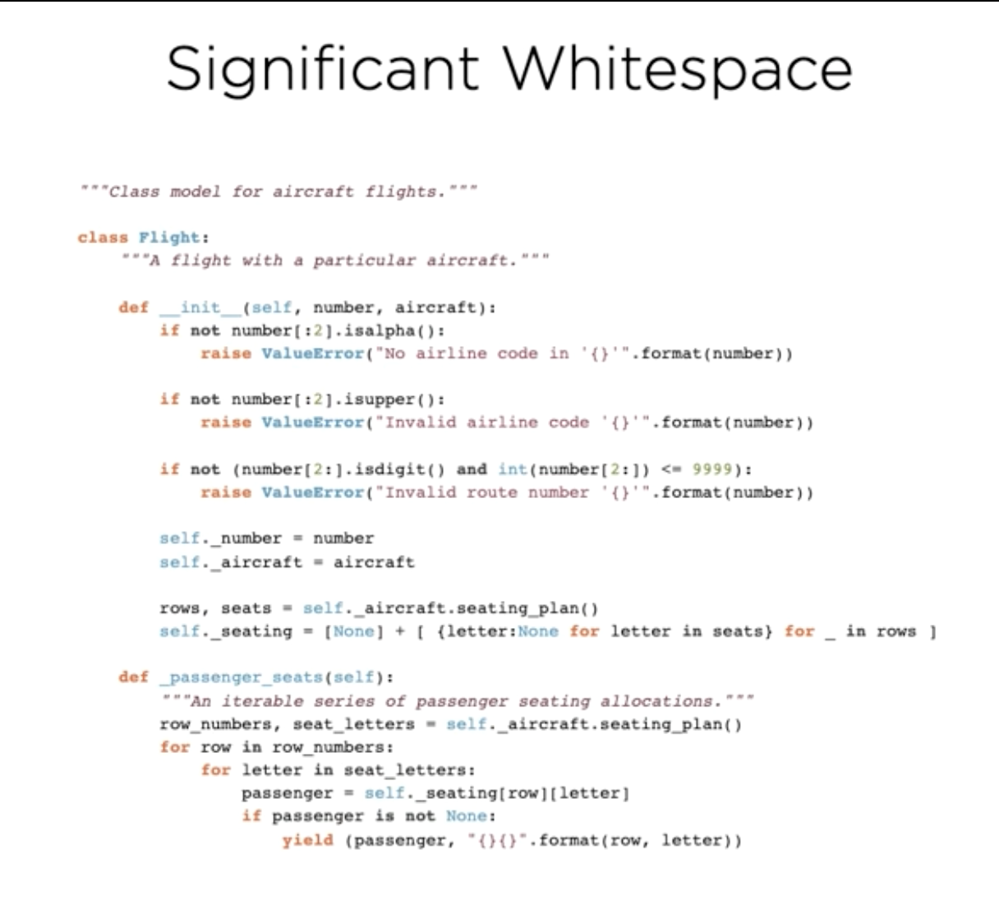

table of contents

- [course overview](#course-overview)
- [installing and starting python](#installing-and-starting-python)
  - [intstalling python](#intstalling-python)
  - [interactive python](#interactive-python)
    - [typing in the command line](#typing-in-the-command-line)
    - [how to exit REPL](#how-to-exit-repl)
  - [significant whitespace](#significant-whitespace)
  - [python culture](#python-culture)
    - [moment of zen 1: readbility counts](#moment-of-zen-1-readbility-counts)
  - [using the standard library](#using-the-standard-library)
    - [using the `math` module](#using-the-math-module)
      - [`from module_name import attribute_name`](#from-module_name-import-attribute_name)
      - [`from math import factorial as fac`](#from-math-import-factorial-as-fac)
  - [summary](#summary)
- [scalar types, operators, and control flow](#scalar-types-operators-and-control-flow)
  - [scalar types](#scalar-types)
    - [`integers`](#integers)
    - [`float`](#float)
    - [`None`](#none)
    - [`bool`](#bool)
  - [relational operators](#relational-operators)
    - [control flow](#control-flow)
      - [if-statement syntax](#if-statement-syntax)
        - [else-clause](#else-clause)
      - [while-loops](#while-loops)
        - [`break`](#break)
  - [summary](#summary-1)
- [introducing strings, collectons, and iteration](#introducing-strings-collectons-and-iteration)
  - [`str`](#str)
  - [`string literals`](#string-literals)
    - [newline](#newline)
    - [escape sequences](#escape-sequences)
    - [string features](#string-features)
    - [difference between string and string literal](#difference-between-string-and-string-literal)
  - [`bytes`](#bytes)
  - [`list`](#list)
  - [`dict`](#dict)
    - [dict literals](#dict-literals)
  - [`for-loop`](#for-loop)
  - [putting it all together](#putting-it-all-together)
  - [from REPL to IDE](#from-repl-to-ide)
  - [summary](#summary-2)
    - [strings](#strings)
    - [bytes](#bytes-1)
    - [lists](#lists)
    - [dicts](#dicts)
    - [for-loops](#for-loops)
- [modularity](#modularity)
  - [overview](#overview)
  - [modules](#modules)
  - [functions](#functions)
    - [naming special functions](#naming-special-functions)
  - [`__name__`](#__name__)
  - [the python execution model](#the-python-execution-model)
    - [module, script, or program?](#module-script-or-program)
      - [module](#module)
      - [python script](#python-script)
      - [python program](#python-program)
  - [command line arguments](#command-line-arguments)
  - [moment of zen 2: sparse is better than dense](#moment-of-zen-2-sparse-is-better-than-dense)
  - [docstrings](#docstrings)
  - [comments](#comments)
  - [shebang](#shebang)
  - [summary](#summary-3)
- [objects and types](#objects-and-types)
  - [overview](#overview-1)
    - [assigning to a variable](#assigning-to-a-variable)
      - [built-in `id()` function](#built-in-id-function)
    - [value vs. identity equality](#value-vs-identity-equality)
  - [passing arguments and returning values](#passing-arguments-and-returning-values)
    - [argument passing](#argument-passing)
      - [argument passing semantics](#argument-passing-semantics)
      - [replacing argument value](#replacing-argument-value)
      - [mutable arguments](#mutable-arguments)
      - [return semantics](#return-semantics)
  - [function arguments](#function-arguments)
    - [when are default values evaluated?](#when-are-default-values-evaluated)
  - [python's type system](#pythons-type-system)
  - [scopes](#scopes)
    - [scopes of words.py](#scopes-of-wordspy)
      - [global/module scope](#globalmodule-scope)
      - [local scope inside `fetch_words()`](#local-scope-inside-fetch_words)
    - [rebinding global names](#rebinding-global-names)
  - [moment of zen 3: special cases aren't special enough to break the rules](#moment-of-zen-3-special-cases-arent-special-enough-to-break-the-rules)
  - [everything is an object](#everything-is-an-object)
# course overview

the course is 100% applicable to python version `3.6` released in 2016.

it is not applicable to python version `3.7`  to `.10`

# installing and starting python

## intstalling python

use `python3` command on command line to launch python in your CLI

the triple arrow `>>>` displayed in the CLI means python is waiting for our input.

## interactive python

we can start using it immediately.

the interactive CLI environment is a `read, eval, print` loop

python will
1. **read** everything we type in
2. **evaluate** it 
3. **print** the result, and loop back to the beginning

this is also known as the `REPL` >>> the read, eval, print loop.

### typing in the command line

* can initialize variables in the cli and reference them
```py
>>> x = 5
>>> x
5
>>> 3 * x
15
```

* can use the `_` variable to reference the most recently printed value
```py
>>> 3 * x
15
>>> _
15
```

can also use the `_` variable in an expression
```py
>>> 3 * x
15
>>> _
15
>>> _ * 2
30
```
this is one of the very few obscure shortcuts in python

note: the `_` variable doesn't have any behavior in python scripsts or program. this functionality is only in the RE
some commands don't have return values

```py
>>> x = 5
```

we assigned the value of 5 to x and there was no return value from that command.

```py
>>> print('Hello, Python')
Hello, Python
```

this command printed the string `Hello, Python`

`print` is one of the biggest differences between Python 2 and Python 3.

- in Python 3, the parenthesis are **required**
  - `print("Python 3")`
  - this is because `print` in Python 3 is a function call

- in Python 2, the parenthesis are **not required**
  - `print "Python 2"`

### how to exit REPL

send the end-of-file control character, `CTRL-D` on mac/linux systems

`CTRL-Z`, then  `Enter` on windows systems

## significant whitespace

basic code structure

control flow structures
- for-loops
- while-loops
- if-statements

are all introducted by statements that are terminated by a **colon**, `:`

python will change the prompt to three dots `...` requesting that you provide the body of the for-loop.

example:

`for-loop`

```py
>>> for i in range(5):
...
```

leading whitespace is **syntactically significant** in python.

python uses **indentation levels** rather than curly braces `{}` to demarcate code blocks.

by convention, contemporary python code is indented by `4` spaces for each level. this can be accomplished by hitting the <kbd>Tab</kbd> key.

so, we provide those four spaces and a statement to form the body of our for loop.

```py
>>> for i in range(5):
...     x = i * 10
...     print(x)
```

our for-body is finished after our print(x)statement. to terminate our block of code, we must enter a blank line into REPL.

```py
>>> for i in range(5)
...     x = i * 10
...     print(x)
...
```

after doing do, our code is evaluated and executed and our prompt `>>>` returns after it is finished.

```py
>>> for i in range(5)
...     x = i * 10
...     print(x)
...
0
10
20
30
40
>>>
```

looking at more significant examples of code clearly demonstrate how indentation matters in differentiating different blocks of code.



the whitespace **must** match the structure of your program.

even with code removed, we can see different colored bars with different levels of indentation that visually help us see the levels of code.


each level of indentation is **typically** four spaces.

advantages to significant whitespace:

1. forces developers to write readable code 
2. no clutter with unnecessary braces
3. human and computer can't get our of sync

rules for indentation

1. prefer **four spaces**
2. **never** mix tabs and spaces
3. be **consistent** on consecutive lines
4. only deviate to **improve** readability

> "programming as Guido intended (or indented) it"

## python culture

development of python is managed thru PEPs, or `python enhancement proposals`

PEP 8 recommends we use four spaces for indentation of our code

PEP 20 describes the zen of python, the 20 aphorisms that describe the guiding principals of python, 19 of which are written down

it can also be access from the REPL by typing `import this`

```
The Zen of Python, by Tim Peters

Beautiful is better than ugly.
Explicit is better than implicit.
Simple is better than complex.
Complex is better than complicated.
Flat is better than nested.
Sparse is better than dense.
Readability counts.
Special cases aren't special enough to break the rules.
Although practicality beats purity.
Errors should never pass silently.
Unless explicitly silenced.
In the face of ambiguity, refuse the temptation to guess.
There should be one-- and preferably only one --obvious way to do it.
Although that way may not be obvious at first unless you're Dutch.
Now is better than never.
Although never is often better than *right* now.
If the implementation is hard to explain, it's a bad idea.
If the implementation is easy to explain, it may be a good idea.
Namespaces are one honking great idea -- let's do more of those!
```

### moment of zen 1: readbility counts

Readability Counts
- Clarity matters
- So readability makes
- For valuable code

## using the standard library

the standard library contains modules

you gain access to standard library modules by uding the `import` keyword

the basic method of importing a module is this syntax:  `import module_name`

example:

using the standard library's `math` module to perform some calculations

we can access something inside of a module with the syntax `module.attribute_name`

```py
>>> math.sqrt(81)
9.0
>>> 
```

how do we know which modules have certain attributes or methods?

REPL has a built-in `help` function that can retrieve any embedded documentation form objects for which it has been provided

```
>>> help
Type help() for interactive help, or help(object) for help about object.
>>> 
```

### using the `math` module

```
>>> help(math)
```

prints this to the console:

```
Help on module math:

NAME
    math

MODULE REFERENCE
    https://docs.python.org/3.8/library/math
    
    The following documentation is automatically generated from the Python
    source files.  It may be incomplete, incorrect or include features that
    are considered implementation detail and may vary between Python
    implementations.  When in doubt, consult the module reference at the
    location listed above.

DESCRIPTION
    This module provides access to the mathematical functions
    defined by the C standard.

FUNCTIONS
    acos(x, /)
        Return the arc cosine (measured in radians) of x.
    
    acosh(x, /)
        Return the inverse hyperbolic cosine of x.
    
    asin(x, /)
        Return the arc sine (measured in radians) of x.
...
```

we can scroll thru the list using the arrow keys on mac/linux or <kbd>Spacebar<kbd> on windows

press <kbd>Q</kbd> to exit the `help` browser and return to REPL.

we can use help to look up specific functions in modules, too.

```
>>> help(math.factorial)
Help on built-in function factorial in module math:

factorial(x, /)
    Find x!.
    
    Raise a ValueError if x is negative or non-integral.
(END)
```

again, press <kbd>Q<kbd> to return to REPL.

it can be very verbose to reference the same math module each time a function or method is used from it.

our calculation calculates how many different ways we can choose `k` number of items from `n` number of total items

example:

```py
>>> n = 5
>>> k = 3
>>> math.factorial(n) / (math.factorial(k) * math.factorial(n-k))
10.0
>>>
```

we had to repeat using the `math` module each time we referenced the `factorial` function from `math`

#### `from module_name import attribute_name`

instead, we can import **specific** functions from modules into the current namespace with the syntax `from math import factorial`

example:

```py
>>> from math import factorial
>>> factorial(n) / (factorial(k) * factorial(n-k))
10.0
```

it's an improvement, but is still a lot of code for such a simple expression. 

#### `from math import factorial as fac`

a third form of the `import`  statement allows us to rename the imported function with the syntax `from math import factorial as fac`

example:

```py
>>> from math import factorial as fac
>>> fac(n) / (fac(k) * fac(n-k))
10.0
```

this can be used to make code more readable or to avoid name clashes

as useful as it is, this style of the import statement should be used infrequently and judiciously

remember that when we used `factorial` by itself, it returned an `integer`

but when we performed a division calculation with multiple factorials, it's returning a `floating point integer`

this is because we have used python's `floating point division operator`, and single forward-slash `/`

we can improve our expression since we know it will only ever return integral results.

we can do this by using python's `integer division operator`, which is a double forward-slash `//` 

example:

```py
>>> fac(n) // (fac(k) * fac(k-n))
10
>>>
```

most programming languages would fail on the above expression for even moderately high values of `n`

this is because in most programming languages, regular signed integers can only store values less than 2<sup>31</sup> - 1, which equals `2147483647`

however, factorials growso fastthat the largest factorial that you can fit into a 32-bit signed integer is 12 factorial, since 13 factorial is too large.

in most-widely used programming languages, we would need more complex code or more sophisticated mathematics merely to compute how many ways there are to draw 3 fruit from a set of 13 fruits. 

python encounters no such problems and can compute with arbitrarily large integers limited only by the memory in my computer.

how many different pairs of fruit can we pick from 100 fruit?

to emphasize how large 100 factorial is, we calculated it in our console:

```py
>>> from math import factorial as fac
>>> fac(100)
93326215443944152681699238856266700490715968264381621468592963895217599993229915608941463976156518286253697920827223758251185210916864000000000000000000000000
>>> 
```

we can convert this integer to a text string and count the number of characters in it:

```py
>>> len(str(fac(100)))
158
>>> 
```

158 digits! that's a lot.

## summary

we learned
* how to download and install python
* starting python REPL
* evaluating simple expressiona and mathematic calculations in REPL
* the role of underscore in the REPL
  * the value of `_` in REPL is the result of the last evaluated expression
* how to make basic use of the `print()` function
  * that the printed output is a **side effect**  of the function, **not** a return value
* how to exit REPL
  * using <kbd>CTRL</kbd> + <kbd>Z</kbd> on windows or <kbd>CTRL</kbd> + <kbd>D</kbd> on Linux and macOS
* how python uses significant whitespace
  * code blocks are initiated  with a colon and comprise consecutive lines at the same indentation level
  * advantages of significant whitespace
    * clarity
    * consistency
  * rules for indentations
* python culture
  * the zen of python
    * can be printed in REPL by typing `import this` in REPL
  * "readability counts"
* importing standard library modules
    1. `import from`
       - importing an entire module
    2. `from module import name`
       - importing selected/specific elements of a module
    3. `from module import name as name2`
       - renaming imported elements
* using python's help system
* learned how to use python's `factorial` function from python's standard math library

# scalar types, operators, and control flow
## scalar types

python comes with a number of built-in  data types

these include **primitive** scalar types like `integers` as well as **collection** types like `dictionaries`

| Data Type  | Description                     | Example            |
| ---------- | ------------------------------- | ------------------ |
| `int`      | arbitrary precision integer     | `42`               |
| `float`    | `64-bit` floating point numbers | `4.2`              |
| `NoneType` | the `null` object               | `None`             |
| `bool`     | `boolean` logical values        | `true` and `false` |


### `integers`

python integers are **signed** and have, for all practical purposes, unlimited precision, meaning they can contain as many digits as you need.

integer literals are specified in decimal:

```py
>>> 10
10
>>> 
```

they may also be specific in `binary` with the `0b` prefix:

```py
>>> 0b10
2
>>>
```

or `octal` with the `0o` prefix:

```py
>>> 0o10
8
>>> 
```

or in `hexadecimal` with the `Ox` prefix:

```py
>>> 0x10
16
>>>
```

can also create integers with the `int` constructor function

```py
>>> int(3.5)
3
>>> 
```

- this can convert from other numeric types (like floats) to integers
- the rounding of integers is always rounded down towards zero

can also convert `strings` to `integers`

```py
>>> int("496")
496
>>> 
```

you can supply an optional number base when converting from a `string`

```py
>>> int("10000", 3)
81
>>> 
```

### `float`

floating point numbers are supported in python by the `float` type

python floats are implemented as `IEEE-754 double-precision` with `53-bits of binary precision`
- this is equalivalent to between 15 and 16 significant digits in decimal

any literal number containing a decimal is interpreted by python as a `float`

```py
>>> 3.125
3.125
>>> 
```

scientific notation can also be used. an example being the speed of light in meters per second.

```py
>>> 3e8
300000000.0
>>> 
```

for small numbers, like Planck's constant, 1.616 times 10<sup>-35</sup>

```py
>>> 1.616e-35
1.616e-35
>>> 
```

notice how it switched the display representation, that is, the format it prints to the REPL, to the most readable form.

as with integers, convert to floats from other numeric or string stypes  using the float constructor function

we can pass int values to the float constructor:

```py
>>> float(1)
1.0
>>>
```

we can also pass strings:

```py
>>> float("1")
1.0
>>> 
```

this is also how  we create the special floating point values `nan` or `not a number`

```py
>>> float("nan")
nan
>>>
```

as well as positive infinity and negative infinity

```py
>>> float("inf")
inf
>>> float("-inf")
-inf
>>> 
```

**NOTE: the result of any calculation involving an `int` and a `float` is promoted to a `float`.**

```py
>>> 3.0 + 1
4.0
>>> 
```

### `None`

python has a special `null` value called `None`, spelled with a capital `N`.

`None` is frequently used to represent the absence of a value.

the python REPL **never** prints `None` results, so typing `None` into the REPL has no effect

```py
>>> None
>>>
```

`None` can be assigned to variables just like an other object

we can check whether an object is `None` by using python's `is` operator

```py
>>> a = None
>>> a is None
True
>>>
```

### `bool`

the `bool` type represents boolean logical values (`True` and `False`) and plays an important role in several of python's control flow structures

there are two `bool` values, `True` and `False`, both spelled with the first letter capitialized

```py
>>> True
True
>>> False
False
```

there is also a `bool` constructor that can be used to convert from other types to `bool`

for integers, `0` is considered `falsy` and all other values, including negative numbers, `truthy`

```py
>>> bool(0)
False
>>> bool(42)
True
>>> bool(-1)
True
>>> 
```

the same behavior applies to `float` types, again where only `0` is considered `falsy`

```py
>>> bool(0.0)
False
>>> bool(0.207)
True
>>> bool(-1.117)
True
>>> 
```

whenc converting from collections, such as strings or lists, only empty values are considered `falsy`

for lists, the empty list is falsy

```py
>>> bool([])
False
>>>
```

while any non-empty list is `truthy`

```py
>>> bool([1, 5, 9])
True
>>> 
```

similarly, empty `strings` are `falsy`

```py
>>> bool("")
False
>>> 
```

while any other string is `truthy`

```py
>>> bool("Spam")
True
>>> 
```

the `bool` constructor may not behave how you would expect when passing in the strings `"True"` and `"False"`

```py
>>> bool("True")
True
>>> bool("False")
True
>>> 
```

since both are non-empty `strings`, both result in `True`

## relational operators

`bool` values are commonly produced by python's relational operators which can be used for comparing objects

| Description                      | Example |
| -------------------------------- | ------- |
| value equality / equivalence     | `==`    |
| value inequality / inequivalence | `!=`    |
| less-than                        | `<`     |
| greater-than                     | `>`     |
| less-than or equal to            | `<=`    |
| greater-than or equal to         | `>=`    |

two of the most widely used relational operators are pythons equality (`==`) and inequality (`!=`) tests

these test whether two objects are equivalent or inequivalent -- whether one can be used in place of the other or not.

```py
>>> g = 20
>>> g == 20
True
>>> g == 13
False
>>> g != 20
False
>>> g != 13
True
>>> 
```

we can also compare the order of quantities using the rich comparison operators

```py
>>> g < 30
True
>>> g <= 20
True
>>> g > 30
False
>>> g >= 20
True
>>> 
```

### control flow

conditional statements allow us to branch execution of our code based on the value of an expression

#### if-statement syntax

the **form** of the statement is the `if` keyword, followed by an `expression`, terminated by a colon `:` to introduce a new code block

```py
if expression:
    block
```

at the REPL:

```py
>>> if True:
...     print("It's true!")
... 
It's true!
>>> 
```

remember to terminate the block of code with a blank line!

if false, the code does not execute.

```py
>>> if False:
...     print("It's true!")
... 
>>> 
```

the expression used with the if-statement will be converted to a `bool`, just if the `bool` constructor had been used

so explicitly constructing a `bool` in the if-statement is exactly equivalent to using a bare string.

```py
>>> if bool("eggs"):
...     print("Yes please!")
... 
Yes please!
>>> if "eggs":
...     print("Yes please!")
... 
Yes please!
>>> 
```

thanks to this useful shorthand, explicit conversion to `bool` using the `bool` constructor is rarely used in python.

##### else-clause

optional block that goes in a block introduced by th else keyword followed by a colon `:` which is indented to the same level as the `if` keyword

```py
>>> h = 42
>>> if h > 50:
...     print("Greater than 50")
... else:
...     print("50 or smaller")
... 
50 or smaller
>>> 
```

for the `else` keyword in this case, we just omit the indentation after the three dots.

for multiple conditions, use python's `elif` keyword, which is a combined else-if. the zen of python reminds us that flat is better than nested.

```py
>>> if h > 50:
...     print("Greater than 50")
... elif h < 20:
...     print("Less than 20")
... else:
...     print("Between 20 and 50")
... 
Between 20 and 50
>>> 
```

the above is much easier to read than this:

```py
>>> if h > 50:
...     print("Greater than 50")
... else:
...     if h < 20:
...         print("Less than 20")
...     else:
...         print("Between 20 and 50")
... 
Between 20 and 50
>>> 
```

#### while-loops

while loops in python are introduced by the `while` keyword, followed by a `boolean` expression

just like the condition for if-statements, the expression is implicitly converted to a boolean value as if had been passed to the `bool` constructor

the while statement is terminated by a colon because it introduces a new block

```py
while expression:
    block
```

example loop that counts down from 5 to 1

```py
>>> while c != 0:
...     print(c)
...     c -= 1
... 
5
4
3
2
1
>>> 
```

new language feature is the **augmented assignment operator**, a minus sign followed up an equal sign to subtract one from the value of `c` on each iteration.

because the expressions are implicitly converted to a bool, we can also write the loop this way:

```
>>> while c:
...     print(c)
...     c -= 1
... 
5
4
3
2
1
>>> 
```

why? because
* c is truthy when initialized at 5 because 5 is != 0. 0 is a falsy value and would terminate the while loop. this repeats until the value of `c` reaches 0.

however, doing this may be considered "unpythonic" because referring back to the zen of python, "explicit is better than implicit"

we place higher value on the readability of the first form over the consision of the second form.

while-loops are often used in python where an infinite loop is required.

we can create an infinite loop in REPL that will never end, but we can terminate it with CTRL+C on mac

```py
>>> while True:
...     pass
... 
^C
Traceback (most recent call last):
  File "<stdin>", line 2, in <module>
KeyboardInterrupt
>>> 
```

##### `break`

python requires you to use `while True`and `break` together with an early exit facilitated by the `break` statement

the `break` statement jumps out of the inner-most executing loop to the line immediately after it

example of break:

```py
>>> while True:
...     response = input()
...     if int(response) % 7 == 0:
...             break
... 
8
9
10
14
>>> 
```

1. we write an infinite loop that asks the user for input using the `input()` function
2. we assign the value that the user enters in that the input function returns to a variable called `response`
3. we write an if-statement that first converts the input in the response variable to an integer and checks if the input is divisible by  7 using the modulo operator (`%`)
   1. if it is, we break out of the loop
   2. if it is not, our program asks the user for another input.
4. the loop continues to ask for input until correct input is entered, or we terminate the program

## summary

we..
* looked at data types `int`, `float`, `None`, and `bool`
* reviewed relational operators for equivalence and ordering
* wrote conditional code containing if-elif-else statements
* used while-loops to ask the user for input with an infinite `while True:` loop
* learned that while-loop expressions, like if-statements, are converted to `bools`
* learned how interrupt/terminate infinite loops with <kbd>CTRL</kbd> + <kbd>C</kbd> on macOS and that doing this generates a `KeyboardInterrupt` exception
* learned how to break out of loops using the `break` statement
  * observed that `break` only exits the **inner-most executing loop**
  * and that it takes execution to the first statement following the loop that we broke out of
* looked at **augmented assignment operators** like `-=` and `+=` for modifying iterator/counter variables in-place
* requesting text input from the user with the `input()` function

# introducing strings, collectons, and iteration

## `str`

strings in python have the data type `str` and we have already been using them extensively.

strings are a **sequence of Unicode code points**. we can think of code points as being like characters, although they are not strictly equivalent.

the sequence of characters in a python string is **immutable**, meaning that once a string has been constructed, you cannot modify its contents.

`literal strings` in python are delimited by single quotes or double quotes.
 - this differs from `C` where `char`s can only be delimited by single-quotes (`'A'`) and `string`s can only be delimited by double quotes (`"This is a string"`)
   - and technically, `string` is not a data type in `C`, but is rather an array of `char`s terminated by the `null` character (`\0`) represented like so: 
        ```c
        char greetings[] = "Hello World!"
        ```

```py
>>> 'This is a string'
'This is a string'
>>> "This is also a string"
'This is also a string'
>>> 
```

no matter which type of quotes you decide to use for strings in python, you must be consistent

you can't use single quotes on one side and double quotes on the other, like below:

```py
>>> 'This is also a string"
  File "<stdin>", line 1
    'This is also a string"
                           ^
SyntaxError: EOL while scanning string literal
>>> 
```

this allows us to use single quotes where they apply in normal english in a string and avoids from having to escape characters.

```py
>>> "It's a good thing"
"It's a good thing"
>>> '"Yes!", he said, "I agree!"'
'"Yes!", he said, "I agree!"'
>>> 
```

## `string literals`

adjacent string literals are concatenated by the python compiler into a single string, which can be useful for nicely formatted code

```py
>>> "first" "second"
'firstsecond'
>>> 
```

### newline

if you want a string literal containing new lines, we have two options

1. use multi-line strings
    - spread the string literal across multiple lines

multi-line strings are delimited by three quote characters rather than one

```py
>>> """This is
... a multiline
... string"""
'This is\na multiline\nstring'
>>> 
```

when the string is echoed back to us in REPL, the new lines are represented by the `\n` escape character

we can also use three single-quotes

```py
>>> '''So 
... is
... this.'''
'So\nis\nthis.'
>>> 
```

2. use escape sequences
    - embed escape sequences in a single-line string literal

as an alternative, we can just embed the `\n` characters into the string literal ourselves

to get a better sense of what we are representing, we can use the print function to see the string

```py
>>> m = 'This string\nspans multiple\nlines'
>>> m
'This string\nspans multiple\nlines'
>>> print(m)
This string
spans multiple
lines
>>> 
```

python 3 translates `\n` to the appropriate, native newline sequence for your platform/OS

### escape sequences

we can use the escape sequence for other purposes, too like:

1. incorporating tabs with `\t`
2. allowing us to quote characters within strings
```py
>>> "This is a \" in a string"
'This is a " in a string'
>>> 'This is a \' in a string'
"This is a ' in a string"
>>> 
```

to put a backslash in a string, we escape the backslash with itself

to reassure ourselves that there really only is one backslash in that string, we can again use the print function

```py
>>> k = 'A \\ in a string'
>>> k
'A \\ in a string'
>>> print(k)
A \ in a string
>>> 
```

### string features

you can create a `raw string` in python, useful or things like regex patterns or file paths that use backslashes extensively

raw strings **don't support any escape sequences** and are essentially *what you see is what you get*

to create a raw string, prefix the opening quote with a lowercase `r`

```py
>>> path = r'C:\Users\Merlin\Documents\Spells'
>>> path
'C:\\Users\\Merlin\\Documents\\Spells'
>>> print(path)
C:\Users\Merlin\Documents\Spells
>>> 
```

we can use the string constructor to create string representations of other types, such as `integers` or `floats`

```py
>>> str(6.02e23)
'6.02e+23'
>>> 
```

strings in python are what are called sequence types, which means they support certain common operations for querying sequences

we can access individual characters using square bracket notation with an integer 0-based index

```py
>>> s = 'parrot'
>>> s[4]
'o'
>>> 
```

in contract to other programming languages, there is no separate character type distinct from the `string` type. for example, `C` has the `char` data type and while it doesn't technically have a `string` type, a `string` is an array of `char`s

```c
char greetings[] = "Hello World!";
```

this means that even though we are accessing only one character of a string in our example above, it is still of the `string` type. we can test this

```py
>>> type(s[4])
<class 'str'>
>>> 
```

string objects also support a  wide variety of operations/methods

we can list those methods using the help function on the string type

we will try the `capitalize` method

like other languages, we use object/dot notation to call methods on objects

```py
>>> c = "oslo"
>>> c.capitalize()
'Oslo'
>>> 
```

remember that strings are **immutable**, so the `capitalize` method didn't modify `c` in-place. rather, it returned a **new** string.

we can verify by this by displaying `c` again in REPL, which remains unchanged

```py
>>> c
'oslo'
>>> 
```

strings (`str`) are unicode-capable, meaning we can use them with international characters easily, even in string literals.

this is because the default source code for python 3 is `UTF-8`.

if we have access to Norwegian characters, we can store them in a string literal without issue

```py
>>> "Vi er så glad for å høre og lære om Python!"
'Vi er så glad for å høre og lære om Python!'
>>>
```

we can even write the hexadecimal representations of Unicode code poinst as an escape sequence prefixed by `/u`, such as:

```py
>>> "Vi er s\u00e5 glad for \u00e5 h\xf8re og l\u00e6re om Python!"
'Vi er så glad for å høre og lære om Python!'
>>> 
```

similarly, we can use thee `\x` escape sequence followed by aa two-character hexadecimal string or an escaped octal string to include Unicode characters in a string literal

```py
>>> '\xe5'
'å'
>>> '\345'
'å'
>>> 
```

there are no such Unicode capabilities in the otherwise similar `bytes` type

### difference between string and string literal

> A string literal is what you type into your source code. The string value is what gets output when you print it.

[Source]a(https://stackoverflow.com/questions/61975353/what-is-the-difference-between-string-literals-and-string-values#:~:text=A%20string%20literal%20is%20what,output%20when%20you%20print%20it)

## `bytes`

data type for sequences of bytes

bytes are very similar to strings

bytes are sequences of bytes

they are used for raw binary data and fixed-width single-byte character encodings such as ASCII

as with strings, they have a simple literal form using quotes, the first of which is prefixed by a lowercase `b`

```py
>>> b'data'
b'data'
>>> b"data"
b'data'
```

there is also a bytes constructor, but it is an advanced feature which we won't cover in this course.

at this point, it's our goal to recognize bytes literals and understand that they support most of the same methods as `str` such as

1. indexing, which returns the integer value of the specified byte
    ```py
    >>> d = b'some bytes'
    >>> d[0]
    115
    >>>
    ```
2.  splitting, which returns a list of `bytes` objects
    ```py
    >>> d.split()
    [b'some', b'bytes']
    >>> 
    ```

to convert between bytes and strings, we must know the encoding of the byte sequence used to represent the string's Unicode code points as bytes.

python supports a wide variety of encodings

starting with a pangram (a sentence that contains all of the letters of the alphabet of the language it was written in) in Norwegian, we can encode that using `UTF-8` into a bytes object

```py
>>> norsk = "Jeg begynte å fortære en sandwich mens jeg kjørte taxi på vei til quiz"
>>> data = norsk.encode('utf8')
>>> data
b'Jeg begynte \xc3\xa5 fort\xc3\xa6re en sandwich mens jeg kj\xc3\xb8rte taxi p\xc3\xa5 vei til quiz'
>>> 
```

notice how the norwegian characters have each been rendered as pairs of bytes?

we can reverse the process using the `decode` method of the bytes object. we must supply the correct encoding

we can do this and check that they are the same as our beginning pangram

```py
>>> norwegian = data.decode('utf8')
>>> norwegian == norsk
True
>>> norwegian
'Jeg begynte å fortære en sandwich mens jeg kjørte taxi på vei til quiz'
>>> 
```

**this is crucial to understand, since files and network resources such as HTTP responses are transmitted as byte streams, whereas we often prefer to work with the convenience of Unicode strings**

## `list`

python lists are sequences of objects

unlike strings, lists are mutable, insofar as the elements inside of them can be replaced or removed, and new elements can be inserted or appended.

lists are a workhorse of python data structures

literal lists are delimited by square brackets `[]`, separated by commas.

```py
>>> [1, 2, 3]
[1, 2, 3]
>>> 
```

we can also have a list of strings, too

we can access elements in lists with square bracket notation on a zero-based index, and can replaced items in lists to other values.
```py
>>> a = ["apple", "orange", "pear"]
>>> a[0]
'apple'
>>> a[1] = 7
>>> a
['apple', 7, 'pear']
>>> 
```

lists can contain multiple different data types. for example,now we have a list that contains strings and an integer

it's sometimes useful to create an empty list, which we do by using empty square brackets

```py
>>> b = []
>>> 
```

we can also modify the list in other ways

we can add some floats to the end of the list using the `append()` method

```py
>>> b.append(1.618)
>>> b
[1.618]
>>> b.append(1.414)
>>> b
[1.618, 1.414]
>>> 
```

there is also a `list` constructor which can be used to create lists from other collections such as strings

```py
>>> list("characters")
['c', 'h', 'a', 'r', 'a', 'c', 't', 'e', 'r', 's']
>>> 
```

though the python whitespace rules may seem pretty rigid, there is some flexibility

for example, if at the end of the line, brackets, braces, or parenthesis are unclosed, you can continue on the next line

```py
>>> c = ['bear',
...     'giraffe',
...     'elephant',
...     'caterpillar',]
>>> c
['bear', 'giraffe', 'elephant', 'caterpillar']
>>> 
```

this can be useful for long literal collections or to simply improve readability.

see also how we're allowed to use an additional comma after the last element
- this is an important maintainability feature 

## `dict`

a `dict` or dictionary, maps keys to values, and in other languages is known as a `map` or an `associative array`

### dict literals

literal dictionaries are created using curly braces containing key-value pairs

```py
{k1: v1, k2: v2}
```

each pair is separated by a comma, and each pair contains a key and a value

`k1` being the first key, `v1` being the value of the first key

using a dict to create a simple telephone directory:

```py
>>> d = {'alice': '878-8728-922', 'bob': '256-5262-124', 'eve': '1982321-787'}
>>> 
```

we can retrieve items from the `dict` by using the square bracket notation

```py
>>> d['alice']
'878-8728-922'
>>> 
```

we can update the values associated with the key by "assigning thru the square brackets"

```py
>>> d = {'alice': '878-8728-922', 'bob': '256-5262-124', 'eve': '1982321-787'}
>>> d['alice'] = '966-4532-6272'                                    
>>> d
{'alice': '966-4532-6272', 'bob': '256-5262-124', 'eve': '1982321-787'}
>>> 
```

if we assign a value to a key that has not yet been added, a new key is created.

```py
>>> d
{'alice': '966-4532-6272', 'bob': '256-5262-124', 'eve': '1982321-787'}
>>> d['charles'] = '334-5551-913'
>>> d
{'alice': '966-4532-6272', 'bob': '256-5262-124', 'eve': '1982321-787', 'charles': '334-5551-913'}
>>> 
```

as of python 3.7, entries are required to be kept in the order in which they were inserted. prior to 3.7, the entries in the dictionary can't be relied upon to be stored in any particular order.

similiarly, empty dictionaries can be created using empty curly braces

```py
>>> e = {}
>>> 
```

## `for-loop`

visit each item in an iterable sequence

they request items one by one from a collection, or more strictly, an **iterable series**, and assign them to a variable that we specify.

```py
for item in iterable:
    ...body...
```

example:

```py
>>> cities  = ["London", "New York", "Paris", "Oslo", "Helsinki"]
>>> for city in cities:
...     print(city)
... 
London
New York
Paris
Oslo
Helsinki
>>> 
```

if you iterate over `dictionaries`, you can get the keys, which you can then use within the for-loop to retrieve values from the dictionary

```py
>>> colors = {'crimson': 0xdc143c, 'coral': 0xff7f50, 'teal': 0x008080}
>>> for color in colors:
...     print(color, colors[color])
... 
crimson 14423100
coral 16744272
teal 32896
>>> 
```

note that we used the ability of the built-in `print` function to accept multiple arguments. we pass the key and the value for each color separately

see also how the color codes are returned to us in decimal

## putting it all together

putting it all together -- we will write a program that fetches some text on the internet using a python standard library function called `urlopen`

1. we have to import url open from the request module within the standard library `urllib` package
2. we call the `urlopen` function with the url to our story
3. we will then create an empty list which will eventually hold all of the words from the text
4. write a for-loop which will work through and read the story
   - this will work thru the story line by line, and assign each literal line from the `story` to the variable called `line`
5. it so happens that the HTTP request we made returns iterative lines of texts in this way, so the for-loop will retrieve one line of text at a time
6. for each line of text, use the split method to divide it into words on whitespace boundaries
7. use a second for-loop inside of the first to iterate over this list of words, appending each in turn to the accumulating story words list
8. when finished reading the url, we need to close our handle it, `story`, using `story.close`
9. view the value of the `story_words`

```py
>>> from urllib.request import urlopen
>>> story = urlopen('http://sixty-north.com/c/t.txt')

>>> 
>>> story_words = []
>>> for line in story:
...     line_words  = line.split()
...     for word in line_words:
...             story_words.append(word)
... 
>>> story.close()
>>> story_words
[b'It', b'was', b'the', b'best', b'of', b'times', b'it', b'was', b'the', b'worst', b'of', b'times', b'it', b'was', b'the', b'age', b'of', b'wisdom', b'it', b'was', b'the', b'age', b'of', b'foolishness', b'it', b'was', b'the', b'epoch', b'of', b'belief', b'it', b'was', b'the', b'epoch', b'of', b'incredulity', b'it', b'was', b'the', b'season', b'of', b'Light', b'it', b'was', b'the', b'season', b'of', b'Darkness', b'it', b'was', b'the', b'spring', b'of', b'hope', b'it', b'was', b'the', b'winter', b'of', b'despair', b'we', b'had', b'everything', b'before', b'us', b'we', b'had', b'nothing', b'before', b'us', b'we', b'were', b'all', b'going', b'direct', b'to', b'Heaven', b'we', b'were', b'all', b'going', b'direct', b'the', b'other', b'way', b'in', b'short', b'the', b'period', b'was', b'so', b'far', b'like', b'the', b'present', b'period', b'that', b'some', b'of', b'its', b'noisiest', b'authorities', b'insisted', b'on', b'its', b'being', b'received', b'for', b'good', b'or', b'for', b'evil', b'in', b'the', b'superlative', b'degree', b'of', b'comparison', b'only']
>>> 
```

notice that each of the single-quoted words is prefixed by a lowercase `b`, meaning we have a list of `bytes` objects, where we would have preferred a list of strings

why did we get them?
- remember that the HTTP request transferred raw bytes (bytes literals) to us over the network. to get a list of strings, we need to decode the bytes using bytes.decode() to get Unicode strings

adding the decode method on each bytes literal line of next now returns us strings as expected

```py
>>> story = urlopen('http://sixty-north.com/c/t.txt')
>>> story_words = []
>>> for line in story:
...     line_words  = line.decode('utf8').split()
...     for word in line_words:
...             story_words.append(word)
... 
>>> story_words
['It', 'was', 'the', 'best', 'of', 'times', 'it', 'was', 'the', 'worst', 'of', 'times', 'it', 'was', 'the', 'age', 'of', 'wisdom', 'it', 'was', 'the', 'age', 'of', 'foolishness', 'it', 'was', 'the', 'epoch', 'of', 'belief', 'it', 'was', 'the', 'epoch', 'of', 'incredulity', 'it', 'was', 'the', 'season', 'of', 'Light', 'it', 'was', 'the', 'season', 'of', 'Darkness', 'it', 'was', 'the', 'spring', 'of', 'hope', 'it', 'was', 'the', 'winter', 'of', 'despair', 'we', 'had', 'everything', 'before', 'us', 'we', 'had', 'nothing', 'before', 'us', 'we', 'were', 'all', 'going', 'direct', 'to', 'Heaven', 'we', 'were', 'all', 'going', 'direct', 'the', 'other', 'way', 'in', 'short', 'the', 'period', 'was', 'so', 'far', 'like', 'the', 'present', 'period', 'that', 'some', 'of', 'its', 'noisiest', 'authorities', 'insisted', 'on', 'its', 'being', 'received', 'for', 'good', 'or', 'for', 'evil', 'in', 'the', 'superlative', 'degree', 'of', 'comparison', 'only']
>>> 
```

## from REPL to IDE

the REPL is good for short-lived work and experimentation

using an IDE is recommended for larger/longer-lived projects, which we will use next

we will learn how to move this code into a python module so it can be more easily worked with in a text editor

## summary

### strings
- single and multi-line literals
- concatenation of adjacent literals
- universal newlines (`\n`)
  - appropriately translated to the native newline during IO
- escape sequences
- raw strings, with R prefix can be used to suppress the escaping mechanism
- use `str` constructor to convert other types to strings
- access individual characters with square bracket notation/indexing
- rich API
- string literals can contain Unicode as of python 3

### bytes
- sequence of bytes rather than codepoints
- literals prefixed with lowercase `b`
- use `str.encode()` and `bytes.decode()` for conversion to and from bytes, respectively, in both cases passing in the encoding as a string argument, which we must know in advance


### lists
- mutable, heterogeneous sequences
- literals delimited by square brackets
- literal items separated by commas
- access elements with square bracket notation
- elements can be replaced by assigning to an index. this is not possible with strings. strings are immutable in this way.
- grow lists with append()
- use `list` constructor to create lists from other sequences


### dicts
- associate keys with values
- literals are delimited by curly braces
- key-value pairs are separated by commas
- keys are separated from values by colons

### for-loops
- bind each item from an iterable one at a time to a variable

# modularity

## overview

modularity is an important concept in software engineering that allows us to reuse pieces of code and functionality across an application/environment

one of the most common uses of modularity is with reusable functions

we can use self-contained, reusable pieces to solve problems

we will learn how modules can be used from other modules, so as long as we don't introduce circular dependencies

we will also learn more about importing modules

executing programs or scripts

python execution module

make programs executable

we will be starting with the code we had from the last section that retrieved text from a URL with an HTTP request

```py
from tkinter import W
from urllib.request import urlopen

story = urlopen('http://sixty-north.com/c/t.txt')
story_words = []

for line in story:
    line_words = line.decode('utf-8').split()
    for word in line_words:
        story_words.append(word)

story.close()
```

## modules

our module can also be used in the REPL by importing it.

in order for us to import it, we need to have launched REPL using the `python3` command in our terminal while in the parent folder/directory of the file we want to import, or as far as I know. i tried a file path /corepy/words and it didn't work

after importing our file into the REPL, our code was executed immediately. we'll need to make it more modular to stop this from happening and as a result, we'll need to put our code into a function.

## functions

functions are defined using the `def` keyword, followed by the function name, an argument list in parenthesis, and a colon to start a new block

the code inside the function block must be indented

we use the `return` keyword to return a value from a function

example:

```py
>>> def square(x):
...     return x * x
... 
>>> square(8)
64
>>> 
```

functions aren't required to explicitly return a value though. perhaps, they perform side-effects such as our `launch_missiles` function that prints text, but doesn't have a return value

```py
>>> def launch_missiles():
...     print("Missiles launched!")
... 
>>> launch_missiles()
Missiles launched!
>>> 
```

it's good practice to prefer functions which return values rather than cause side-effects

we can return early from a function by using the `return` keyword with no parameter

both the return statement without a parameter, as well as the **implicit return** at the end of a function actually causes the function to return `None`

but, the REPL doesn't display `None` results, so we don't see them.

by capturing the returned value/object in a variable, we can test for the `None` value in REPL:

```py
>>> def even_or_odd(n):
...     if n % 2 == 0:
...             print("even")
...             return
...     print("odd")
... 
>>> w = even_or_odd(31)
odd
>>> w is None
True
>>> 
```

another example:

```py
>>> def nth_root(radicand, n):
...     return radicand ** (1/n)
... 
>>> nth_root(16, 2)
4.0
>>> nth_root(27, 3)
3.0
>>> 
```

see how the calls of the function evaluate value of the returned expression

### naming special functions

in python, many language feaatures are implemented or controlled using specially named objects or functions.

these special names generally have two leading and two trailing underscores

`__feature__`

this makes them visually distinct, making it easy to remember and unlikely to collide with other names.

but it does make them hard to pronounce.

as a result, we result to using the term `dunder` when pronouncing these names

`dunder` is a portmanteau of the term `double underscore` and we will use it to refer to any name with leading and trailing underscores

for example:

* when we talk about `__name__`, or underscore underscore name underscore underscore, we'll say `dunder name`

## `__name__`

we will now define a new function called `fetch_words` with our code from our previous section that fetched the words from the txt file on the internet.

now, our file looks like this:

```py
from urllib.request import urlopen

def fetch_words():
    story = urlopen('http://sixty-north.com/c/t.txt')
    story_words = []

    for line in story:
        line_words = line.decode('utf-8').split()
        for word in line_words:
            story_words.append(word)

    story.close()

    for word in story_words:
        print(word)
```

now that we have defined this as a function and we run `import words` again, we no longer automatically execute our script. in order to run it, we now need to call it on the words module with `words.fetch_words()`

```py
>>> import words
>>> words.fetch_words()
It
was
the
'''words omitted for spacing'''
of
comparison
only
>>> 
```

the use of the `.` is qualifying the function name with the module name. alternatively, we can import a specific function using a different form of the import statement, `from words import fetch_words`

having imported ou `fetch_words` function directly into our REPL session, we are able to call `fetch_words` without the dot notation

this works as expected

```py
>>> from words import fetch_words
>>> fetch_words()
It
was
the
'''words omitted for spacing'''
of
comparison
only
>>> 
```

but what happens if we try to run the moduile directly from our OS terminal/shell prompt?

```shell
$ python words.py
$
```

no words are printed, which is because all the module does now is define a function and then exit -- the function is never called. we would prefer if the module printed something when we executed it.

to make a module from w hich we can usefully import functions into the REPL and which can be run as a script, we need to learn a new python idiom

`__name__` (dunder name)

a specially named variable allowing us to **detect** whether a module is run as a script or imported into another module

to see how, add `print(__name__)` at the end of our `words.py` file., outside of the `fetch_words` function

when we then re-import words into REPL, we get this:

```py
>>> import words
words
>>> 
```

when imported for the first time, dunder name does evaluate to the  module's name

if we run it again, we get no output. why? because module code is only executed once when the module is first imported

```py
>>> import words
words
>>> import words
>>>
```

let's try running it again as a script from the shell

```shell
$ python3 words.py
__main__
$
```

now, the special dunder name (`__name__`) variable is equal to the string dunder main (`__main__`)

why? python sets the value of dunder name differently depending on how our module is being used. 

the **key idea** being introduced here is that our module can use this behvaior **to decide how it should behave** 

if we replace the print function call with an if-check that checks if the dunder name variable is == to dunder main, we will call the fetch_words function

```py
...
if __name__ == '__main__':
    fetch_words()
```

if dunder name is not equal to dunder main, the module knows it's being imported into another module and won't be executed, and so only **defines** the fetch_words function without executing it.

now we are able to safely import our module without unintentionally executing our function:

```py
>>> import words
>>> 
```

and we can usefully run our module as a script:

```shell
$ python words.py
It
was
the
### words omitted for spacing ###
of
comparison
only
$
```

## the python execution model

`def` is a statement, which when executed in sequence with the other top-level model scope code, causes the code within the function to be bound to the name of the function

whem modules are imported or run, **all** of the top-level statements are run, and this is by the means which the function within the module namespace are defined

### module, script, or program?

#### module
- convenient import with API
- any `.py` file constitutes a python module

#### python script
- convenient execution from the command line

#### python program
- perhaps is composed of many python modules


strongly recommended to even making simple scripts importable because it eases development and testing so much if you can access your code from within the REPL

likewise, even modules which are only evermeant to be imported in production settings benefit from having executable test code.

for this reason, nearly all modules we create have this form of defining one or more importable functions with a postscript to facilitate execution

## command line arguments

we will modify our words.py file to moduilarize more of the program

we
* added a print_words function that prints the story words now returned by the fetch words function
* added a main function that can be called when the program is run in the terminal/shell
* added the call of the `main` function in the if-check on the dunder name variable if it is equal to `__main__`

our code now looks like this:

```py
...
        for word in line_words:
            story_words.append(word)

    story.close()
    return story_words

def print_words(story_words):
    for word in story_words:
        print(word)

def main():
    words = fetch_words()
    print_words(words)    

if __name__ == '__main__':
    main()
```

we can now test this new functionality in the REPL with a few new forms of the import statement

1. `from words import (fetch_words, print_words)
   - allowing you to import multiple objects from a module using a comma-separated list. the parenthesis are **optional**. the list is allowed to bread over multiple lines if it gets too long.
   - is likely the most widely-used form of the import statement

example:

```py
>>> from words import (fetch_words, print_words)
>>> print_words(fetch_words())
It
was
the
... '''words omitted'''
of
comparison
only
>>> 
```

2. `from words import *`
   - imports everything from a module using an asterisk wildcard (`*`)
   - this form is recommended only for casual use at the REPL, as it could have unintended consequences in programs since what is now imported is potentially beyond your control. issues such as namespace clashes at a future time is just one example

example:

```py
>>> from words import *
>>> fetch_words()
['It', 'was', 'the', 'best', 'of', 'times', 'it', 'was', 'the', 'worst', 'of', 'times', 'it', 'was', 'the', 'age', 'of', 'wisdom', 'it', 'was', 'the', 'age', 'of', 'foolishness', 'it', 'was', 'the', 'epoch', 'of', 'belief', 'it', 'was', 'the', 'epoch', 'of', 'incredulity', 'it', 'was', 'the', 'season', 'of', 'Light', 'it', 'was', 'the', 'season', 'of', 'Darkness', 'it', 'was', 'the', 'spring', 'of', 'hope', 'it', 'was', 'the', 'winter', 'of', 'despair', 'we', 'had', 'everything', 'before', 'us', 'we', 'had', 'nothing', 'before', 'us', 'we', 'were', 'all', 'going', 'direct', 'to', 'Heaven', 'we', 'were', 'all', 'going', 'direct', 'the', 'other', 'way', 'in', 'short', 'the', 'period', 'was', 'so', 'far', 'like', 'the', 'present', 'period', 'that', 'some', 'of', 'its', 'noisiest', 'authorities', 'insisted', 'on', 'its', 'being', 'received', 'for', 'good', 'or', 'for', 'evil', 'in', 'the', 'superlative', 'degree', 'of', 'comparison', 'only']
>>> 
```

we can also print any list of words by calling print_words

```py
>>> print_words(['Any', 'list', 'of', 'words'])
Any
list
of
words
>>> 
```

and we can run the main program, which will fetch our words and print them like we have seen before.

notice that the print_words function doesn't care about the types of items in the list

```py
>>> print_words([1, 7, 3])
1
7
3
>>>
```

as a result, maybe print_words isn't the best name. it prints anything in a list, and even any iterable , as shown below, like a string

```py
>>> print_words("i am a string")
i
 
a
m
 
a
 
s
t
r
i
n
g
>>> 
```

it's a good idea to rename it to something more generic like `print_items`, and changing the variable names in the functino to suit the change we made

here is our code now:

```py
        for word in line_words:
            story_words.append(word)

    story.close()
    return story_words

def print_items(items):
    for item in items:
        print(item)

def main():
    words = fetch_words()
    print_items(words)    

if __name__ == '__main__':
    main()
```

dynamic typing is what allows us this degree of flexibility.

another modification we can make to our code is to replace the hard-coded URL with a URL we can pass in instead.

now, our code looks like:

```py
def fetch_words(url):
    story = urlopen(url)
    story_words = []

    for line in story:
        line_words = line.decode('utf-8').split()
        for word in line_words:
            story_words.append(word)

    story.close()
    return story_words

...
```

but now, we will need to accept the URL as a command-line argument

access to the command-line arguments in Python is through the attribute of the `sys` module called `argv`, which is a list of strings. this shares the same name as the main function argument `argv` in `C`

in order to use it, we must first import the sys module at the top of our program.

```py
import sys
from urllib.request import urlopen
...
```

then, we need to get the **second** argument with an index of `1` from the list, just like we would in C.

the first arg at index 0, just like `C`, is the name of the program, and the second arg, index 1, is the first argument you passed to the program

```
>>> exampleProgram firstArgument
    ^ argv[0]      ^ argv[1]
```

and now our main function looks like:

```py
def main():
    url = sys.argv[1]
    words = fetch_words(url)
    print_items(words)
```

running this now works as expected as well:

```shell
$ corepy % python3 words.py http://sixty-north.com/c/t.txt
It
was
the
... # words omitted
of
comparison
only
$ corepy % 
```

this looks fine until we realize that we can't usefully test `main` any longer from the REPL since it referes to `argv[1]` which is unlikely to have any useful value in the REPL environment

the solution is to allow the argument list to be passed as a formal argument to the main function using `sys.argv` as the actual parameter if the dunder name equals dunder main block.

here is the change:

before:

```py
...
def main():
    url = sys.argv[1]
    words = fetch_words(url)
    print_items(words)    

if __name__ == '__main__':
    main()
```

after:

```py
def main(url):
    words = fetch_words(url)
    print_items(words)    

if __name__ == '__main__':
    main(sys.argv[1])
```

we have ensured that our functionality will now work regardless if we use the REPL or the command line. if we use the REPL, it will work as expected with a normal URL. if we use it from the command line, the dunder name will be dunder main and will grab `argv[1]` as the argument instead!

## moment of zen 2: sparse is better than dense

our top-level functions have two lines between them -- this is conventional for modern python code.

> Two between functions 
> That is the number of lines
> PEP8 recommends

according to the PEP8 style guide, it is customary to use two balnk lines between module-level functions 

we use single blank lines for logical breaks within functions

## docstrings

we saw that it was possible to ask for help at the REPL for help with modules, how can we add our own documentation to our own modules?

`docstrings`

- literal strings which document functions, modules, and classes
- they must be the first statement in the blocks for these constructs

we use triple-quoted strings, even for single-line docstrings because they can be easily expanded to add more detail.

referenced in PEP 257, official python convention for docstrings, although not widely adopted.

tools such as `Sphinx` are available to create HTML documentation from Python docstrings

our docstrings format is the form presented in Google's Python Style Guide since it is amenable to being machine parsed while still remaining readable at the console.

our fetch_words function looks like this now, with our docstrings added:

```py
def fetch_words(url):
    """Fetch a list of words from a URL.
    
    Args:
        url: The URL of a UTF-8 text document.

    Returns: A list of strings containing the words from the document.
    """
    story = urlopen(url)
    story_words = []

    for line in story:
        line_words = line.decode('utf-8').split()
        for word in line_words:
            story_words.append(word)

    story.close()
    return story_words
```

accessing our function using help from REPL:

```py
>>> from words import *
>>> help(fetch_words)
Help on function fetch_words in module words:

fetch_words(url)
    Fetch a list of words from a URL.
    
    Args:
        url: The URL of a UTF-8 text document.
    
    Returns: A list of strings containing the words from the document.
(END)
```

our docstrings print as we saw before with other modules and their functions :)

then, we add the other docstrings to the rest of our functions.

additionally, we add a module docstring.
- they should be placed at the beginning of the module before any statements

now our module looks like this:

```py
"""Retrieve and print words from a URL.

Usage:

    python3 words.py <URL>
"""

import sys
from urllib.request import urlopen


def fetch_words(url):
    """Fetch a list of words from a URL.
    
    Args:
        url: The URL of a UTF-8 text document.

    Returns: A list of strings containing the words from the document.
    """
    story = urlopen(url)
    story_words = []

    for line in story:
        line_words = line.decode('utf-8').split()
        for word in line_words:
            story_words.append(word)

    story.close()
    return story_words


def print_items(items):
    """Prints items one per line.

    Args:
        An iterable series of printable items.
    
    """
    for item in items:
        print(item)


def main(url):
    """Print each word from a text document at a URL.

    Args:
        url: The URL of a UTF-8 text document.
    
    """
    words = fetch_words(url)
    print_items(words)    

if __name__ == '__main__':
    main(sys.argv[1])
```

now, when we request help on the module as a whole, we get this as our output:

```py
>>> import words
>>> help(words)
Help on module words:

NAME
    words - Retrieve and print words from a URL.

DESCRIPTION
    Usage:
    
        python3 words.py <URL>

FUNCTIONS
    fetch_words(url)
        Fetch a list of words from a URL.
        
        Args:
            url: The URL of a UTF-8 text document.
        
        Returns: A list of strings containing the words from the document.
    
    main(url)
        Print each word from a text document at a URL.
        
        Args:
            url: The URL of a UTF-8 text document.
    
    print_items(items)
        Prints items one per line.
        
        Args:
            An iterable series of printable items.

FILE
    /Users/$/Documents/repos/core-python/02-getting-started/corepy/words.py
(END)
```

## comments

docstrings are the right place for **most** documentation in python -- but, your code should ne clear enough without needing explanation.

sometimes, it's necessary to explain why your code is written as it is

this can be done with python comments. they begin with a `hash` character (`#`) and continue to the end of the line

good example of this is explaining why we are using `sys.argv[1]` instead of `sys.argv[0]` for our if-check on dunder name:

```py
...

if __name__ == '__main__':
    main(sys.argv[1]) # The 0th arg is the module filename.
```

## shebang

it's common on UNIX-like system to have the first line of a script include a special comment called a `shebang`

example:

```
#!/usr/bin/env python
```

it begins with a hash, like any other comment, followed by an exclamation mark.

this allows the program loader to identify which interpreter should be used to run the program.

from [this stack overflow post](https://stackoverflow.com/a/19305076), on which shebang you should use and not use:

> The shebang line in any script determines the script's ability to be executed like a standalone executable without typing python beforehand in the terminal or when double clicking it in a file manager (when configured properly). It isn't necessary but generally put there so when someone sees the file opened in an editor, they immediately know what they're looking at. However, which shebang line you use is important.
> 
> Correct usage for (defaults to version 3.latest) Python 3 scripts is:
> 
> `#!/usr/bin/env python3`
> 
> Correct usage for (defaults to version 2.latest) Python 2 scripts is:
> 
> `#!/usr/bin/env python2`
> 
> The following should not be used (except for the rare case that you are writing code which is compatible with both Python 2.x and 3.x):
> 
> `#!/usr/bin/env python`
> 
> The reason for these recommendations, given in PEP 394, is that python can refer either to python2 or python3 on different systems.
> 
> Also, do not use:
> 
> `#!/usr/local/bin/python`
> 
> "python may be installed at /usr/bin/python or /bin/python in those cases, the above #! will fail."
>
> ― ["#!/usr/bin/env python" vs "#!/usr/local/bin/python"](https://mail.python.org/pipermail/tutor/2007-June/054816.html)

shebangs have an additional purpose of conveniently documenting at the top of a while whether the python code therein is python 2 or python 3.

the exact details of your shebang command depend on the location of python on your system.

typical python 3 shebangs used the UNIX `env` program to locate python 3 on your path environment variable which is compatible with python virtual environments. 

on Mac or Linux, we must mark our script as executable using the command `chmod +x words.py` before the shebang will have any effect

having done that and adding `#!/usr/bin/env python3` to the top of our `words.py` file, we can now run our script directly.

```bash
$ chmod +x words.py
$ ./words.py http://sixty-north.com/c/t.txt
It
was
the
... # words omitted
of
comparison
only
$ corepy % 
```

since python 3.3, python also supports the use of the shebang to make python scripts directly executable with the correct version of the python interpreter, even to t he extent that shebands look like they should only work on UNIX-like system will work as expected on Windows

this works because Windows python distribution now uses a program called `Pylauncher`. Pylauncher, the executable  for which is simply called `py.exe` will parse the shebang and locate the appropriate version  of python

on windows in CMD, writing:

```cmd
> words.py http://sixty-north.com/c/t.txt
```

would be sufficient to run your script with python 3, even if you also have python 2 installed. 

in powershell, the equivalent is almost the same:

```shell
PS> .\words.py http://sixty-north.com/c/t.txt
```

you can read more about pylauncher in PEP 397.

## summary

we learned..

* python code is generally placed in *.py files called **modules**
* how we can execute modules by passing them as the first argument to python
  * as well as being able to pass command line arguments to our program on the command line, and reading those in our script and doing something with that input
    * doing so by using `sys.argv`, a list that contains the command-line arguments
* all top-level statements are executed when a module is imported
* how to define functions using the `def` keyword
* return objects from functions with the return keyword
* return without an argument returns `None`, as does the implicit return
* how to use dunder name (`__name__`)  to determine how a module is being used, whether it was imported or executed
  * if dunder name is equal to dunder main (`__main__`), then it has been executed directly as a program
  * learned how to handle both cases and make our module both executable and importable with our if statement (`if __name__ == '__main__'`)
* a module is only executed once, on first import
* `def` is a statement which binds code to a name
* python's dynamic typing means our functions can be very generic with respect to the type of arguments
* functions can have `docstrings`
* help() can retrieve docstrings
* modules can have docstrings
* python comments start with `#`
* program loaders can use #! to determine which python to run

# objects and types

## overview

pyton object model
names references to objects
value vs identity equality
passing arguments and returning values
python's type system
scopes to limit name access
everything is an object

### assigning to a variable

what happens under the hood when we assign something to a variable?

`x = 1000`

python creates an `int` object with a value of `1000`, an object reference with the name `x`, and arranges for `x` to refer to the `int 1000` object.

what if we modify the value of `x` with another assignment?

`x = 500`

the value of the integer object does **NOT** change. `integer` objects in python are **immutable** and **cannot be changed** 

python creates a **NEW**, **immutable** integer object with the value `500` and redirects the `x` reference to the new object.

we now have no way of reaching the `int 1000` object and the python garbage collector will reclaim it at some point.

```py
y = x
```

when we assign from one variable to another, we're really assigning from one object reference to another object reference, so both references now refer to the same object.

if we now reassign x..

```py
x = 3000
```

...we have x referring to an `int 3000` object and y referring to a separate int 500 object. there is no work for the garbage collector to do because all objects are reachable from live references.

#### built-in `id()` function

`id()`

returns a unique integer identifier for an object that is constant for the life of the object

example in REPL:

```py
>>> a = 496
>>> id(a)
4456608816
>>> b = 1729
>>> id(b)
4456609104
>>> b = a
>>> id(b)
4456608816
>>> id(a) == id(b)
True
>>> a is b
True
>>> a is None
False
>>>
```

`id()` is rarely used in production python code. instead,the `is` operator is far more commonly used, which tests for equality of identity.
  - that is, it tests where two references refer to the same object

operations that seem naturally mutating in nature are not necessarily so. example, using the augmented assignment operator:

```py
>>> t = 5
>>> id(t)
4455381424
>>> t += 2
>>> id(t)
4455381488
>>> 
```

we see that the id of the incremented integer is different from the original. what happened?

steps:

1. initialize `t` referring to an `int 5` object
2. augmented assignment operator creates an `int 2` object **without** assigning a reference to it.
3. it then adds the `int 2` object with the `int 5` object to create a new `int 7` object
4. finally, it assigns `t` to the `int 7` object and the remaining `int` objects (`int 5` and `int 2`) are garbage-collected 

python objects show this behavior for **all types**

**core rule to remember**
- the assignment operator only ever binds objects to names. it **never** copies an object to a value.

another example, using a mutable object, lists!:

```py
>>> r = [2, 4, 6]
>>> r
[2, 4, 6]
>>> s = r
>>> s
[2, 4, 6]
>>> s[1] = 17
>>> s
[2, 17, 6]
>>> r
[2, 17, 6]
>>> 
```

we created a list with `r` and assigned `s`, a new variable, to `r`

we modified the element index 1 of `s` to 17, but it also modified `r` list, too.
  - this happens since the names s and r in fact refer to the same object, which we can verify with the `is` operator
    - ```py
      >>> s is r
      True
      >>>
      ```

example with step-by-step:

1. we assign `r` to a new list
2. we assign `s` to `r`, creating a new name for the existing list
3. if we modify `s`, we also modify `r` because we're modifying the same underlying object.
4. `s is r` is therefore `True` because both names refer to the same object

if you want to create an **actual** copy of an object such as a `list`, other techniques must be used. we will look at this later.

python doesn't have variables in the sense of boxes holding a value. it only has named references to objects and these references behave more like labels, which allow us to retrieve objects.

### value vs. identity equality

```py
>>> p = [4, 7, 11]
>>> q = [4, 7, 11]
>>> p == q
True
>>> p is q
False
>>> 
```

`p is q` returns `False` because `p` and `q` refer to **different** objects

but, the objects they refer to have the same value

the steps:

1. we have two separate lists objects, each with a single reference to it.
2. the values contained in the lists are the same, that is, they are equivalent, or value-equal even though they have different identities

value-equality and identity equality are very different.

- comparison by **value** can be controlled **programatically**
- comparison by **identity** is **unalterably** defined by the language and this behavior cannot be changed

## passing arguments and returning values

### argument passing

example:

```py
>>> m = [9, 15, 24]
>>> def modify(k):
...     k.append(39)
...     print("k =", k)
... 
>>> modify(m)
k = [9, 15, 24, 39]
>>> m
[9, 15, 24, 39]
>>> 
```

#### argument passing semantics

what happens when we pass an object reference to a function?

we are essentially assigning from an actual argument reference

1. list `m` is created
2. list `m` is passed into the `modify` function as argument `k`
3. argument `k` now points to the same reference as `m`, as `m` is the list argument `k`.
4. therefore, `k` is now equal to the `m` list, and the `m` list is therefore mutated
5. `m` list is updated with new appended number

**no copy of m is made**

if you want the function to modify a **copy** of an object, it's the responsibility of the function to do the copying.

#### replacing argument value

```py
>>> f = [14, 23, 37]
>>> def replace(g):
...     g = [17, 28, 45]
...     print("g =", g)
... 
>>> replace(f)
g = [17, 28, 45]
>>> f
[14, 23, 37]
>>> 
```

`f` still refers to the original, unmodified list

this time, the function **did not** modify the object that was passed in. why?

1. object reference named `f` was assigned to the formal argument named `g`
2. `g` and `f` refer to the same object
3. on the first line of the function, we reassigned the reference `g` to point to a newly constructed list (`[17, 28, 45]`)
4. within the function, the reference to the original list (`[14, 23, 37]`) was overwritten, although the original list was still pointed to by the `f` reference outside of the function.

#### mutable arguments

if you wanted to change the contents of the list and have the changes seen outside of the function, you could modify the contents of the list by writing a function that replaces each element of the list in-place.

```py
>>> def replace_contents(g):
...     g[0] = 17
...     g[1] = 28
...     g[2] = 45
...     print("g =", g)
... 
>>> f = [14, 23, 37]
>>> replace_contents(f)
g = [17, 28, 45]
>>> f
[17, 28, 45]
>>> 
```

function arguments are transferred using **pass-by-object-reference**
  - means that the value of the reference is copied into the function argument, not the value of the referred-to object.

references to objects are copied, **not the objects themselves**

#### return semantics 

the return statement uses the same pass-by-object reference semantics as function arguments

```py
>>> def f(d):
...     return d
... 
>>> c = [6,  10, 16]
>>> e = f(c)
>>> c is e
True
>>> 
```

we see that it returns the very same object we passed in,showing that no copies of the list were made

## function arguments

function arguments are a list separated by a comma in the function definition

arguments can be made optional by providing default values

```py
>>> def banner(message, border='-'):
...     # other code
```

our function takes two arguments, the second of which (`border`) is optional whose default value is a hyphen as a string literal.

since we have given it this default value, people who use this function can choose whether they want to pass in their own value for `border` or use the default value.

**arguments with default values must come after those without default values**

```py
>>> def banner(message, border='-'):
...     line = border * len(message)
...     print(line)
...     print(message)
...     print(line)
... 
>>> banner("Norwegian Blue")
--------------
Norwegian Blue
--------------
>>> 
```

this shows that we are able to multiply the integer length of our message times the border value to create a string with `border * len(message)` number of characters dynamically and easily

if we do provide an optional argument, it does get used

```py
>>> banner("Sun, Moon and Stars", "*")
*******************
Sun, Moon and Stars
*******************
>>> 
```

in production, this code is not particularly self-documenting

we can alleviate this by naming the border argument at the call site

```py
>>> banner("Sun, Moon and Stars", border="*")
*******************
Sun, Moon and Stars
*******************
>>> 
```

in this case, the message string (`"Sun, Moon and Stars"`) is called a **positional argument**

the `border` string is called a **keyword argument**

the actual positional arguments are matched up in sequence with the formal arguments, that is **by position**, where as the keywords arguments are **matched by name**.

if we use keyword arguments for both of our arguments, we have the freedom to supply them in any order we want

```py
>>> banner(border=".", message="Hello from Earth")
................
Hello from Earth
................
>>> 
```

it is important to remember that all keywords arguments **must be** specified after the p

### when are default values evaluated?

example using a function that prints the current time

```py
>>> import time
>>> time.ctime()
'Mon Aug  1 15:50:51 2022'
>>> def show_default(arg=time.ctime()):
...     print(arg)
... 
>>> show_default()
Mon Aug  1 15:51:24 2022
>>> show_default() # called a few seconds after the first call
Mon Aug  1 15:51:24 2022
>>> show_default() # called a few seconds after the second call
Mon Aug  1 15:51:24 2022
>>> 
```

why are we getting the same time printed for each subsequent function call, even though we should be expecting different times for each call? the displayed time never progresses

remember -->
  - def is a statement that is executed at runtime that binds a function definition to a function name

as a result -->

**default arguments are evaluated when `def` is executed and are evaluated only ONE TIME, when the `def` statement is executed**

normally, when the default is a simple, immutable constant, such as an integer or a string, this doesn't cause any issues

but for dynamic, mutable default values such as the current time, this can have issues.

```py
>>> def add_spam(menu=[]):
...     menu.append("spam")
...     return menu
... 
>>> breakfast = ['bacon', 'eggs']
>>> add_spam(breakfast)
['bacon', 'eggs', 'spam']
>>> lunch = ['baked beans']
>>> add_spam(lunch)
['baked beans', 'spam']
>>> add_spam()
['spam']
# function adds one spam to empty, default list as expected
>>> add_spam()
['spam', 'spam']
# function adds another 'spam' to list, even though list should be empty.
>>> add_spam()
['spam', 'spam', 'spam']
# adds another
>>> add_spam()
['spam', 'spam', 'spam', 'spam']
# and another
>>> 
```
this behavior does not happen with javascript:


why is the `menu` default value persisting thru function calls in python?

the empty list used for the default argument is created exactly **ONE TIME**, when the def statement is executed.

the first time we fall back on the default, the `menu` list has `'spam'` added to it.

when we use the default a second time, the list still contains that item, and adds another one.

the solution to this is straightforward, but may not be obvious:

**always** use immutable objects such as integers or strings for default values.

following this advice, we can solve this particular case by using the immutable `None` object as a sentinel.

now, our function needs to check if menu is None and provide a newly constructed empty list if so. the rest of the function remains unchanged.

```py
>>> def add_spam(menu=None):
...     if menu is None:
...             menu = []
...     menu.append('spam')
...     return menu
... 
>>> add_spam()
['spam']
>>> add_spam()
['spam']
>>> add_spam()
['spam']
>>> add_spam()
['spam']
>>> 
```

## python's type system

python can be characterized as having a **dynamic** and a **strong** type system

dynamic-typing means the type of an object reference isn't resolved until the program is running and doesn't need to be specified upfront when the program is initially written.

example:

a simple function that adds two objects. nowhere in this definition do we mention any types

we can use our function with integers, floats, strings, or any type for which the addition operator has been defined

```py
>>> def add(a, b):
...     return a + b
... 
>>> add(5, 7)
12
>>> add(3.1, 2.4)
5.5
>>> add("news", "paper")
'newspaper'
>>> add([1, 6], [21, 107])
[1, 6, 21, 107]
>>> 
```

this is an example of the dynamic typing of python. the two arguments of `add()`, `a` and `b` can reference any type of object.

the strength of the type system is demonstrated by trying to add type for which addition has not been defined, such as strings and floats or strings and integers.

```py
>>> add("The answer is", 42)
Traceback (most recent call last):
  File "<stdin>", line 1, in <module>
  File "<stdin>", line 2, in add
TypeError: can only concatenate str (not "int") to str
>>> add("The answer is", 4.2)
Traceback (most recent call last):
  File "<stdin>", line 1, in <module>
  File "<stdin>", line 2, in add
TypeError: can only concatenate str (not "float") to str
>>> 
```

python will not generally perform implicit conversions between types.
  - the exception to this rule is the conversion of if-statement and while-loop predicates to `bool`.

this differs greatly from javascript, where javascript sometimes uses implicit **type coercion** to convert one type to another depending on the types being combined

```js
function add(a, b) { 
  return a + b 
}
add("The answer is ", 42)
'The answer is 42'
add("The answer is ", 4.2)
'The answer is 4.2'
add("42", 31)
'4231'
add(31, "42")
'3142'
add(31, Number("42"))
73
```

js could have coerced the string number and `Number` number into a number, but chose to do a string instead.  if we explicitly type the `string` number to a `Number` using the `Number` constructor, js will then perform the math as we expect and return a number. 

read more about **type coercion** vs **type conversion** in javascript [here](https://developer.mozilla.org/en-US/docs/Glossary/Type_coercion)

## scopes

when we bind a name to an object, where is that binding stored?

name reesolution to objects is managed by **scopes** and **scoping rules**

there are **four** types of scope in python arranged in an hierarchy. each scope is a context in which names are stored and can be looked-up/are accessible.

the four scopes, in order of most-narrow to most-broad

| Scope     | Description                                                                                |
| --------- | ------------------------------------------------------------------------------------------ |
| Local     | Names defined inside the current function                                                  |
| Enclosing | Names defined inside any and all enclosing functions                                       |
| Global    | Names defined at the top level of a module. Each module brings with it a new, global scope |
| Built-in  | Names built into the Python language through the special `builtins` module                 |

together, the scopes comprise the `LEGB` rule. names are looked-up in the **narrowest** relevant context

**note:** **scopes** in Python **do not** correspond to source code blocks as demarcated by indentation.

for-loops and the like **do not** introduce new, nested scopes.

### scopes of words.py

looking back at our words.py module and the scopes within it:

```py
import sys
from urllib.request import urlopen


def fetch_words(url):
    story = urlopen(url)
    story_words = []

    for line in story:
        line_words = line.decode('utf-8').split()
        for word in line_words:
            story_words.append(word)

    story.close()
    return story_words


def print_items(items):
    for item in items:
        print(item)


def main(url):
    words = fetch_words(url)
    print_items(words)    

if __name__ == '__main__':
    main(sys.argv[1])
```

#### global/module scope

| Variable/Function | Description                                |
| ----------------- | ------------------------------------------ |
| `main`            | bound by `def main()`                      |
| `sys`             | bound by `import sys`                      |
| `__name__`        | provided by the python runtime             |
| `urlopen`         | bound by `from urllib.request import open` |
| `fetch_words`     | bound by `def fetch_words()`               |
| `print_items`     | bound by `def print_items()`               |

global/module-scope name bindings are typically introduced by `import` statements and function or class definitions

#### local scope inside `fetch_words()`

| Variable/Function | Description                           |
| ----------------- | ------------------------------------- |
| `word`            | bound by the inner for-loop           |
| `line-words`      | bound by assignment                   |
| `line`            | bound by the outer for-loop           |
| `story_words`     | bound by assignment                   |
| `url`             | bound by the formal function argument |
| `story`           | bound by assignment                   |

each of these variables is brought into existence at first use and continues to live within the function scope until the function completes, at which point the references will be destroyed

### rebinding global names

occasionally, we will need to rebind a global variable (a variable defined at the top-level module scope) from within a function

example:

```py
>>> count = 0
>>> def show_count():
...     print(count)
... 
>>> def set_count(c):
...     count = c
... 
>>> show_count()
0
>>> set_count(5)
>>> show_count()
0
>>> 
```

1. `count` is initialized to `0` at the module/global scope
2. `show_count` function is created to print the value of `count`
3. `set_count` function is created that binds the name `count` to a new variable
4. when `show_count` is called, python looks up the `count` name in the local namespace and doesn't find it
5. as a result, it looks up in the next-most outer name space. in this case, this is the global module namespace
6. python **does** find `count` in the global namespace and prints the referred-to object
7. we call `set_count(5)` to set the `count` variable equal to `5`
8. we call `show_count` to display the value of `count`, which prints `0`

why did we get `0` printed instead of `5`?

1. when we call `set_count(5)`, the assignment, `count = c` binds the object referred to by the formal argument `c` to a new name, `count`, in the **innermost** namespace context which is the scope of the current function.
   1. no look-up is performed for the global count at the module scope.
   2. we created a **new variable** which shadows and therefore prevents access to the global variable of the same name
   3. to avoid this, we need to tell python to consider the use of the `count` variable in the `set_count` function to resolve the `count` in the module namespace.
   4. this is achieved by using the `global` keyword

now, we can update our `set_count` function like so:

```py
>>> def set_count(c):
...     global count 
...     count = c
... 
>>> show_count()
0
>>> set_count(5)
>>> show_count()
5
>>> 
```

this now behaves as expected and we are now properly modifying the `count` reference at the global scope

## moment of zen 3: special cases aren't special enough to break the rules

we follow patterns
not to kill complexity
but to master it

all variables in python are references to objects, even basic types such as integers. practically everything in python is an object, including functions and modules

## everything is an object

going back to our `words.py` module, we can `import words` in the REPL and it will bind a module object to the name `words` in the current namespace

```py
>>> import words
>>> 
```

we can determine the type of any object by using the built-in `type` function

```py
>>> type(words)
<class 'module'>
>>> 
```

if we want to see the attributes/properties of an object, we  can use the built-in `dir` function in a python-interactive session to introspect it. 

```py
>>> dir(words)
['__builtins__', '__cached__', '__doc__', '__file__', '__loader__', '__name__', '__package__', '__spec__', 'fetch_words', 'main', 'print_items', 'sys', 'urlopen']
>>> 
```

`dir` returns a sorted list of the module attributes, including the ones we defined 

we can use the `type` function on any of these attributes to learn more about them

```py
>>> type(words.fetch_words)
<class 'function'>
>>> 
```

here, we find out that fetch_words is a function object. therefore, we can in turn call the `dir` function on our `fetch_words` function to reveal its attributes, too

```py
>>> dir(words.fetch_words)
['__annotations__', '__call__', '__class__', '__closure__', '__code__', '__defaults__', '__delattr__', '__dict__', '__dir__', '__doc__', '__eq__', '__format__', '__ge__', '__get__', '__getattribute__', '__globals__', '__gt__', '__hash__', '__init__', '__init_subclass__', '__kwdefaults__', '__le__', '__lt__', '__module__', '__name__', '__ne__', '__new__', '__qualname__', '__reduce__', '__reduce_ex__', '__repr__', '__setattr__', '__sizeof__', '__str__', '__subclasshook__']
>>> 
```

dunder name (`__name__`) as you would expect is the name of the function as a string

```py
>>> words.fetch_words.__name__
'fetch_words'
>>> 
```

dunder doc (`__doc__`) is the doc string we provided for the function

```py
>>> words.fetch_words.__doc__
'Fetch a list of words from a URL.\n    \n    Args:\n        url: The URL of a UTF-8 text document.\n\n    Returns: A list of strings containing the words from the document.\n    '
>>> 
```


